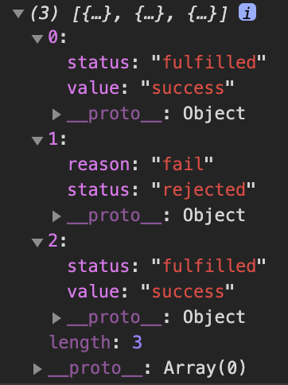

<br>


2020년을 맞이 하기에는 벌써 5월이 끝나고 있지만 그래도 올해 나온 ES2020 에 새로운 기능을 살펴보도록 하겠습니다.

2015년 ES6 이후로 Ecma International의 TC39에서 매년 ECMAScript의 새로운 버전을 출시합니다. ECMAScript 2020은 ECMAScript 언어 11 번째 버전입니다.

ES11 또는 ES2020 이라고도 부릅니다.

## What?

새롭게 적용된 기능인 아래와 같습니다.

- globalThis
- Promise.allSettled
- Optional Chaining Operator
- Nullish Coalescing
- Dynamic Import
- BigInt
- String.prototype.matchAll

## globalThis

globalThis는 Javascript의 최상위 객체인 global 객체에 접근하기 위해 ES2020에서 추가된 방식입니다.
최상위 객체라면 브라우저에서는 window 객체를 의미하고,

Node.js 에서는 global 객체를 의미합니다.

JS가 실행되는 런타임 환경이 달라지게 되면 접근하는 방식이 달라져서 불편하기 때문에 globalThis이라는 공통객체를 사용하여 동일하게 접근을 할 수가 있게 됩니다.

```ts
//브라우저 실행 환경 기준
globalThis === window // true;
//Node 실행 환경 기준
globalThis === global // true;
```

## Promise.allSettled

순차적이지 않은 비동기적인 작업을 수행 할 때 es6에 등장한 Promise.all를 사용했을텐데
하지만 결정적인 단점이 하나라도 reject로 떨어진다면 다른 나머지 수행이 결과값을 처리 할 수 없게 되었습니다.

```ts
const A = new Promise((resolve, reject) => setTimeout(resolve, 500, 'success'))
const B = new Promise((resolve, reject) => setTimeout(reject, 500, 'fail'))
const C = new Promise((resolve, reject) => setTimeout(resolve, 500, 'success'))

const pArray = [A, B, C]
/* Promise.all */
Promise.all(pArray)
  .then(results => {
    console.log(results)
  })
  .catch(err => {
    console.error(err)
  })
```

위에 결과는 어떻게 나올까요?
A 와 C 는 success 지만 B가 fail 이기때문에 결과는 catch 로 빠지게 되어 reject fail 로 처리가 됩니다.
이것을 방지하기 위해서 Promise.allSettled 가 나왔습니다.

**Promise.allSettled** 사용하면

```ts
//...위와 조건은 똑같다
/* Promise.all */
Promise.allSettled(pArray)
  .then(results => {
    console.log(results)
  })
  .catch(err => {
    console.error(err)
  })
```



> 성공한 경우 status는 fulfilled로, 반환값은 value로 나오고, 실패한 경우에는 status는 rejected, 반환값은 reason으로 나옵니다. 실패한 Promise만 추려서 재요청할 수 있습니다.

## Optional Chaining(?.)

선택적 체이닝(?.)

### What

Optional Chaining(?.) 연산자는 왼쪽 피연산자 값이 null이나 undefined일 경우 실행을 멈추고 undefined를 반환하는 연산자입니다

```js
const data = {
  user: {
    name: 'song',
    getName() {
      return this.name
    },
  },
}

// 옵셔널 체이닝 하지 않았을때
const A = data !== undefined && data !== null ? data.user : undefined // {...}

// 옵셔널 체이닝 적용
const B = data?.user // {...}

const userName = data?.user.getName?.() // song
const useAge = data?.user.age?.[0] // undefined
```

### Another Example

```js
const a = {
    b: {
        c: 0
    }
}

console.log(a.d.c)
// Uncaught TypeError: Cannot read property 'c' of undefined
// a안에 d undefined 이므로  c 속성을 읽으려고 하면 에러 발생
​
// 옵셔널 체이닝 하지 않았을때
console.log(a.d && a.d.c)
​
// 옵셔널 체이닝 적용
console.log(a.d?.c)
// 결과: undefined
```

## Nullish coalescing Operator

즉 병합 연산자(??)Nullish coalescing Operator(??) 입니다.

### What?

왼쪽 피연산자 값이 null이나 undefined일 경우 오른쪽 피연산자를 반환하고 그렇지 않으면 왼쪽 피연산자를 반환하는 연산자입니다.

```ts
const data = {
  name: 'song',
  bio: '',
}

const A = data.bio ?? 'default value' // ''

const B =
  data.bio !== undefined && data.bio !== null ? data.bio : 'default value' // ''

const C = data.desc || 'default value' // 'default value'
```

## Dynamic import

모듈 import () 할때 동적으로 할 수 있는 구문 입니다.
import()구문은 Promise객체를 반환하기 때문에 async/await이나 then/catch를 사용해서 비동기처리

아래와 같은 이점을 얻을수가 있다.

- 사용자 언어를 모두로드하는 대신로드
- 애플리케이션 경로의 지연 로딩 (성능 향상)
- 모듈을 찾을 수없는 경우 장애 처리 가능

```js
// Using callback
import('/module.js')
  .then((module) => {
  });

//  async / await 사용시
async function () {
  let module = await import('/modules.js');
}
```

## BigInt

JS에서 큰숫자를 취급 표현하는데 어려움이 많았습니다. 그래서 BigInt라는 객체가 도입이 되었습니다.
BigInt는 2^53 보다 큰 정수를 취급할수가 있습니다.
사용법은 숫자뒤에 `n`을 붙여 사용을 하면 됩니다.

### BigInt 미사용

```js
const max = Number.MAX_SAFE_INTEGER

console.log(max) // 9007199254740991

console.log(max + 1) // 9007199254740992
console.log(max + 2) // 9007199254740992
console.log(max + 3) // 9007199254740994
console.log(Math.pow(2, 53) == Math.pow(2, 53) + 1) // true
```

### BigInt 사용

```js
const bigNum = 100000000000000000000000000000n

console.log(bigNum * 2n) // 200000000000000000000000000000n
```

> BigInt는 BigInt끼리 계산을 해야하며, Big + Int 이기때문에 소수점은 표현을 못합니다.

## String.prototype.matchAll

matchAll은 쉽게 설명하자면 정규식표현이라고 생각하면 좋을거 같습니다.
RegExp.prototype.exec 메서드와 유사하게 동작합니다.

matchAll 문자열에서 일치하는 정규표현식을 iterator 형식으로 반환합니다

```js
// 일반 정규식
const regexp = /g(ro)(up(\d?))/g
const groups = 'group1group2group3'
groups.match(regexp)
//(3) ["group1", "group2", "group3"]
//0: "group1"
//1: "group2"
//2: "group3"
```

```js
//matchAll
const regexp = /g(ro)(up(\d?))/g
const someString = 'group1group2group3'
const array = [...someString.matchAll(regexp)]
array
//(3) [Array(4), Array(4), Array(4)]
//0: (4) ["group1", "ro", "up1", "1", index: 0, input: //"group1group2group3", groups: undefined]
//1: (4) ["group2", "ro", "up2", "2", index: 6, input: //"group1group2group3", groups: undefined]
//2: (4) ["group3", "ro", "up3", "3", index: 12, input: //"group1group2group3", groups: undefined]
//length: 3
```

> 주의!!! 정규표현식 뒤에 /g를 사용하지 않으면 Uncaught TypeError: String.prototype.matchAll called with a non-global RegExp argument ERROR

## References

> - [https://github.com/tc39/proposals/blob/master/finished-proposals.md](https://github.com/tc39/proposals/blob/master/finished-proposals.md)
> - [https://developer.mozilla.org/en-US/docs/Web/JavaScript/Reference/Global_Objects/String/matchAll](https://developer.mozilla.org/en-US/docs/Web/JavaScript/Reference/Global_Objects/String/matchAll)
> - [https://dev.to/carlillo/es2020-features-in-simple-examples-1513](https://dev.to/carlillo/es2020-features-in-simple-examples-1513)

### 🙏🏻감사합니다.
