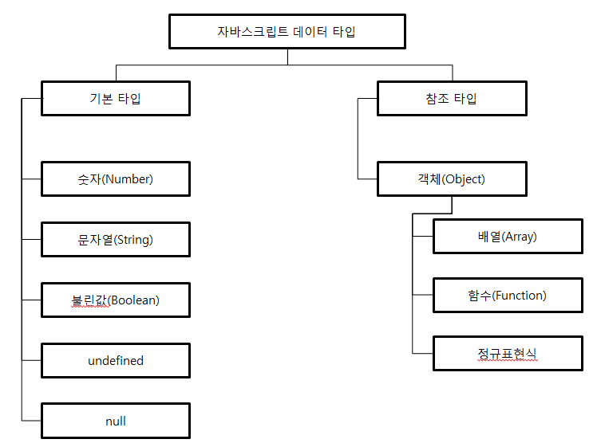

### 자바스크립트의 데이터 타입은 크게 기본 타입과 참조 타입으로 나뉜다.

- 기본 타입(숫자, 문자열, 불린값, null, undefined) : 기본 타입 자체가 하나의 값을 나타낸다.
- 참조 타입 : 기본 타입 5가지를 제외한 모든 값은 객체이며, 이 객체들은 자바스크립트에서 참조 타입이라고 부른다. 객체의 모든 연산이 실제 값이 아닌 참조 값으로 처리되기 때문이다. 자바스크립트에서 객체는 단순히 '이름(key):값(value)'형태의 속성(property)들을 저장하는 공간(container)으로서, 컴퓨터 과학의 해시(Hash)라는 자료구조와 상당히 유사하다. 기본 타입은 하나의 값만을 가지는 것에 비해, 참조 타입인 객체는 여러 개의 프로퍼티를 포함할 수 있으며 이러한 프로퍼티들은 기본 타입의 값을 포함하거나, 다른 객체를 가리킬(=참조할) 수 있다. 이러한 프로퍼티의 성질에 따라 객체의 프로퍼티는 함수를 포함할 수 있으며 자바스크립트에서는 이러한 함수 프로퍼티를 메서드라고 부른다.

### A. 자바스크립트의 데이터 타입도



### B. 자바스크립트 기본 타입(숫자, 문자열, 불린값, null, undefined)

#### 1. 숫자 number

C언어, 자바등과 달리 자바스크립트는 하나의 숫자형만 존재한다. C와 자바에서 Double이라고 불리는 숫자 타입과 같다.(64비트 부동 소수점 형태) 따라서 정수형이 따로 없고 모든 숫자를 실수로 처리하므로 나눗셈 연산을 할 때 주의해야 한다.(2든 2.5이든 실수로 취급하기 떄문에) C와 자바차럼 소수점이 생략되거나 하지 않으므로 헷갈리지 않도록 하자.

```javascript
var num = 5 / 2

console.log(num) // 2.5
console.log(Math.floor(num)) // 2
//소수 부분을 버린 정수 부분을 구하고 싶다면 Math.floor 메서드를 사용한다.
```

#### 2. 문자열 String

큰 따옴표와 작은 따옴표를 사용하여 생성.

```javascript
var str = 'String' // 또는 'string';
```

배열처럼 인덱스 사용 가능

```javascript
console.log(str[0], str[1], str[2], str[3], str[4], str[5]) // 출력값 String
```

자바스크립트에서 한 번 생성된 문자열은 읽기만 가능하고 수정이 불가하다. 만약 변경된 값을 사용하고 싶다면 다른 변수를 선언하고 변경된 값을 저장해야 한다.

```javascript
str[0] = 's' //str의 맨 첫 번째 글자 대문자 S를 소문자로 바꿈
console.log(str) //처음 생성했을 때와 마찬가지로 String 출력. 즉 변경되지 않음
```

- 기본 타입 String과 String 객체의 차이는?

조금 어려울 수 있는 내용이나 충분히 의문이 들 만한 내용이라 찾아 보았다. 기본 타입인 String은 값 자체에 대한 타입이므로 어떤 추가적인 속성도 붙일 수 없고, 프로토타입도 없다. 이러한 행위를 할 수 있는 유일한 방법은 String 생성자의 ToObject 전환을 통해서만 가능하다.

좀 더 실제적으로 설명하자면, 기본 타입인 문자열에 어떤 메서드를 적용시키면 기본 타입인 String에는 어떠한 속성도 붙일 수 없으므로, 자바스크립트는 '오토박싱(auto-boxing)'이라는 기법을 통해 기본 타입 String 변수를 또 하나의 String 객체로 감싸버린다. 그리고 겉에 감싼 String객체에 속성과 프로토타입을 추가하는 방식으로 작업을 진행한다. (자바의 기본형 타입 int와 Wrapper클래스 하위의 Interger클래스의 관계와 유사하다고 할 수 있다.)

['참고 1'](https://stackoverflow.com/questions/2051833/difference-between-the-javascript-string-type-and-string-object)
['참고 2'](https://stackoverflow.com/questions/17256182/what-is-the-difference-between-string-literals-and-string-objects-in-javascript)

- 이스케이프 문자 사용

  | 이스케이프 문자 |    설명     |
  | :-------------: | :---------: |
  |       \t        |   수평 탭   |
  |       \n        |   줄 바꿈   |
  |       \\'       | 작은 따옴표 |
  |       \\"       |  큰 따옴표  |
  |      \\\        |  역 슬래시  |

#### 3. 불린 boolean

true와 false값만을 가지는 타입이다.

#### 4. null과 undefined

null과 undefined 모두 '값이 비어있음'을 나타낸다. 그러나 약간의 차이가 있다.

- undefined => 값이 할당되지 않은 변수 : undefined 타입, undefined 타입은 모든 변수의 값이 undefiend이다.

- null => 개발자가 명시적으로 값이 비어있음을 할당한 변수 : null 타입, null 타입은 모든 변수의 값이 null이다.

즉, 코드를 작성하는 개발자가 일부러 값이 비어있음을 나타내기 위해 값을 할당할 때 사용하는 것이 null이고, 변수는 선언되었지만 값 자체가 할당된 적이 없을 때의 변수 값이 undefined인 것이다.

원래 typeof 연산자를 사용하여 타입을 판단할 때, null값의 타입은 null이 나와야하지만 ECMAScript의 버그로 인해 typeof 연산자를 통해 null값의 타입을 판단하면 object가 나온다.

['버그 관련 mozilla 공식 문서'](https://developer.mozilla.org/ko/docs/Web/JavaScript/Reference/Global_Objects/null)

따라서 null값의 타입을 판단할 떄는 typeof연산자를 사용하지 말고, 모든 null타입의 값은 어차피 null이므로 일치연산자(===)를 통하여 자료형과 값을 판단하도록 한다.

```javascript
var nullVar = null

console.log(typeof nullVar === null) // false(typeof nullVar의 값이 "object"라는 문자열로 나오므로 null과 타입과 값 모두 다르다.)
console.log(typeof null === null) // true;
```

### C. 자바스크립트 참조 타입(객체, 배열)

#### 1. 객체 생성

es5에는 클래스의 개념이 없었지만, es6로 넘어오면서 class의 개념이 도입됨에 따라 객체를 생성하는 방법이 굉장히 수월해졌다. 기존에 객체지향언어와 똑같은 형식으로 생성할 수 있게 되었다. 하지만 현재 쓰이고 있는 대부분의 자바스크립트 버전이 es5이므로 es5에서 객체를 다루는 법도 필수적으로 알아야 한다. es5를 중점적으로 알아보고 이와 비교하여 es6를 추가적으로 알아보도록 한다.

1-1. Object() 생성자 함수 이용
자바스크립트에서는 객체 생성 시 내장 Object() 생성자 함수를 제공한다.

```javascript
//내장 Object() 생성자 함수를 이용해서 foo 빈 객체 생성.
var foo = new Object() //아무 값도 할당되지 않은 빈 객체

//foo 객체 프로퍼티 생성
foo.name = 'foo' // foo 객체에 name프로퍼티를 추가한 후, 문자열타입 'foo' 값을 할당.
foo.age = 30 // foo 객체에 age프로퍼티를 추가한 후, 숫자타입 30 값을 할당.
foo.gender = 'male' // foo 객체에 gender프로퍼티를 추가한 후, 문자열타입 'male' 값을 할당

console.log(typeof foo) // object 참고로 typeof 연산자는 string 타입으로 결과를 반환한다.
console.log(foo) // {name: 'foo', age: 30, gender: 'male'}
```

1-2. 객체 리터럴 방식 이용
리터럴 방식이라는 것은 어렵게 들리지만 쉽게 말해 표기법이라고 생각하면 된다. 즉, 객체의 표기법으로 객체를 생성하겠다는 말이다. 이러한 문법은 다른 언어에는 없는 자바스크립트만의 강력한 문법이다. 자바스크립트 객체 표기법을 줄여서 JSON(JavScript Object Notation)이라고 칭하기도 한다. 즉, 흔히 듣는 JSON형식은 자바스크립트 객체 표기법으로 된 형식이라는 말과 같다.

```javascript
var foo = {} // 아무것도 적지 않으면 빈 객체가 생성된다.
var foo2 = {
  // 이런 식으로 "프로퍼티 이름":"프로퍼티 값" 형태로 표기하면 해당 프로퍼티가 추가된 객체를 생성할 수 있다. 프로퍼티 이름은 문자열이나 숫자가 올 수 있다. 값으로는 자바스크립트의 값을 나타내는 어떤 표현식도 올 수 없으며, 이 값이 함수일 경우 이러한 프로퍼티를 메서드라고 부른다.
  name: 'SONGC',
  age: 27,
  gender: 'male',
}
```

1-3. 생성자 함수 이용
자바스크립트는 함수를 통해서 객체를 생성할수도 있다. 이렇게 객체를 생성하는 함수를 생성자 함수라고 부른다. 생성자 함수의 개념은 뒤에 함수를 다루면서도 계속 나오므로 꼭 숙지해둬야 할 중요한 개념이다. 여기서 다루고 함수에서도 또 다시 언급할 예정이다.

##### !! 생성자 함수 : '객체를 생성하는 함수' !!

자바스크립트의 함수도 Function()이라는 기본 내장 생성자 함수로부터 생성된 **객체**라고 볼 수 있다. 함수를 생성하는 방식 중 함수 선언문이나 함수 표현식 방식도 겉으로는 함수 리터럴 방식으로 함수를 생성하지만, 결국 내부적으로는 Function() 생성자 함수로 함수가 생성된다.

```javascript
//Function() 생성자 함수로 함수를 생성하는 문법
new Function(arg1, arg2, ...argN, functionBody)

* arg1, arg2, .., argN : 함수의 매개변수
* functionBody : 함수가 호출될 때 실행될 코드를 포함한 문자열
```
