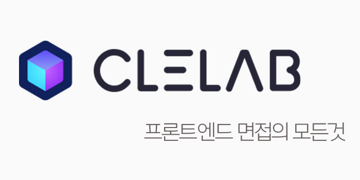

⚠️[clelab.io](https://clelab.io) 면접의 모든것을 소개합니다.

### Table of Contents

- 프론트엔드 개발 지식편
- 프론트엔드 기술 면접편
- 프론트엔드 컬처 면접편
- 마무리

## Intro

구글에 널리 퍼져있는 블로그 글을 수집하여 프론트엔드 코스를 만들어주는 서비스를 운영하고 있는 있습니다!

이번에 프론트엔드 주니어 개발자분들의 취업을 위해 으로 이루어진 프론트엔드 면접코스를 준비했습니다.

## WHY

프론트엔드 개발자로 취업을 하기 위해서 면접이라는 과정은 피할 수 없어요. 여러분들은 면접 준비를 어떻게 하고 계시나요? 또, 프론트엔드 면접에서 많이 물어보는 주제로는 뭐가 있을까? 고민을 할것입니다.

프론트엔드 개발자분들의 성공적인 면접 경험을 위해 면접의 모든것 코스를 준비하고 찾게 되었습니다.

## 프론트엔드 개발 지식편

[프론트엔드 개발 지식편](https://clelab.io/course/developer-interview)

### 브라우저 동작원리

브라우저는 프론트엔드 개발자들이 만든 어플리케이션이 실행되는 환경이라서 브라우저를 피할수 없습니다.

[브라우저 살펴보기](https://clelab.io/course/developer-interview/browser-activity)👏🏻

- 브라우저는 어떻게 동작하는가?
- 브라우저는 웹페이를 어떻게 그리나요?
- 브라우저 Critical Rendering Path 최적화
- Reflow or Repaint(or ReDraw)과정 설명 및 최적화 방법

### DOM (Document Object Model)

DOM은 HTML이나 XML과 같은 마크업 기반의 문서들을 프로그램에서 읽어들이기 위해 만들어진 일종의 규칙입니다.

[DOM 살펴보기](https://clelab.io/course/developer-interview/dom)👏🏻

- DOM 소개
- DOM 스펙 살펴보기
- 버블링과 캡처링
- 왜 Virual DOM 인가

### CORS (Cross Origin Resource Sharing)

CORS는 브라우저와 서버 간 통신을 할 때, 혹시나 우리가 이상한 서버와 통신을 해서 원하지 않은 리소스를 받지 않을 수도 있도록 방어해주는 브라우저의 보안 규칙입니다.

[CORS 살펴보기](https://clelab.io/course/developer-interview/cors)👏🏻

- CORS는 왜 이렇게 우리를 힘들게 하는 걸까?
- CORS (Cross Origin Resource Sharing)

### SSR

[서버사이드 렌더링 살펴보기](https://clelab.io/course/developer-interview/ssr)👏🏻

- Universal Server Side Rendering이란?
- SSR (서버사이드 렌더링) vs CSR (클라이언트 렌더링)
- CSR, SSR, SPA, MPA
- Suspense를 이용한 새로운 SSR 아키텍처

### 올바른 CSS 사용법

[CSS 살펴보기](https://clelab.io/course/developer-interview/css)👏🏻

- CSS Flex 완벽가이드
- CSS 방법론 (OOCSS, BEM, SMASCC) 자료정리
- BEM 방식

### Webpack & Babel

여러가지 모듈을 하나의 파일로 만들거나 현재 브라우저에서 지원하지 않는 자바스크립트 문법을 지원한 가능한 문법으로 변경가능하거나 소스코드에 존재하지 않는 의미 없는 부분을 제거해서 용량을 줄이는 다양한 과정을 거쳐서 어플리케이션을 만듭니다. 그중 대표적인 webpack babel을 소개합니다.

[Webpack & Babel 살펴보기](https://clelab.io/course/developer-interview/webpack-babel)👏🏻

- Webpack이란 무엇인가?
- 프론트엔드 개발환경의 이해:웹팩
- Webpack5
- polyfill & transpiler

## 프론트엔트 기술 면접편

### HTML

[HTML 보러가기](https://clelab.io/course/frontend-interview/html)👏🏻

- 프론트엔드 면접 질문 리스트 - FE (Browser)
- 웹브라우저 & HTML
- Front End Interview Handbook (HTML)
- HTML 질문 리스트

### Javascript

[Javascript 보러가기](https://clelab.io/course/frontend-interview/javascript)👏🏻

- 자바스크립트란?
- 자바스크립트의 프로토타입 훓어보기
- 프론트엔드 면접 핸드북 - 자바스크립트-
- Interview Question for_Beginner - 자바스크립트 -
- 프론트엔드 면접 문제 은행
- 자바스크립트 코딩 면접에서 알고 있어야 할 3가지 질문
- 프론트엔드 직군 웹개발자 면접질문 모음 답변 달아보기

### CS 지식

[CS 지식보러가기](https://clelab.io/course/frontend-interview/cs-fundamental)👏🏻

- 프로그래밍 공통
- 자료구조
- 알고리즘
- 네트워크
- 운영체제
- 함수형 프로그래밍이란?
- 개발자 기술면접 대비 🖥️/ 공통 직군
- 프론트엔드 개발자 면접 질문 정리

### React

[React 보러가기](https://clelab.io/course/frontend-interview/react)👏🏻👏

- Clelab React 코스
- React 기술면접 질문리스트
- React Interview (리액트 면접질문)
- React 인터뷰 대비 질문과 답변 15
- React (Environment Setup)
- React 아키텍처
- React Router 다루기
- Components 디자인하기

## 프론트엔트 컬처 면접편

### 성장

많은 회사에서 성장이라는 키워드에 질문을 할수가 있습니다.

[성장 질문](https://clelab.io/course/culture-interview/growth)👏🏻

- 5년, 10년 뒤에 어떤 개발자가 되어 있으실 것 같으신가요?
- 평소에 성장을 위해 어떤 노력을 하시나요?
- 우리 회사에 왜 지원하셨나요? (어떤 성장과 어떤 것을 얻을 수 있다고 생각하시나요?)
- 개발자 롤모델이 있나요?

글은 아래와 같은 내용을 담고 있습니다.

- 그 때 성장이라고 생각했던 것들
- 성장하는 프론트엔드 개발자 되기 (2021 원티드)
- 2020 FE 개발자가 되기 위한 10가지 방법
- 프로그래머로서의 성장을 도왔던 태도들

### 소프트 스킬

하드 스킬만큼 중요한 부분이 소프트 스킬입니다.. 회사 특성상 혼자서 작업하는 경우는 거의 없기 때문에 소프트 스킬 역량도 매우 중요한 평가요소 중 하나입니다.

[동료와의 관계]

- 다른 직군과 협업할 때 어려운 부분이 있었나요?
- 일하고 싶은 동료는 어떤 동료라고 생각하는지, 그런 동료가 되기 위해서 어떤 노력을 하고 있나요?
  - 본인이 생각하는 좋은 리더와 좋지 못한 리더는 누구인가요?
- 함께 일하기 힘들었던 동료는 어떤 유형이었고, 어떻게 해결했나요?
- 열심히 하지만 본인이 원하는 만큼 따라오지 못하는 팀 동료들이 있을 수 있는데, 이럴 때는 어떻게 했나요?

[문화에 대한 생각]

- 좋은 개발문화는 무엇이라고 생각하나요?
  - 그렇다면 좋은 개발문화를 만들어 나아가기 위해 노력한 부분이 있나요?

[갈등 해결 능력]

- 팀원과 갈등이 발생했을 때 어떻게 해결하나요?
  - 설득하려고 해도 끝까지 일치하지 않을 수 있는데 이럴 땐 어떻게 하나요?
  - 프로젝트의 기한도 길지 않아서 두 방식을 모두 해볼 수 없다고 가정하면 어떻게 해야 할까요?
    - → 프로젝트를 진행할 때 마감과 퀄리티 둘 중 어느 것이 중요하다고 생각하나요
- 만약 본인의 주장이 본인과 협업하는 사람(예를 들어 프론트 개발자, 기획자 등)이 받아들이지 못한다면 어떻게 해결하실 건가요?

[자기 객관화]

- 자신이 좋은 개발자라고 생각하시나요?
- 좋은 개발자는 어떤 개발자일까요?

[소프트 스킬 보러가기](https://clelab.io/course/culture-interview/soft-skills)👏🏻

글은 아래와 같은 내용을 담고 있습니다.

- 개발자가 조직문화에 대해 관심을 가져야 하는 이유
- 센스있는 직원의 소프트 스킬
- 솔직한 피드백으로 좋은 팀워크를 만들 수 있을까? - 파워풀을 읽고
- 개발자에게 필요한 디자이너와 협업하기
- 좋은 개발자란 무엇일까?
- 커뮤니케이션 잘하는 개발자가 되는 방법
- 질문을 잘하는 개발자

### 역질문하기

기술 면접을 진행하면서 면접이 마무리 될 때 쯤 "혹시 저희 팀에 궁금한 점이 있으신가요?"라는
질문을 받을 수 있습니다.

[역질문 예시]

- Git을 사용할 때 특별히 브랜치 전략을 세워두고 작업을 진행하시나요?
- 팀에 프론트엔드(개발팀) 팀원은 총 몇 명인가요? 그리고 평균 연차가 어떻게 되나요?
- 타 부서와 어떻게 커뮤니케이션하시나요?
- 이슈를 진행할 때 어떤 식으로 이슈 전달을 받게 되나요?
- 새로운 기술이나 관심 있는 기술이 생길 때 스터디를 진행하고 있나요?
- 개발 시작부터 배포까지의 간략한 프로세스가 어떻게 되나요?
- 코드리뷰를 진행하고 있나요? 진행한다면 어떤 방식으로 진행하게 되나요? 잘 지켜지고 있나요?
- 개발 문서화를 어떤 방식으로 진행하고 있나요?

[역질문 보러가기](https://clelab.io/course/culture-interview/question)👏🏻

글은 아래와 같은 내용을 담고 있습니다.

- Git 브랜치 전략(Git flow, Changes)의 필요
- 우린 Git-flow를 사용하고 있어요
- [CI/CD] 개발부터 배포까지 자동화
- 코드 리뷰 개발 문화
- 효과적인 코드 리뷰를 위해서
- 테크 스펙 | 뱅크샐러드

### 면접회고

면접은 통과하는것이 아니라 서로가 서로를 확인하는 자리라고 생각합니다.

면접 후기에 나온 경험들이 무조건 정답은 아니지만, 다른 사람들의 면접 성공과 실패 경험을 엿보고 준비를 해보는 것도 좋은 전략이 될 수도 있습니다.

- [2020 면접후기](https://ian-note.dev/retrospective/%EB%A9%B4%EC%A0%91%ED%9B%84%EA%B8%B0/)
- [컴공 석사생의 스타트업 면접 후기](https://dev-seung2.medium.com/%EC%BB%B4%EA%B3%B5-%EC%84%9D%EC%82%AC%EC%83%9D%EC%9D%98-%EC%8A%A4%ED%83%80%ED%8A%B8%EC%97%85-%EB%A9%B4%EC%A0%91-%ED%9B%84%EA%B8%B0-243fc9679ae4)
- [2년차 프론트엔드 개발자의 이직기](https://flyingsquirrel.medium.com/2%EB%85%84%EC%B0%A8-%ED%94%84%EB%A1%A0%ED%8A%B8%EC%97%94%EB%93%9C-%EA%B0%9C%EB%B0%9C%EC%9E%90%EC%9D%98-%EC%9D%B4%EC%A7%81%EA%B8%B0-4dc3536f3c98)
- [카카오 경력 이직 후기](https://brunch.co.kr/@geeksbaek/2)
- [공채없이 카카오 개발자 취준기](https://jyami.tistory.com/126) -[야놀자를 떠나며... (feat. 레저큐)](https://perfectacle.github.io/2019/08/23/exit-yanolja-feat-leisureq/?fbclid=IwAR0Hgz91OvOSAn_66LRS0sxCfk0uhrJt9HJr83O_0Nrlg4dsQpCGeClFYmg#disqus_thread)

## 마무리

[현재 프론트엔드 면접의 모든것](https://clelab.io)은 이직 또는 취업을 준비하시는 분들에게 조금이라도 도움을 드리기 위한 목적으로 제작한 컨텐츠입니다. 많은 관심 부탁드립니다.

추가적으로 블로그로 프론트엔드 코스를 만드는 것에 관심있는 분은 [admin@clelab.io](mailto:admin@clelab.io) 문의주시면 감사드립니다.

👉🏻서비스 성장 살펴보기: [Clelab.io MVP 과정](https://blog.songc.io/etc/%EB%A3%A8%EB%B9%84%EC%BD%98-%EB%A9%98%ED%86%A0%EB%A7%81-%ED%94%84%EB%A1%9C%EC%A0%9D%ED%8A%B8/)

읽어주셔서 감사합니다.🙏🏻
