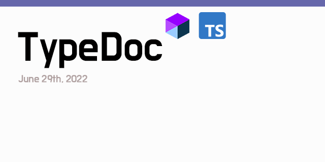
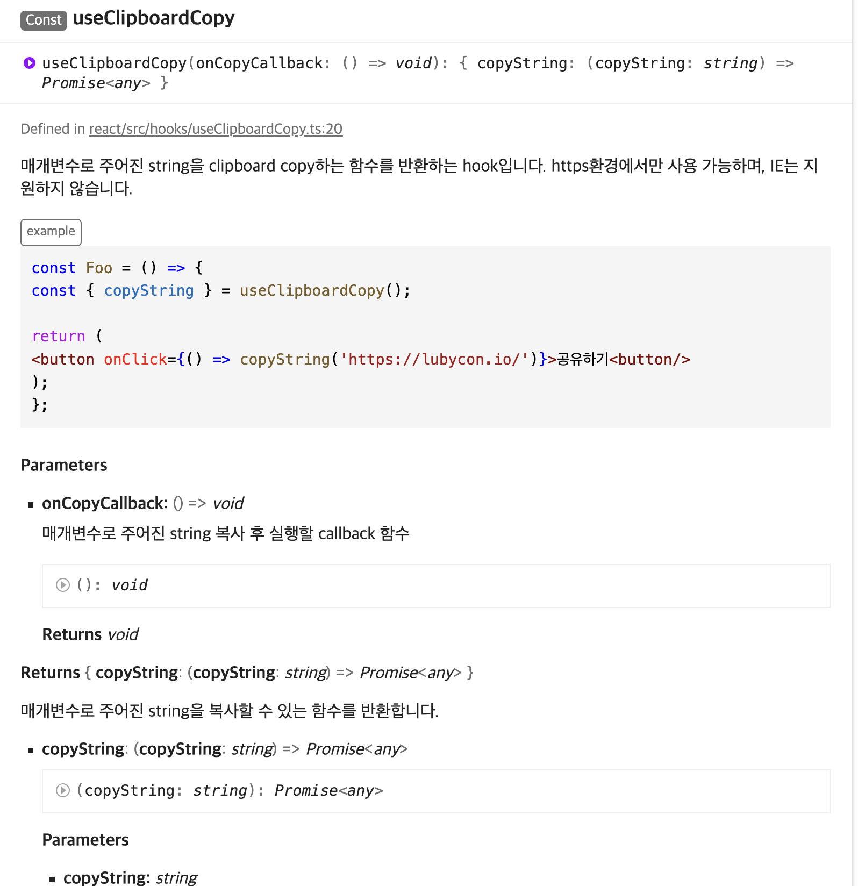

⚠️이 글에서는 라이브러리나 공통 함수에 문서화를 할수 있는 도구에 설명합니다.

## TL;DR

- 문서화가 필요해진 순간
- Typedoc란?
  - 🛠 설치 및 설정가이드
  - 📝 Typedoc 문서를 위한 주석달기
  - 빌드 및 배포하기
- 마무리

## 문서화가 필요해진 순간

언제 사내 라이브러리나 오픈 라이브러리에 문서화를 작성 또는 도입 하시나요?

> 이 함수가 어떤 용도였지?🤔 <br/>
> 이 함수는 어떤 역할이지?🤔<br/>
> 이 함수는 어떤 패키지 안에 있지?🤔

처음 함수 갯수가 많지 않고 이미 히스토리를 알고 있는 함수라면 문서화가 필요 없을수도 있을거에요

이렇게 개발을 계속 진행하다보니, 라이브러리의 패키지 개수와 각 패키지 내부에 포함된 함수와 컴포넌트도 계속 해서 늘어나게 되고, 이로 인해 새로 팀에 합류한 개발자들이 어떤 패키지가 어떤 역할을 하고, 이 패키지 안에는 어떤 함수들이 있는지 알기가 어려워질거에요.

### 결국

<span style="background-color: #f8baba">
❗ 라이브러리의 유틸과 종류가 많아져서 문서가 필요하다!!!
</span>

문서화 툴은 `gitbook` `typedoc` `docz` `Docusaurus` 등등 있습니다.
선택한 툴은 Typedoc 팀이나 상황에 맞게 원하는 라이브러리나 툴을 이용하면 좋을거 같습니다

## 🚀 Typedoc이란?

[typedoc](https://typedoc.org/)

TypeDoc은 TypeScript 소스 코드에 포함된 주석을 바탕으로 Static Site Generation을 할 수 있는 도구입니다.

이 주석들은 최종적으로 HTML 문서 또는 JSON 모델로 빌드되어요. 또한 typedoc은 Markdown, Code Block, Symbol 등 다양한 기능을 지원하고 있기 때문에, 적은 리소스만으로 퀄리티 높은 문서를 작성하기 편합니다.

## 🛠 설치 및 설정가이드

👉🏻 [**설치하기 및 설정 공식문서**](https://typedoc.org/guides/installation/)

1. Install 하기
   - 코드 블록 보기
     ```bash
     $ yarn add -D typedoc
     ```
2. Typedoc 설정하기
   - 코드 블록 보기
       <aside>
       ⚠️ 만약 새로운 패키지가 추가되었다면 entryPoints에 경로를 추가해주셔야 문서가 빌드됩니다
       
       </aside>
       
       ```bash
       {
         "include": ["packages/*/src/**/*.ts"],
         "exclude": [
           "**/node_modules/**",
           "**/src/**/*.test.ts",
           "**/src/**/__tests__/**",
           "packages/icons/*"
         ],
         "baseUrl": "./packages",
         "compilerOptions": {
           "target": "esnext",
           "module": "esnext",
           "jsx": "react",
           "lib": ["dom", "esnext"],
           "moduleResolution": "node",
           "esModuleInterop": true
         },
         "typedocOptions": {
           "entryPoints": [
             "packages/a/src/index.ts",
             "packages/b/src/index.ts",
             "packages/c/src/index.ts"
           ],
           "out": "docs",
           "name":"라이브러리 문서",
           "excludePrivate": true,
           "readme": "README.md",
           "gitRevision": "main"
         }
       }
       ```

## 📝 Typedoc 문서를 위한 주석달기

주석에 Typedoc이 제공하는 태그들을 작성해주면, 이 태그들을 기반으로 Typedoc이 문서를 생성합니다. 이 태그들은 JSDoc과 유사하게 정의되어있기 때문에, JSDoc에 익숙한 개발자라면 큰 학습 비용 없이 쉽게 라이브러리 문서화를 진행할 수 있어요.

👉🏻 [**주석달기 공식문서**](https://typedoc.org/guides/doccomments/)

- 주석 예시 보기

  ````tsx
  /**
   * 매개변수로 주어진 string을 clipboard copy하는 함수를 반환하는 hook입니다.
   * https환경에서만 사용 가능하며, IE는 지원하지 않습니다.
   *
   * @param onCopyCallback 매개변수로 주어진 string 복사 후 실행할 callback 함수
   * @returns 매개변수로 주어진 string을 복사할 수 있는 함수를 반환합니다.
   * @category hooks
   * @example
    ```javascript
      const Foo = () => {
      const { copyString } = useClipboardCopy();

      return (
       <button onClick={() => copyString('https://blog.songc.io')}>공유하기<button/>
      );
    };
    ```
   */
  const useClipboardCopy = (onCopyCallback: () => void) => {
  ````

## 빌드 및 배포하기

Typedoc 문서 생성 스크립트는 프론트엔드 라이브러리 모노레포의 루트에 있는 `package.json`에 선언되어 있습니다.

```json
{
  // ...
  "scripts": {
    // ...
    "docs:generate": "typedoc --tsconfig tsconfig.doc.json",
    "docs:deploy": "node script/deploy.js"
  }
}
```

### 결과



## 마무리

TypeDoc를 사용한다면 비교적 손쉽게 문서화를 적용하는데 어렵지는 않을거에요

물론 모든 팀이나 조직은 범용적으로 사용할수 있는 퀄리티 를 유지하는것을 목표로 할것 라고 생각합니다.

이때 코드도 당연히 중요하지만, 위 코드가 어떻게 사용하는지 알수 있는 문서의 역할도 중요합니다.

라이브러리(함수)를 사용하고 기여하는 분들이 다같이 조금만 신경쓴다면 좋은 문서가 완성 될수 있다고 생각해요.
