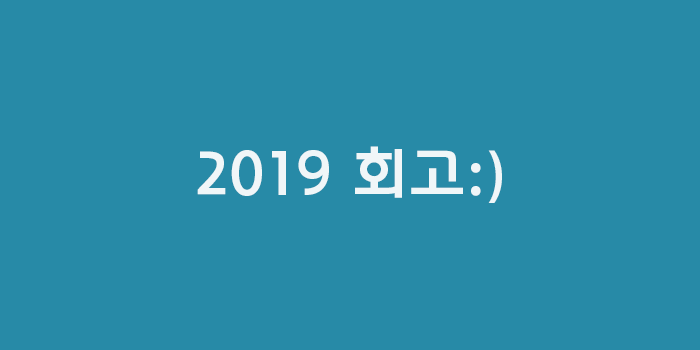
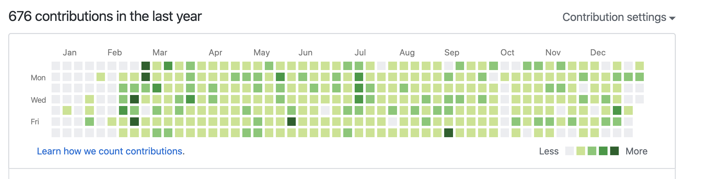
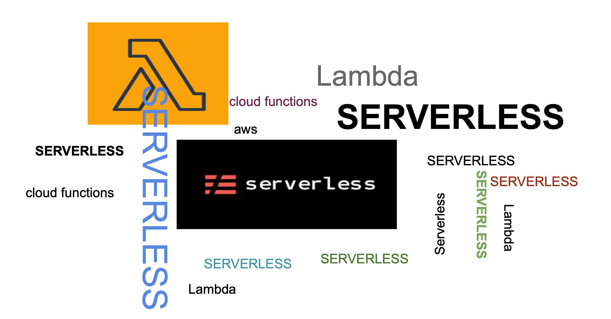

## 2019... 회고

### 👨🏻‍💻2019년 돌아보기

2019년 첫 입사
실무자 첫해

올해 목표 다시보기

- React, Vue (나름??)
- 개인프로젝트 (Fail...)
- 블로그 Gatsby 이전 (O)
- 다양한 세미나 참여(???)
- 블로그 올해보단 많이 하기 (Fail..)
- 헬스장 꾸준히 나가기 (나름...)
- 영어회화 학원 다니기(다니고는 있는데....)

> `👨🏻‍💻절반은 성공한거 같기도 하고 거의 쉬는 날없이 나름 열심히 일도 하고 공부도 하고 세미나도 참여 하고, 영어학원도 틈틈히 다니고 운동도 하고 했지만.... 찝찝함은 끝이 없다.`

## 👇🏻skill UP

### `👨🏻‍💻React & Node server 그리고 Vue`

> `java spring 만 할줄 알았던 나에게 2019 되면서 좀더 개발자로서 방향성을 고민중에 프론트엔드 개발자로서 좀더 비중을 두기 위해서 React 학습을 좀더 깊게 하게 되었다.`

`❗하지만 회사에서는 react & vue 를 사용하지 않는 환경이 였다는 점...❗`

❗️우물은 내가 파는 법

퇴근 후에 쉴때마다
열심히 책도 보고 강의도 찾고 정리도 하면서

https://github.com/s-ong-c/back-end-playground/tree/master/blog-client

- Code-Convention
- react-Typescript
- Style-Component
- react-Hooks
- react-Redux
- react-Apollo
- react-testing-library

https://github.com/s-ong-c/playground-react

- React-Redux-saga
- React-Redux-hooks
- React-Storybook

https://github.com/s-ong-c/back-end-playground/tree/master/backend-server

- Node Server 구축 Koa
- Graphql TypeORM Typescript Postgres
- Aws - Serverless -lambda

그밖에

https://blog.songc.io/react/react-ssr/

- react 서버 사이드 렌더링

https://blog.songc.io/server/node-koa/

- Koa 서버 구축

https://blog.songc.io/react/react-deploy/

- aws cloudFront deploy

`❗생각보다 이것저것 하긴 했던거 같다.❗`

## 👨🏻‍💻`Github`

> 회사 업무를 제외한 1일 1커밋을 목표로 했던 2월 중순부터 했던거 같다

`❗보완해야 할 점❗`

- 👨🏻‍💻 조금 더 커밋을 할 때 명시적으로 할 필요가 있을거 같다
- 👨🏻‍💻 issue & pull-request 적극 활용하기
- 👨🏻‍💻 오픈소스에 기여 해보기

## 👨🏻‍💻`세미나 & meetup`

https://songc92.tistory.com/67

- Kakao If 2019

  - 💪🏻프론트엔드 기술로 조직에 기여하기
  - ❗️브라우저를 확장하는 일이란
  - FE 개발자 브라우저 확장하기
  - React : 그것마저도 정해주마

- AWS summit
  

  > aws serverless 참관해보고 구현해서 회사내에 세미나 진행

- Naver "SHOWROOM:쇼핑 개발자를 부탁해” 다녀오고
  https://blog.songc.io/react/react-storybook/

  - react-storybook 적용해보기

- GDG DevFest Seoul 2019

## 👨🏻‍💻Work

> `👨🏻‍💻첫 회사이면서 2018 인턴을 한것을 제외하면 첫회사 생각보다 많은 프로젝트는 해보지는 못한거 같아 아쉽지만 얻은게 있다면 나의 front end 역량을 조금 인정받았다는 점? 2020에는 많은 프로젝트 기회가 있다면 좋을거 같다. 미친듯이 일하고 싶으니깐`

### 👨🏻‍💻기억에 남는 프로젝트

> `첫 실무 프로젝트는 아니지만 여름쯤에 했던 약관련 프로젝트 React 는 아니지만 Vue.js 로 했던 프로젝트 React & Vue 와 같이 공부하던 도중 프론트엔드 개발자로서 처음으로 역량을 펼쳐볼수 있었던 기회가 생겼다. 혼자서 설계 부터 개발 배포까지 할수 있었던 나름 많은것을 해볼수 있었던 경험이였던거 같다.`

## 🙏🏻2020 목표

> 1년 한듯 안한듯 바쁘게 지나간거 같은데 2020 에도 꾸준하게 목표를 실천할수 있는 한해가 되길 빌어 본다. 2020에는 좋은 기회가 된다면 내가 준비가 된다면 더 많은 경험과 기회가 다양하고 많은 프로젝트를 할수 있는 회사에서 일을 해보고 싶다는 생각도 든다.

- 👨🏻‍💻 오픈소스에 기여 해보기
- 👨🏻‍💻 꾸준한 역량 발전
- 👨🏻‍💻 블로그 발전시키기
- 👨🏻‍💻 개인프로젝트 기획 부터 개발 까지 서비스 구현해보기
- 👨🏻‍💻 운동 꾸준히 하기
- 👨🏻‍💻 영어회화 공부 계획적으로 하기
- 👨🏻‍💻 개발 다양한 밋업, 세미나 참여하기 (연사로 발표를 할수 있는 역량 만들기)

## 감사합니다!)🙏🏻

2019년에 함께 해주신 모든 분들에게 감사드립니다.

2020에도 발전할 수 있는 한해가 되었으면 좋겠습니다.
