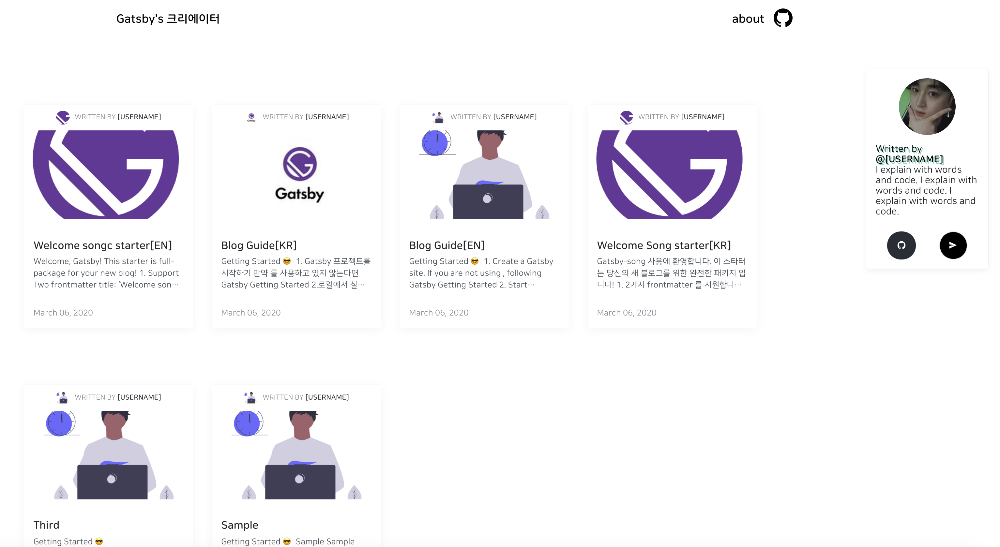
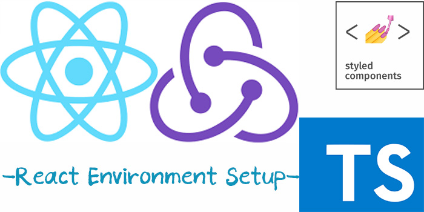

## 👨🏻‍💻2020년 돌아보기

글또 4기 
2020년 첫회사 퇴사 
새로운 회사 

### 올해 상반기 목표 다시보기

- 오픈소스에 기여 해보기 (gatsbyjs)
- 꾸준한 역량 발전 (??)
- 블로그 발전시키기 (나름???)
- 개인프로젝트 기획 부터 개발 까지 서비스 구현해보기 (진행중...)
- 운동 꾸준히 하기 (반은 성공 반은 실패)
- 영어회화 공부 계획적으로 하기 (....51% 실패)
- 개발 다양한 밋업, 세미나 참여하기 (코로나와 함께 사라지다.)

> 👨🏻‍💻다양한 활동과 새로운 공부와 다짐을 하였지만 핑계라면 퇴사를 해서 코로나 때문에 라는 핑계를 되고 싶지만 많은 노력이 부족했고 생각이 듭니다.

## OUTPUT

### 👨🏻‍💻Performance improvement 그리고 고민들....

#### 1. 속도 개선

REACT 페이지 랜더링 할때 효율과 속도를 올리기 위해서 SSR을 통한 개선을 하는 작업을 해보고,또 Lazy Rendering 읕 통해 속도 개선에 고민을 했습니다.

Lazy Rendering 을 하면서 Skeleton UI 을 사용하면서 자연스러움 등등

다양한 개발자 분들과 이야기를 해보면서 정말 SSR가 필요한가? 많은 질문과 dooboolab- hyo 님이 알려주신[https://www.youtube.com/watch?v=k-A2VfuUROg](https://www.youtube.com/watch?v=k-A2VfuUROg) 이런 영상에 메시지를 보고 정말 필요한가라는 고민을 다시 해봅니다.

#### 2. Environment

프로젝트를 하면서 서버 환경을 서버리스를 사용하는것이 좋을까? 서버리스의 단점 때문에 도커컨테이너 환경을 사용하는것이 좋은가 고민을 해봤습니다.

그리고 cloud 서비스를 사용을 한다면 CSR 환경이라면 CloudFront에 환경에 배포를 하는것이 최선의 방법일까? 또 CSR => SSR로 전환시에 SSR 용 서버를 비용이 효율적인가?

#### 3. RestFul Api => Graphql

React 프로젝트에서 프런트엔드 개발자가 데이터 모델을 변경해야 할 때마다 느끼는 방식이
Graphql 환경에서 주는 데이터 방식이 좀더 효율적이고 어울린다고 생각을 하지만 어떤 이유와 명분으로 Restful => Graphql 으로 변경을 요청할수 있을까?

## OpenSource with Github

- [Gatsby Template Project](https://blog.songc.io/etc/blog/)
  

  - Gastby Blog Template
  - deploy with [netlify](https://netlify.com)
  - Post Toc UI
  - GA, RSS 지원

> Gastby Blog Template

- [cra-template-songc](https://blog.songc.io/react/react-cra-custom/)
  

  > Custom Create-React-App template

## BLOG

### 글또

- 글또 다짐글
- [React] CSS in JS
- [Server]TypeOrm & Graphql
- 블로그를 만들면서 (Gatsby-starter-song)
- [JS] What's new in ECMAScript 2020
- [React] Custom CRA with Github Actions

총 6개의 글을 작성 하였습니다. 2번의 패스 아니 총 3번의 패스를 사용하였습니다.

좀더 분발을 해서 깊이 있는 글 작성을 다짐해봅니다.

## 퇴사 그리고 새로운 시작

### 퇴사를 하다.

> 👨🏻‍💻첫 회사이면서 2018 인턴을 한것을 제외하면 첫회사 생각보다 많은 프로젝트는 해보지는 못한거 같아 아쉬운게 많았다. 회사와 내가 하고자 하는 방향과 많이 다른거 같아서 이직의 길을 선택 하기로 하였습니다..

### 👨🏻‍💻새로운 시작

이직을 하면서 달라진게 있다면 React 개발자 => React-Native 개발자로 전향

사실 달라진거라고는 React-Native 프레임워크를 쓴다는 차이 뿐인거 같습니다. 결론적으로는 Web 개발을 하고 있는거 같습니다.

이직을 하면서 다양한 면접과 다양한 과제와 다양한 코딩테스트를 하면서 정말 부족한것이 무엇인가와 그리고 하고 싶은걸 알게되었던거 같습니다.

## 🙏🏻하반기 목표

> 2020년 상반기가 코로나 때문인지 이직을 해서 인지는 모르겠지만 너무 이룬거 없이 시간이 빨리간거 같습니다. 남은 하반기 만큼은 다양한 역량을 쌓아서 회사에서 많은 것을 해보고 싶다는 생각을 해봅니다.

- 👨🏻‍💻 꾸준히 오픈소스에 기여 해보기
- 👨🏻‍💻 꾸준한 역량 발전
  - core (기초를 다지자)
  - relay
  - Graphql
- 👨🏻‍💻 블로그 발전시키기
- 👨🏻‍💻 `영어` 공부 계획적으로 하기 (영어로 블로그 작성도 도전해보기)
- 👨🏻‍💻 운동 꾸준히 하기

## 감사합니다!)🙏🏻

> 남은 하반기 2020년 발전하고 가치있는 한해가 되었으면 좋겠습니다.
