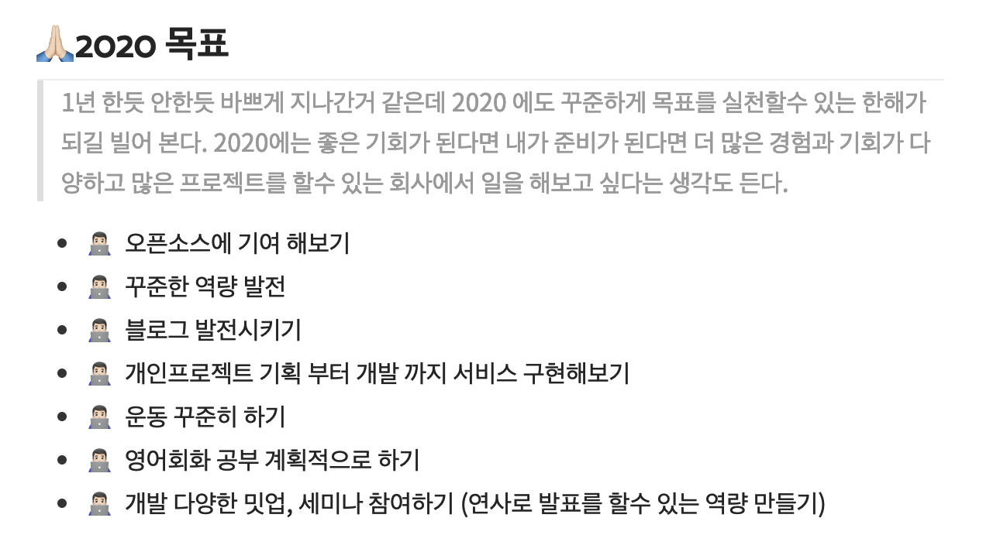
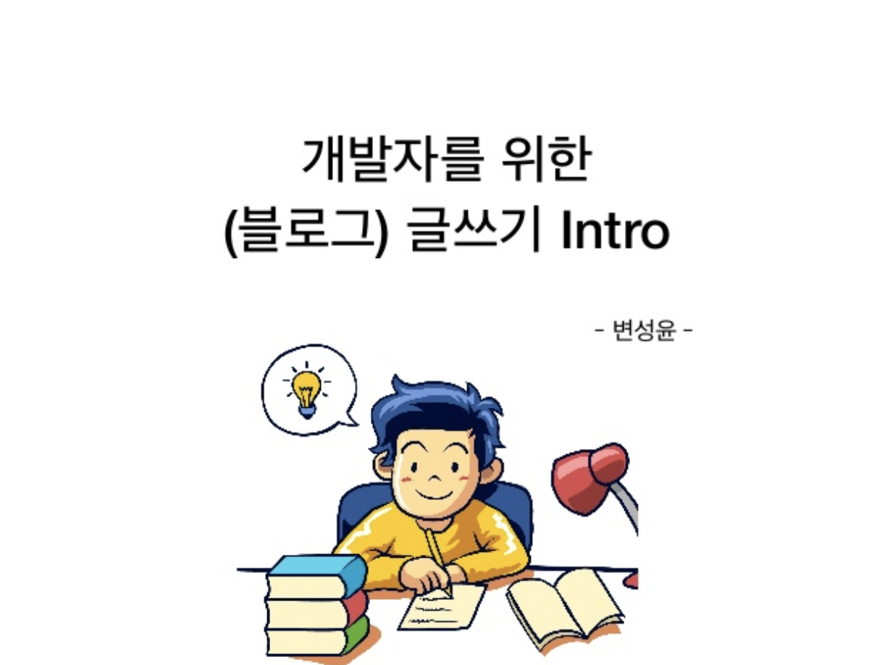

## 2020 Blog plan


### 👨🏻‍💻2019년 회고 돌아보기



> `👨🏻‍💻 현재 무려 2달이나 지났지만 잘 하고 있는게 있는지 참 부끄럽다.`

## 👨🏻‍💻현재 BLOG

2019년 작성한 글

```
 -[Koa] Koa에서 JWT 사용하기
 -[React] StoryBook Tutorial
 -[React] Todo-Application
 -[React] KOA 서버사이드 렌더링
 -[React] Typescript React Hook 정복하기
 -[React] Eslint & Prettier 적용하기
 -[React] Aws cloud Front Deploy]
 -[Koa] Server 구축 -[SERVERLESS] 튜토리얼
```

> 대부분 튜토리얼이다.
> .... 너무 소홀했던 한해다.

## 👨🏻‍💻NEW 도 전🚀글또4기

### WHY?

항상 블로그 와 역량성장을 꿈꾸지만 미뤘던 `블로그`

그러다 우연히 `[글또]!!`라는 것을 발견하게 되었고


[변성윤님](https://www.slideshare.net/zzsza/intro-102870757)에 "백수들의 Conference"에서 발표한 개발자를 위한 (블로그) 글쓰기 intro을 읽고
내블로그에 심각성을 알게 되었다

현재 내가 필요한 커뮤니티 모임 같아서 신청을 하게 되었다.
나도 당당하게 누군가에게 도움이 되는 블로그를 목표 🙏🏻🙏🏻

### WHY? BLOG & 다짐

> `글쓰는 능력`과 개발 능력은 비례 한다고 느낀다.
> 나는 어떤 능력을 가지고 있고 어떻게 설명을 할수 있는가?
> 또 내가 어떻게 이해를 했는지 하나의 블로그가 하나의 회고가 될수가 있다고 생각이 든다.
> 피드백을 받으면서 다른사람에 `능력(블로그)`을 보면서 성장할수 있는 환경을 제공해주는 `하나의 공간`이면서
> 현재 나를 설명할수 있다고 생각한다.

### 👨🏻‍💻HOW?

1. 일단 내가 알고있는 지식을 정리
   (FE 관련)

   - 튜토리얼
   - 개념정리

2. 개인프로젝트

3) 공부하기 & 스터디

   - 책 요약 (HTTP완벽가이드)
   - 내 스타일로 요약

4. 회고
   - 자주 회고를 작성하자

5) Medium 블로그 번역
6) 세미나 & 레퍼런스
   - 코로나 때문에 하반기 예상🧐

## 감사합니다!)🙏🏻
