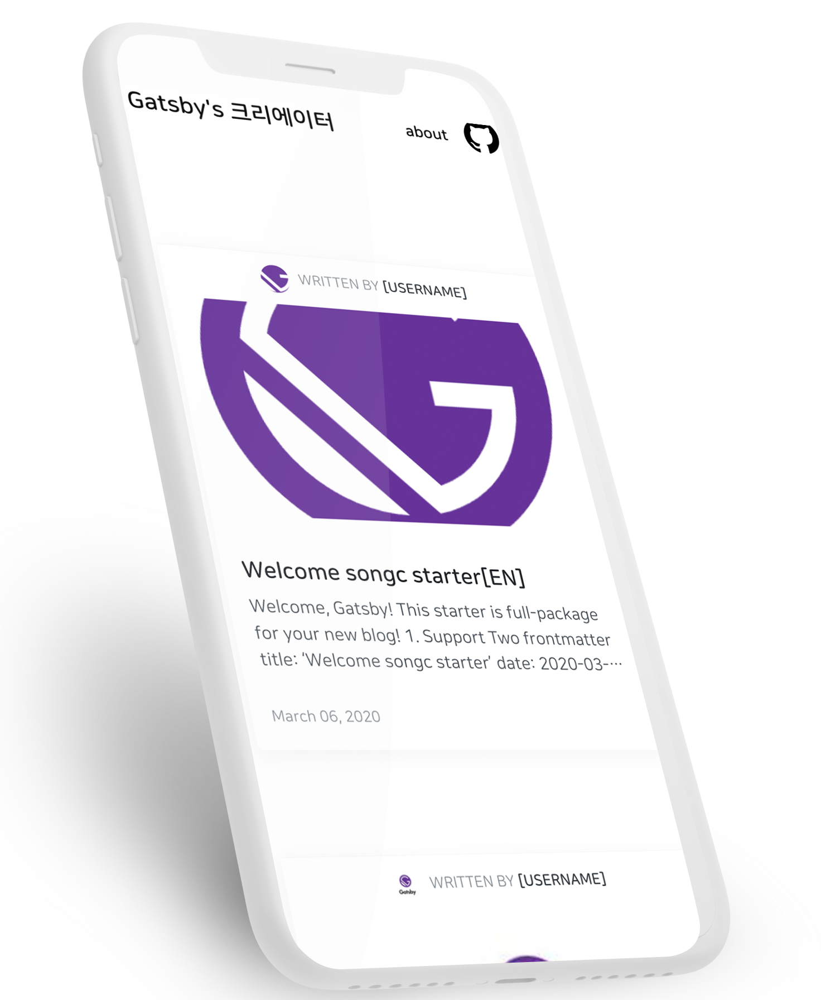
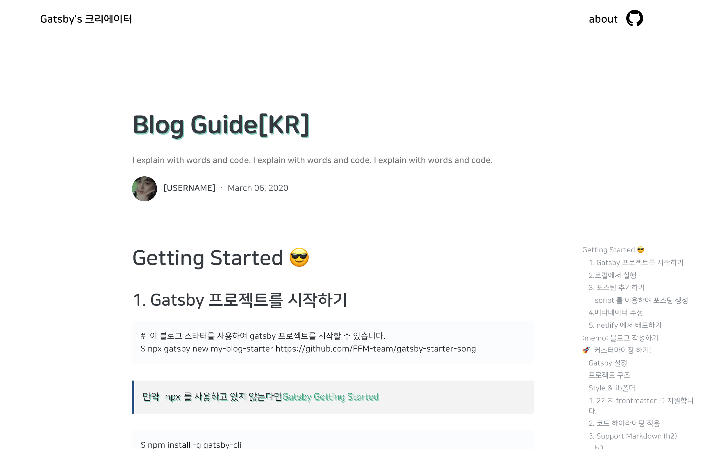
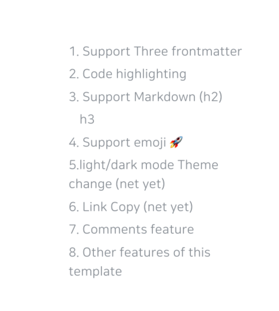
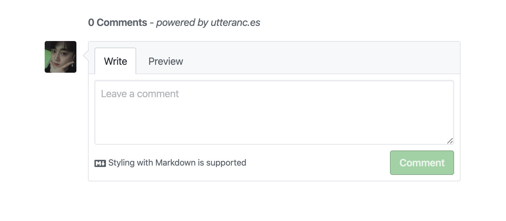

항상 한번쯤은 만들고 싶었던 블로그 템플릿 프로젝트를 마무리해서 글을 써봅니다.

## 👨🏻‍💻Choose Tool

제가 선택한 라이브러리는 [Gatsby](https://github.com/gatsbyjs/gatsby) 선택한 결과는 매우 만족입니다. 사실 React 기반의 Static Web Generator 중 가장 거대한 Framework라고 생각되며 이미 거대한 ecosystem 덕분에 빠르게 블로그를 만들기 어렵진 않았습니다.이 거의 대부분 plugin으로 만들어져 있어서 가져다가 사용하고 조금씩 customize 과정으로 해결되었습니다.


### 👨🏻‍💻Template

이 블로그는 [gatsby-starter-song](https://github.com/FFM-team/gatsby-starter-song) template을 기반으로 만들어졌습니다.

### 👨🏻‍💻Deploy

Github 블로그이기 때문에 보통 git-page 로 배포를 하였지만 이번에는 [netlify](https://netlify.com)를 사용했는데, 편리하고 좋게 사용한거 같습니다. 기본적인 deploy 기능, Preview feature, DNS Setting, SSH setting 등 부가적으로 제공하는 기능들이 편리하여서 기본적인 포트폴리오나 페이지를 올리고 싶을때는 자주 사용할거 같습니다.

## 👨🏻‍💻 UI 및 구조


**simple하고** **깔끔한** 블로그 UI 담을 수 있을지 고민했습니다.

### 프로젝트 구조

```
src
├── components // Just component with styling
├── layout // home, post layout
├── lib
│    ├── remark
│    │      └── prismPlugin.js
│    ├── styles
│    │    ├── media
│    │    ├── palette
│    │    ├── responsive.ts
│    │    ├── transitions.ts
│    │    ├── utils.ts
│    │    ├── zIndexes.ts
│    ├── heading.ts
│    └── utils.ts
├── pages // routing except post: /(home), /about
├── static
├── lib
│     └── blog-post.tsx
├── utils
├── lib
└── templates
└── typography.css

```

## 👨🏻‍💻Readability

블로그는 글이기 때문에 가독성이 중요하다고 중요하다고 생각을 했습니다.



### Font

일반 글씨체에는 [NanumSquareRounds](https://github.com/innks/NanumSquareRound) 폰트 사용 한글 폰트가 모바일 웹 상태를 오고 갈때 가장 잘읽히는 폰트라고 생각이 들어서 적용했습니다. Code snippets에는 [Fira Code](https://github.com/tonsky/FiraCode) 폰트를 적용했습니다.

### Post Toc

h1 h2 h3 를 구분하여 Post Toc 구현으로 목차를 만들어서 가독을 높히고자 하였습니다.



### Styling

src/lib/styles` 디렉토리에서 CSS관련 속성

```
│    ├── styles
│    │    ├── media
│    │    ├── palette    ( color 모음)
│    │    ├── responsive.ts  ()
│    │    ├── transitions.ts (트랜지션)
│    │    ├── utils.ts (css 관련 Utils)
│    │    ├── zIndexes.ts (z-index)
│    ├── heading.ts (h1, h2, h3, tag 읽기 )
│    └── utils.ts (유틸함수)
```

## 👨🏻‍💻Features

일반적으로 '블로그'라는 것을 생각했을 때 기본적으로 보고 좋았던 기능 및 부분들을 추가해서 넣어서 적용을 해놓았습니다. 또 계속해서 개선하려고 고민중에 있습니다.

### Comments



[utterances](https://github.com/utterance/utterances) github 아이디로 바로 적용이 가능하고 issue로 바로 등록되어서 관리가 더 편해보여서 선택을 하게 되었습니다. 이미 gatsby 블로그에 적용하고 계신 분의 코드를 참고하여 금방 추가할 수 있었습니다.

### GA, RSS

다음 gatsby plugin 두 가지를 사용했습니다.

- gatsby-plugin-feed
  - `${siteUrl}/rss.xml` 을 통해 접근할 수 있습니다.
- gatsby-plugin-google-analytics
  - **Tranking ID**만 config를 통해 설정해주면 바로 연동이 가능합니다.

## Configurable

gatsby로 프로젝트를 생성하게 되면 `gatsby-*`라고 config 파일들이 생성됩니다. 이 부분에서 template에 특화된 `gatsby-meta-config.js` 설정 파일을 하나 더 만들어서 설정으로 여러 부분을 손쉽게 수정할 수 있도록 했습니다.

### References

- Velog (https://velog.io)
- gatsby-starter-song (https://github.com/FFM-team/gatsby-starter-song)
- gatsby-starter-blog (https://github.com/gatsbyjs/gatsby-starter-blog)
- overreact.io (https://overreacted.io)
- Medium (https://medium.com/)
- https://www.gatsbyjs.org/starters/ (https://www.gatsbyjs.org/starters/)
