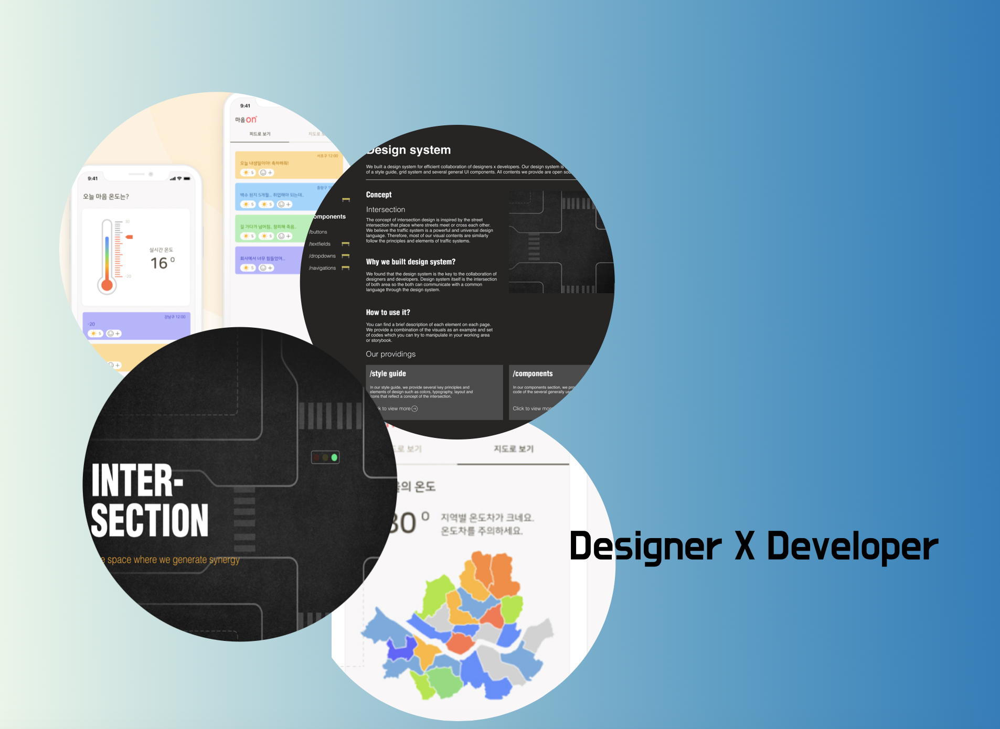
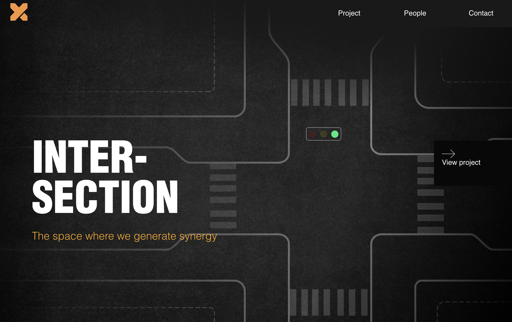
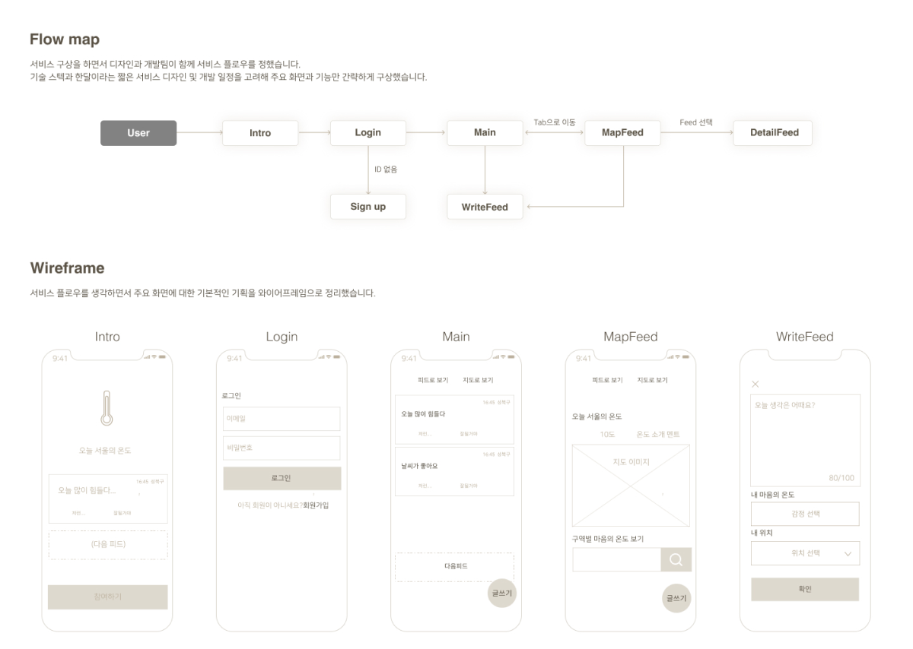
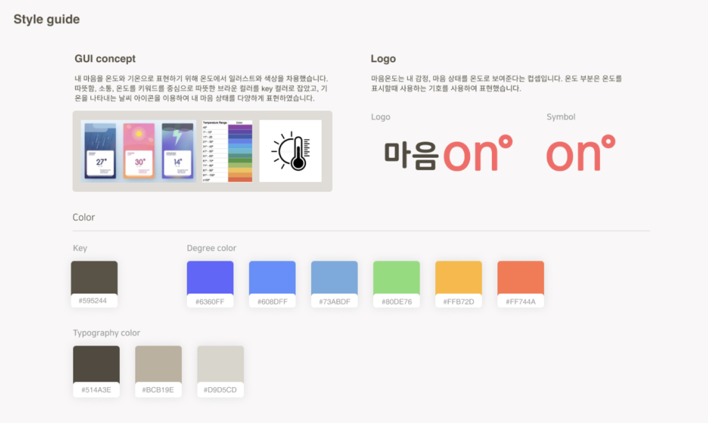
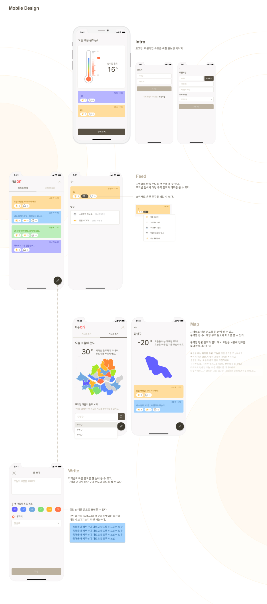
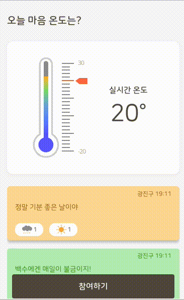

⚠️ 저의 지극히 경험으로 제 생각으로 담은 글입니다.

## INTRO

다니던 회사가 망했다...

회사를 골랐을 때 같이 성장할 수 있는 이 회사를 골랐다고 생각을 했고, 내 목표는 끊임 없이 성장하고 항상 재밌게 일하는 것이다. 항상 이러한 것을 채우기 위해서 실현하기 위해서 고민과 노력을 했던 거 같다. 하지만 회사가 없어졌다.

## 새로운 프로젝트

일을 정말 열심히 하고 싶은데 좋은 Mental로 다시 일을 하고 싶었기 때문에 치유를 개발로 한번 해소하고 싶었다.
잠시 쉬면서라도 무언가 하고 싶어졌다.

그래서 프로젝트 시작!!

디자이너와 개발자 함께 교차점이 되어서 할만한게 없을까? 로 같이 시작을 하게 된 `INTER-SECTION` 서로 다른 목적과 능력을 가진 사람들이 만나 교류하고 소통하는 접합점이라는 identity로 시작을 했다.

### Plan

- 01 사이드프로젝트 (마음온도)
- 02 `INTER-SECTION` 페이지
  

- 03 Design System (~ing)
  > 현재 진행하고 있는 Design-System 은 완성이 되면 포스트를 할 예정입니다.

## 01. App (가제: 마음온도)

- 기획
- 디자인
- 개발

### 소개

마음 온도는 모바일 웹 기반의 익명 소셜 미디어(SNS) 서비스. 사용자는 짧은 글귀로 생각을 공유하고 기온을 나타내는 색으로 마을의 온도를 표현하고 사용자의 글과 마음의 온도를 일기예보와 같은 형태로 지역별 마음의 온도를 보여주어 사람들과의 소통과 공감을 이끌어내도록 유도하는 앱

### 과정

## 아쉬운점

물론 이 프로젝트를 진행 할때 대단한것을 만들거야 좀더 기술적인것을 만들거야라는 생각을 가지고 접근한 프로젝트는 아니였다. 나의 경우는 좀더 초심으로 돌아가 무언가를 하고 싶다라는 생산을 해보자가 첫번째 이유였고, 두번째는 비즈니스 모델이 아닌 단순히 재밌게 생각해볼 요소가 있었다.
온도라는 컨셉과 컬러라는 매칭으로 표현하는것이 재밌어 보이고 다양하게 활용할수 있는 background 라고 생각을 했다.

처음 기획과 의도를 생각을 할때 항상 데이터가 많을것을 가정하고 그것에 대한 데이터를 기반으로 프로젝트의 완성도를 고려했다. 하지만 사용자가 많을거라는 전제 부터가 일단 첫번째 오류를 범했고, 사용자가 이 앱을 써야하는 당위성이 부족하지 않았나? 하지만 전체적으로 컨텐츠 분석이 부족했던거 같다. 사용자 분석을 했을때 배경지식과 당위성이 없다면 사용하기는 힘든 프로젝트라는 아쉬움이 느껴졌다.

## 경험

아쉬움이 많이 남는 프로젝트이긴 하지만 충분히 개선과 보안을 한다면 좀 더 다양한 데이터로 사용되면서 많은 데이터적으로 표현할수 있는 요소들이 많을거 같다고 생각을 했다. 그리고 이번에는 `framer-motion` 이라는 애니메이션 사용하면서 인터렉션에 묘한 매력을 느낀거 같다.
가장 얻은 요소가 있다면 디자이너분과 실무가 아닌 외적으로 같은 비즈니스를 디자이너의 접근방식, 개발자의 접근 방식을 경험할 수 있어서 흥미로웠다.

아래는 framer-motion을 해서 적용해본 animation 입니다.

## 이 글을 마치며

현재 나는 얼마전에 어떤 문구를 보았다.
"개발자의 가치는 비즈니스를 구현하는데 있다" 라는 말을 보았는데 정말 많은 가치를 구현하고 싶다는 생각을 했다. 일단 역경을 겪었지만 이것 또한 재밌는 경험이라고 생각하고 다시 긍정적으로 가치를 구현하고 싶다.

감사합니다.🙏🏻
