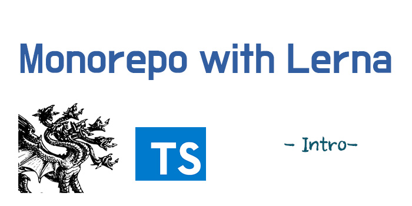
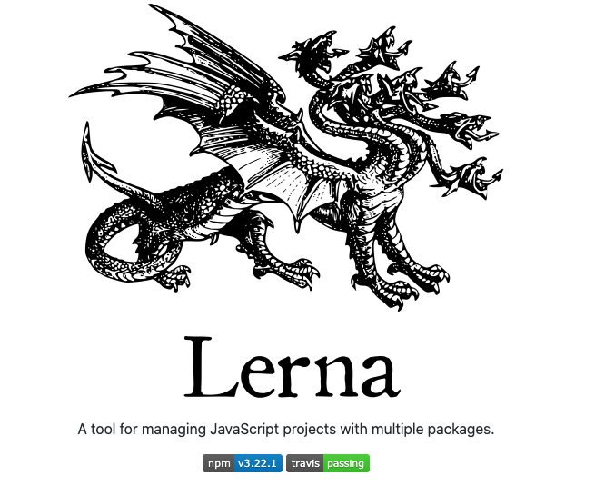

⚠️ monorepo 시리즈를 통해서 monorepo 개념과 monorepo에서 package 환경 구축을 다뤄 보도록 하겠습니다.

## Monorepo

쉽게 정의를 하자면 다양한 모듈을 하나(mono)의 Repository 로 관리 하겠다 라는 정의를 할 수가 있습니다.

좀 더 풀어서 이야기 하자면 Monorepo는 두개이상의 프로젝트, 모듈을 관리 하는 `software development strategy`이라고 말할수 있고
현재 이미 많은 facebook, Google, Circle CI,Open source Project 외 많은 기업에서 도입해서 사용하고 있습니다.

### When

동일한 모듈을 다른 프로젝트에도 적용해서 사용해야 할 경우가 생깁니다. 

> ex) admin 프로젝트, 어떤 UI Components Project 도 해당 될수도 있습니다.

웹과 앱을 만들때 웹 => 앱 개발을 할 경우 사용했던 로직 혹은 모듈을 공유하기 위해 Monorepo 사용

### Advantages

- 코드의 재사용
- 의존성 관리
- Refactoring
- 원자 단위 변화
- 협업

### 코드의 재사용

MultiRepo 로 프로젝트를 진행을 하게 되면 비슷한 로직 또는 같은 의존성 추가하여 사용할 때가 많습니다.
monorepo 에서는 더 이상 공통로직을 또 작성하지 않고 더 이상 같은 세팅을 위해서 복붙을 하지 않아도 됩니다.
만약 첫번째 로직을 사용하던 곳에서 버전 문제로 문제가 생긴다면 모든 레포에서 package.json 에서 수정하여 사용하게 될수 가 있습니다.
만약 monorepo 로 사용하여 lerna 로 관리를 한다면 lerna boostrap 명령으로 수정을 할 수 있게 됩니다.

### 의존성 관리

또 `eslint`, `prettier` 등 초기 환경 설정도 각각 설치해야 하는 번거로움이 생기지만 하나의 repo 로 의존성 관리를 용이 하게 할수가 있습니다.

> 물론 공통 환경 설정 template 를 사용하여 관리를 하면 초기설정의 번거로움은 없어 질수 있지만 결국 그것 또한 각각 설정을 하는 개념과 같습니다.

### 리팩토링

프로젝트 간의 하나의 커밋으로 해결을 할 수가 있습니다. 쉽게 말해서 멀티레포 일때는 각자 다른 많은 양의 리팩토링을 하나하나씩 해야 하지만 또 공통된 로직이 많은 사람들과 함께 사용되기 때문에 효율적으로 로직을 리팩토링을 하게 되고 또 많은 사람이 공통적으로 하나의 로직의 컨트리뷰터가 되기 때문입니다.

### 원자 단위 변화

Multi Repo에서 IF 로고가 바뀌었다면 만약 10개의 프로젝트라면 최소 10의 커밋과 10의 PR 이 일어나게 될것입니다.
이러한 번거로움을 하나의 커밋 하나의 Pull Request 로 처리 할수가 있습니다.

### 협업

보통 프로젝트 마다 Assignees가 있고, Maintainer 가 있어서 담당 프로젝트로 분리가 되어있지만 모든 Member가 코드의 접근하고 누구에게나 코드오너쉽이 모두에게 있습니다.

### HOW

MonoRepo를 구축을 하기 위해서는 의존하고 있는 패키지를 연결해서 사용을 해야 하는데 직접하면 번거롭기 때문에 아래 링크에 많은 도구가 있습니다.
[https://github.com/korfuri/awesome-monorepo](https://github.com/korfuri/awesome-monorepo)

저는 Lerna 를 사용하겠습니다.

## [Lerna](https://lerna.js.org/)란?

쉽게 말하면 Monorepo 를 구성하는 라이브러리라고 보면 될거 같습니다.

다시 말하자면, 단일 Repo에서 Packages 구성과 프로젝트 빌드 및 테스트와 전체 변경을 할때 용이 합니다.

### Lerna 사용법

[README.md](https://github.com/lerna/lerna) 의하면  

> What can Lerna do? 
> The two primary commands in Lerna are lerna bootstrap and lerna publish.
> bootstrap will link dependencies in the repo together. publish will help publish any updated packages.

`lerna bootstrap` , `lerna publish` commands 를 대표적으로 사용 하고 `bootstrap`은 각각 패키지들의 의존을 설치하고 Link 한다
`publish` 업데이트 이후의 있었던 패키지를 배포를 역할을 한다고 되어있습니다.

그 외에 더 많은 [Commands](https://github.com/lerna/lerna/tree/master/commands)확인 해보시기 바랍니다.

다음 포스트에서 monorepo 환경 설정 및 구현하기 (with lerna) 다뤄 보도록 하겠습니다.

감사합니다.🙏🏻

## References

> - [https://github.com/lerna/lerna](https://github.com/lerna/lerna)
> - [https://github.com/korfuri/awesome-monorepo](https://github.com/korfuri/awesome-monorepo)
> - [https://en.wikipedia.org/wiki/Monorepo](https://en.wikipedia.org/wiki/Monorepo)
