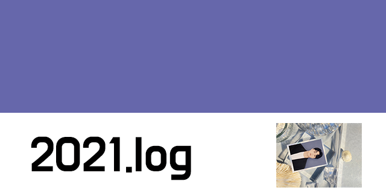

1월 다 지나서 쓰는 2021 회고 😅

2022년이 되어, 회고를 작성하려고 합니다. 2022년이 되어 버렸지만 2021년은 올해로 지칭합니다.
회고는 이직, 회사에서 경험했던 것과 개인적으로 경험했던 것으로 나눠서 회고하려고 합니다.

## TL;DR

- 2021 회사 경험
- 2021 개인 경험
- 요즘 드는 생각
- 마무리

## 2021 Work 경험

### 새로운 환경

2021년 1월부터 새로운 회사에서 시작(3번째 회사)

서비스 도메인이 사실 낯설고 어려워서 잘 적응을 할 수 있을까 했던 스스로에 대한 의문이 있었다. 아직도 내가 현재 도메인에 잘 알고 있다고는 말 못할 거 같다. (열심히 노력중📝)

1월 당시에는 구성원이 20명 이 조금 넘었는데 현재 구성원이 현재 90명이 넘어 버릴 만큼 급속도로 조직이 성장했다.
제품은 빠르게 성장하고 있고 직면하고 있는 문제와 프로덕트로 풀어야 할 문제들은 많다.

### 성장📈

> 오! 회사가 급성장을 하고 있네? / 나는 얼마나 기여했을까?

두 가지 생각이 공존했던 한해였다.

회사원가 개발자가 다른지는 모르겠지만 (조직원 vs 개인)이라고 지칭하자면
조직원으로써 급성장하는 회사에 경험하고 성장하고 있는 일원이라는 것은 기쁘고 좋다.

하지만 한편으로는 개인적으로 개발자로서 급성장하는 회사만큼 내가 크게 성장하고 있는지는 다르기 때문에 두가지 생각이 공존했던거 같다.

### 팀(챕터)빌딩🧑‍🤝‍🧑

회사를 입사하고 나서 힘들면서 가장 흥미로웠던 것은 팀 빌딩이 되는 과정이어서 프론트엔드 구성원에 필요한 개발,자동화, 문서, 코드리뷰, 컨벤션, 배포, 빌드 등등 처음부터 빌딩하는 작업을 기여하고 논의하고 진행을 경험해볼 수 있었다

물론 이미 잘가춰진 조직에서 더 좋은 방법을 고민을 할수 있지만 실행 착오를 겪는다는것도 충분한 좋은 경험이었다.

### 고민🧑🏻‍🔬

스타트업에서 중요한 것은 좋은 코드도 중요하고 좋은 설계도 중요하지만 빠르게 조직에 가설을 빠르게 실험을 해보기 위해서 속도도 매우 중요하다.

2021 목표중에 하나였던 것은 조직에 생산성을 효율적으로 높히는 것을 기여해보고 싶다는 목표로 올해 일을 임했던거 같다.

[올해 시도해 보았던것들]

- 디자인시스템
- yarn berry 마이그레이션
- 마이크로프론트엔드
- OpenAPI Generator

## 2021 개인 경험

### 루비콘

올해 회사일을 제외하고 가장 많은 시간을 보냈다고 말할수도 있을만큼 2021년 비중이 큰 경험이였다.

평소에 개인적으로 사이드프로젝트를 할때 Agile 방법론하지 못했던거 같다.
스타트업 처럼 사이드 프로젝트를
이번 경험은 사실 생각보다 나의 많은곳에 영향을 끼쳤다

- 설득하는 법
- 나에 대한 estimation
- MVP
- 피드백
- 회고

[루비콘 프로젝트 엿보기](https://blog.songc.io/etc/%EB%A3%A8%EB%B9%84%EC%BD%98-%EB%A9%98%ED%86%A0%EB%A7%81-%ED%94%84%EB%A1%9C%EC%A0%9D%ED%8A%B8/)

### 블로그

올해 글을 많이 적지 못했다.

- [TailwindCSS 톺아보기 with styled-components](https://blog.songc.io/react/how-to-use-tailwind/)
- [프론트엔드에서 OpenAPI Generator 사용하기](https://blog.songc.io/react/openapi-generator/)
- [https://blog.songc.io/react/react-form-control/](https://blog.songc.io/react/react-form-control/)
- [루비콘 멘토링 프로젝트 (스타트업 처럼 토이프로젝트 하기)](https://blog.songc.io/etc/%EB%A3%A8%EB%B9%84%EC%BD%98-%EB%A9%98%ED%86%A0%EB%A7%81-%ED%94%84%EB%A1%9C%EC%A0%9D%ED%8A%B8/)
- [프론트엔드 면접의 모든것 with Clelab](https://blog.songc.io/development/clelab/)

> 위 블로그도 거의다 상반기 글이다.

생각보다 블로그를 쓰지 못했다. 여러 핑계가 떠오르지만 다시 반성에 시간을 가지고 올해는 1달에 한번은 꼭 블로그를 쓸수 있도록 계획을 해본다.

추가적으로 작년부터 계획이 였던 블로그 개편을 진행하려고 한다.

## 요즘 드는 생각

### 사이드 프로젝트

올해 이런저런것을 준비하면서 누군가가 왜 사이드프로젝트를 왜 하세요? 라는 질문을 받았을때 뭔가 속시원한 답을 하지 못했다.

1년차 2년차 이때는 사이드 프로젝트를 해야만 개발자로 성장을 할수 있다고 생각해서 시작을 한것인데 요즘 드든 생각은 아닐수도 있겠다에 치우쳤다.

추구하는 개발자가 비즈니스 임팩트를 줄수있는 개발자인데 사이드 프로젝트는 비즈니스와는 멀수도 있겠다라는 생각을 종종하곤했다.
이런생각을 하면서 나는 사이드 프로젝트를 해야하는 이유를 설득을 못할거 같다는 생각이 잠시 들었다.

사실 사이드 프로젝트는 다양한 목적이 될수 있다.

- 공부
- 비즈니스 (가설 실험)
- 필요한 만들다 (기여, 활용)

사이드 프로젝트나 스터디는 영양제라고 생각을 한다. 회사에서 주된 영양소를 채우지만 나 스스로 영양소를 채우고 싶고 부족하고 모자란부분을 채우기 위함이라고 생각을해서 영양 보조식품 같은 존재라고 생각하면 조금은 납득이 되지 않을까

> (내년 2022년) 다시 관점이 바뀔수도 있을거 같다.

### 성장

개발자로서 사람으로 성장을 하는게 중요하다고 생각한다 필자는 개인적으로 성장을 너무 어렵게 받아 들이지 않았고 단편적으로는 내가 어제의 고민과 오늘의 고민이 달라졌다면 어느정도 성장을 했다고 생각을 했다.

요즘 드는 생각은 조금 나만의 성장의 높이 너무 낮은게 아닐까라는 생각이 들었다.

- 목표를 세우고 목표를 이루었을때 느끼는 감정
- 고민이 폭이 넓어질때 (고민이 달라짐을 느낄때)

본질과 다르게 환경 변수로 성장이라고 느꼈던건 아닐까 라는 의심이 들었다.

2022년은 스스로 1on1을 해보면 어떨까 한다.
성장을 객관화 할수는 없지만 내가 겪은건 내가 가장 잘 알지 않을까?

## 마무리

**2021년, 느낀 점**

- 테니스를 시작했다.
- 서비스가 성장하고 있다.
- 올해도 사진을 남겼다.
- 기본기를 다시 공부하자

### 2022 목표

- 무엇이든 꾸준히
- 올해에 이여서 조직에 필요한 프로덕트 기여
- 오픈소스 라이브러리에 기여해 보기
- 꾸준한 블로그
- 건강관리
