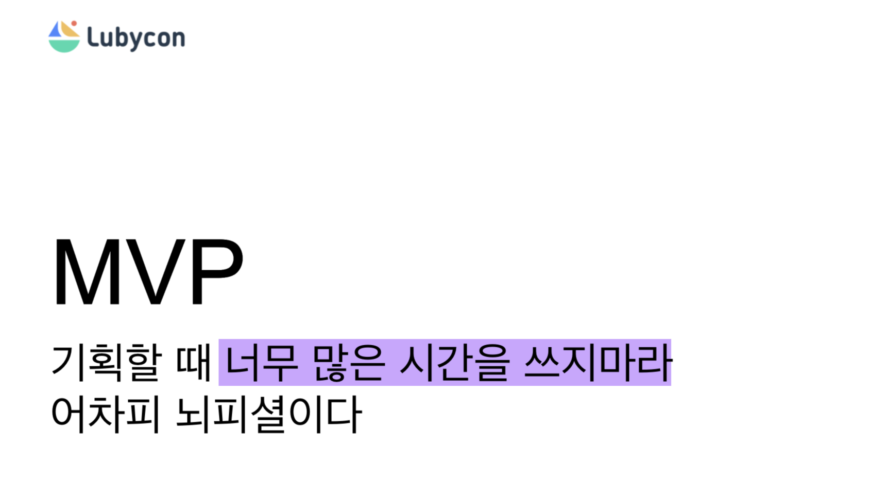
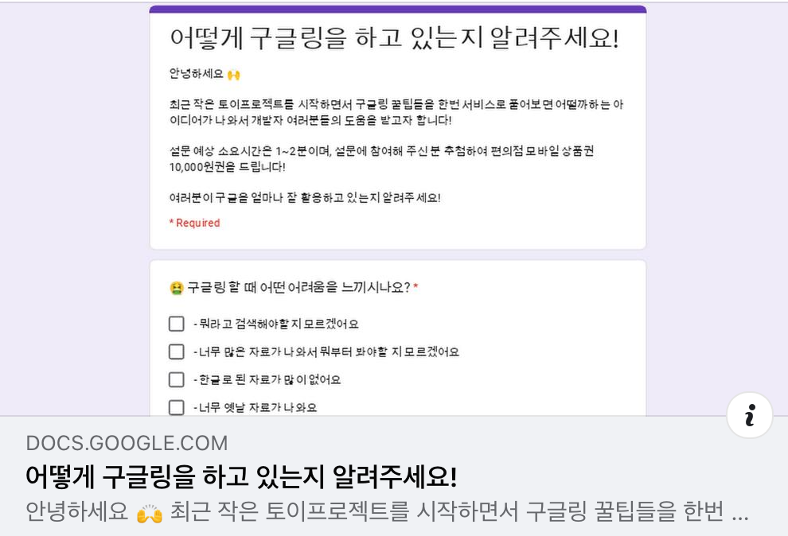
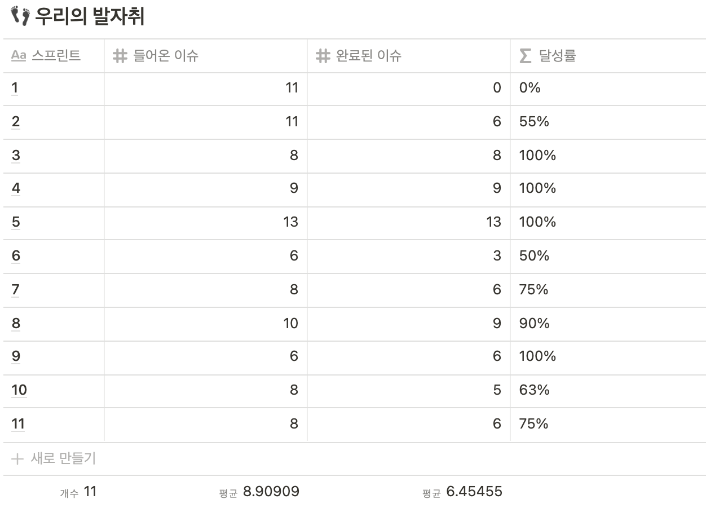
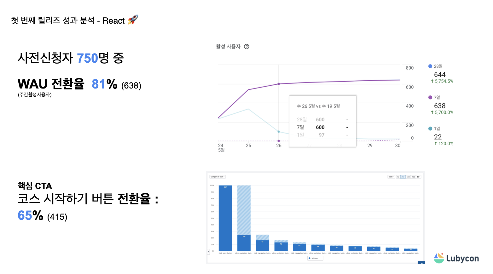
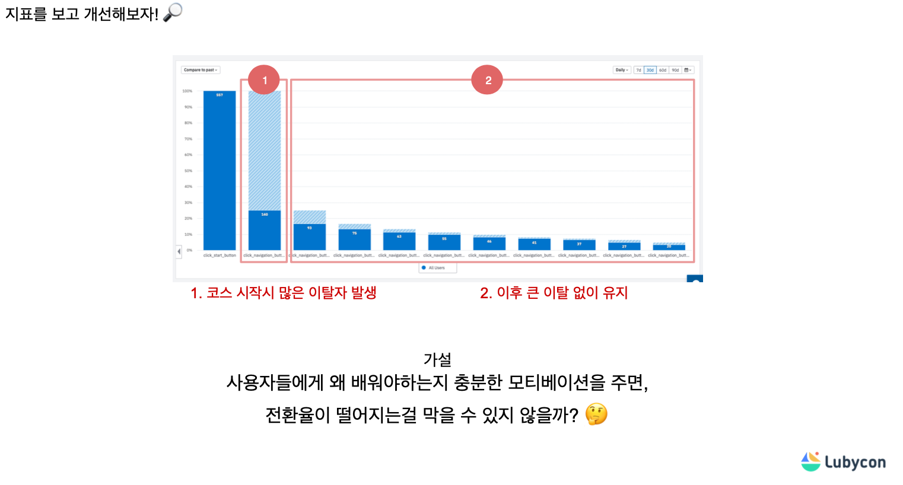
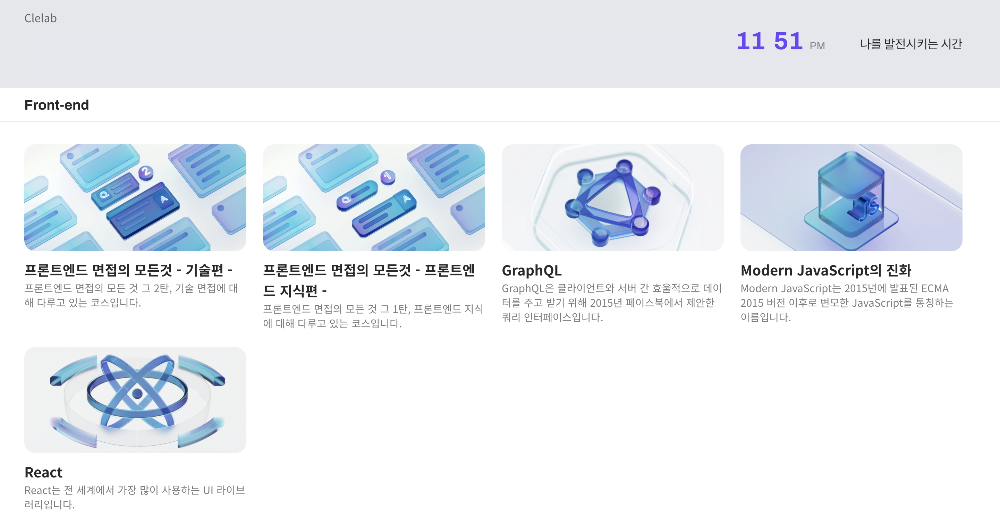
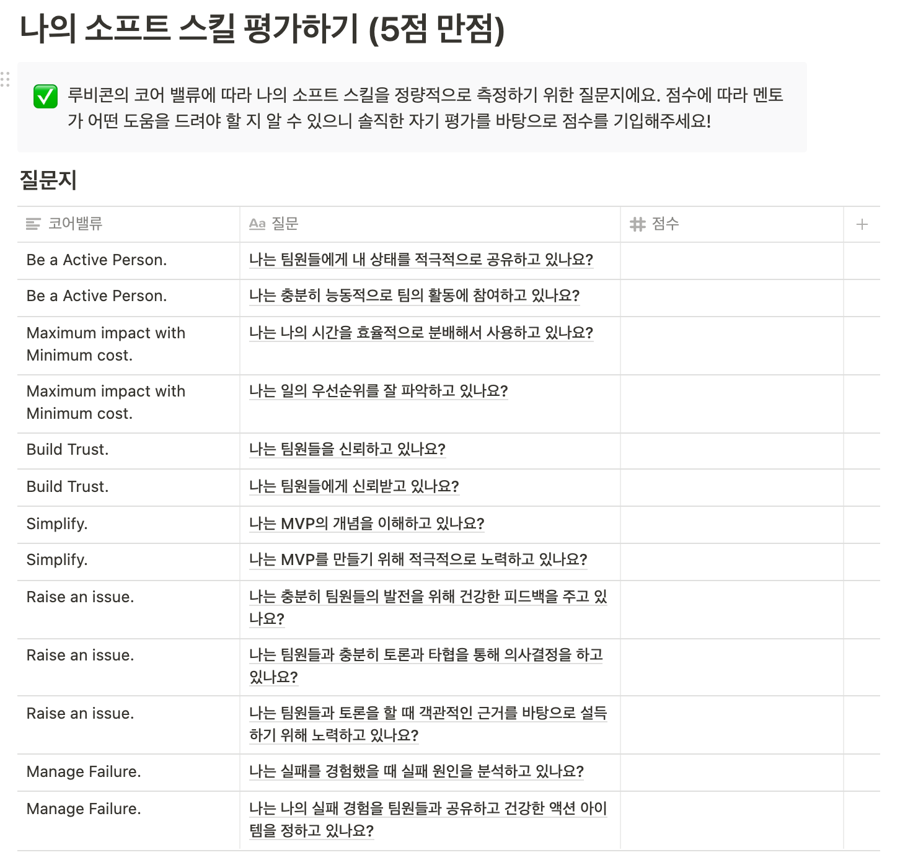

⚠️ 3개월 간에 루비콘 멘토링 프로젝트를 마치며 경험을 담은 글입니다.

## INTRO

누군가가 개발자로서 성장을 하기 위해서 어떤걸 해야하나요? 라는 질문을 받는다면 여러분은 어떻게 답변을 해주실건가요?

일을 잘하기 위해서 공부를 한다거나,
토이 프로젝트를 시작하거나, 공부를 한다거나 다양한 방법이 존재합니다.

필자는 토이프로젝트(멘토링 프로젝트)를 했던 경험을 써보려고 합니다.
토이 프로젝트에 관심이 있거나, 소프트 스킬을 성장하고 싶은분에게 조금이라도 도움이 되면 좋을거 같습니다.

- Lubycon 멘토링 이란?
  - Lubycon 이란?
  - 멘토링 목표와 대상
  - 진행방법
- 👏 Clelab 만들기 (토이프로젝트)
  - 아이데이션
  - MVP 기능 정의
  - Agile 방법론
  - Data Driven Development
- Lubycon 멘토링 장점
  - 멘토링 세션 발표 및 올핸즈 미팅
  - frontend chapter meeting
  - 개인 회고
  - 다양한 직군과 소통
- 마무리

## Lubycon 멘토링

[루비콘 멘토링](https://lubycon.io/mentoring/intro/) 프로젝트에 참여한 멘티들은 프론트엔드 개발자, 백엔드 개발자, 프로덕트 디자이너가 한 팀이 되어 3개월 동안 제품을 개발하게 됩니다.

### Lubycon 이란?

[Lubycon](https://lubycon.io/)국내 IT업계에 선한 영향을 만들어내고 싶은 개발자들과 디자이너들이 모인 팀입니다.
다른 사이드프로젝트 동아리와 공통점으로는 팀 단위로 사이드프로젝트를 진행하지만 차이점은 프로젝트속에서 스터디, 멘토링, 커뮤니티, 오픈소스 개발등 다양한 활동이 활발하게 이루어지고 있습니다.

### 멘토링 목표와 대상

🎓 이런 것을 경험할 수 있어요!

- 단순한 제품 개발이 아닌 문제를 정의하고, 이 문제를 제품을 통해 해결하는 방법
- 최소 비용으로 최대의 임팩트를 만들어 낼 수 있는 MVP 정의
- 국내외 스타트업에서 사용하는 다양한 협업 방법론
- 나와 같은 직군들이 모여서 함께 하는 기술/디자인 토의

👉 이런 사람들이 참여하면 좋아요!

- 동료들과 건설적인 피드백을 주고 받으며 성장하고 싶은 분
- 혼자 하는 제품 개발이 아니라 다양한 직군과 협업하는 경험을 쌓고 싶은 분
- 나름 열심히 공부하고 있는데 내가 맞는 방향으로 나아가고 있는지 확신이 없는 분

### 진행방법

🗓일정

- week 1 ~ 3: 팀별 아이템 선정 및 기획
- week 4 ~ 6: 디자인 및 개발 진행
- week 7 ~ 9: 프로젝트 중간 점검
- week 10 ~ 12: 프로젝트 릴리즈 및 최종 결과 공유

 

## 👏 Clelab 만들기

## 아이데이션

⚠️ 팀이 모두 공감할 수 있고 동의 하는 아이디어로 주제 선정!!

토이프로젝트에서 사실 중요한것은 내가 이게 재밌는가? 동기부여가 되는가? 라는 초점으로 팀원이 모두가 동의하는 주제로 선정하는 과정을 거쳤습니다.

`브레인 스토밍` => `설득` => `구체적 develop` => `투표`

## MVP 기능 정의

아이데이션을 끝마치고 MVP 기능 정의를 하게 되는데요

MVP는 팀이 최소한의 노력으로 고객에 대한 검증 된 정보를 최대한 수집 할 수있는 새로운 제품 버전이라고 알고 있지만 기능정의는 어디까지 해야 할까요? 🤔

> 루비콘 멘토링 세션에 MVP 발표

우리는 보통 가설을 세울 때 뇌피셜을 많이 사용합니다. 이럴것이다. 이렇게 생각합니다. 이렇게 예측합니다.
그래서 첫번째 기획을 할때 큰 기획을 하지 않고 최소한의 가설을 세운 뒤 가설을 검증하는 단계를 시도 했습니다.

`가설 세우기` => `가설 검증` => `데이터 결과` => `보완`

[가설을 검증하기 위해서 설문 조사를 진행했습니다]

사실 설문조사로 모든 모수를 이끌어낼수는 없지만 설문조사의 결과로 데이터를 분석하여 일치하는 부분은 저희가 세운 가설에 조금이라도 확신을 가지고 제품을 개발하는데 도움이 되었습니다.

## Agile 방법론

루비콘 멘토링 프로젝트에서는 좀더 개발의 제품을 만들기 위해서 애자일 방법론은 (유저스토리, 스프린트, 팀의 포퍼먼스, 개인의 포퍼먼스) 소개하고 권장합니다.

멘토님이 스크럼 마스터 역할을 하면서 1주 단위 스프린트를 진행하였습니다.
플래닝 할때 유저스토리로 작성하고 이번 스크린트를 에스티메이션을 해서 스프린트를 진행하고 회고하는 방식으로 하나의 단위로 진행을 하면서 애자일 경험을 할 수 있었습니다.

`스프린트 Plan` => `스프린트 쳐내기` => `회고`

⚠️ 물론 모든팀이 애자일 방법론을 선택하는것은 아닙니다. 협업 시스템은 팀의 자율적인 재량입니다.

## Data Driven Development

이번 프로젝트는 MVP 가설을 검증하는 전략을 사용했기 때문에 프로젝트의 완성도 보다는 데이터를 빠르게 확보하고 가설의 맞게 기능을 덧붙이고 개선을 하는 방법을 사용했습니다.

[GA](analytics.google.com/), [Firebase](https://firebase.google.com/), [Amplitude](https://developers.amplitude.com/docs) 와 같은 데이터 수집 분석을 할수 있는 SaaS를 직접 사용해서 생각보다 쉽게 데이터를 수집 할수 있었습니다.

지표를 분석하여 또 다른 가설을 추가적으로 수립해보고 또 검증해 나가는 절차를 진행하였습니다.

> 더 자세히 데이터를 어떤방법으로 진행을 알고 싶다면 [clelab 파이널 회고
> ](https://www.slideshare.net/ssuser07357b/data-driven-249502769) 참고해주세요

clelab은 현재도 진행중에 있습니다.

### 👏 Clelab

많은 관심 부탁드립니다. 👉🏻 [clelab 구경하기](https://clelab.io/)

## Lubycon 멘토링 장점

⚠️ 루비콘 프로젝트는 평소에 하던 토이프로젝트와 무엇이 달랐나요?

### 멘토링 세션 발표

[올핸즈 미팅]
매주 2주 마다 온라인 meeting을 합니다. 물론 각팀의 중간 점검 공유하는 시간을 가지면서 어떤 팀은 어떻게 진행을 하고 있는지 내가 하고 있는 팀은 제품을 만들때 어떻게 진행을 하는지 엿볼수 있는 경험을 할수가 있습니다.

그리고 각 분야 (디자인, 백엔드, 프론트엔드, 데브옵스) 멘토님들이 2주 마다 소프트스킬을 성장 시킬수 있는 세션 발표를 들을수 있습니다.

- 연봉협상
- 핵심인재
- 피드백
- 커뮤니케이션
- MVP 개념이해하기

### Frontend chapter 미팅

- 페어프로그래밍 (짝코딩)
- 코드리뷰
- 개발자 (스몰토크)
- 오픈소스 라이브러리 개발

### 개인 회고

2주 마다 `나의 소프트 스킬 평가하기` 스스로 평가 하면서 멘토와 함께 1on1 (커피 미팅)을 통해서 뒤돌아보고 개선해나가는 회고를 하는 시간을 가지면서 소프트 스킬을 성장 시키는 시간을 가질수 있습니다.

### 다양한 직군과 소통

원팀에서도 백엔드, 프론트엔드, 디자이너로 이루어져서 다양한 직군과 함께 소통하면서 일을 해볼수 있지만 슬랙, Gather.town, 페어프로래밍 (짝코딩), 모각작 등을 할수 있게 조성이 되어 있어서 자연스럽게 다양한 직군과 소통을 경험을 할수 있습니다.

## 마무리

3개월이라는 시간이 짧다면 짧고 길다면 길수 있는 시간이지만 3개월동안 제품을 만들면서 린(Lean) 하게 제품 만들기, 소프트스킬 성장시키기, 비즈니스란, MVP, 데이터 분석 과 같은 다양한 경험을 할수 있어서 좋았습니다.

만약 성장을 하고 싶고, 협업의 경험을 하고 싶은 주니어 개발자라면 경험해 보시는걸 추천드립니다.

감사합니다.🙏🏻
