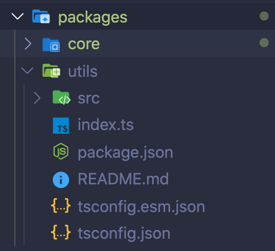
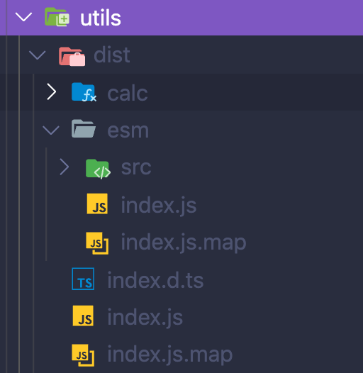
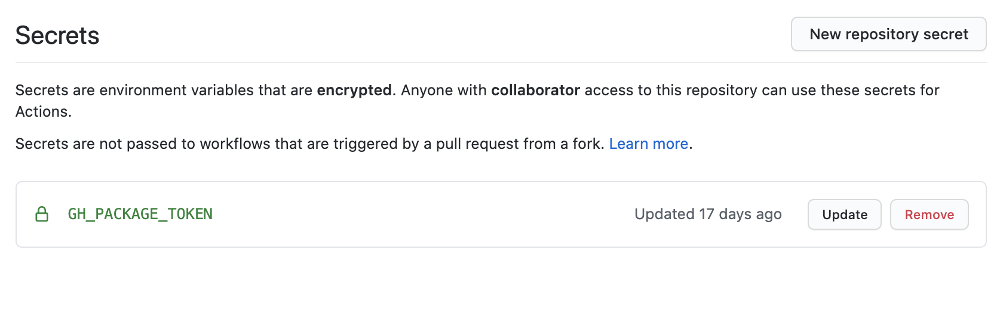
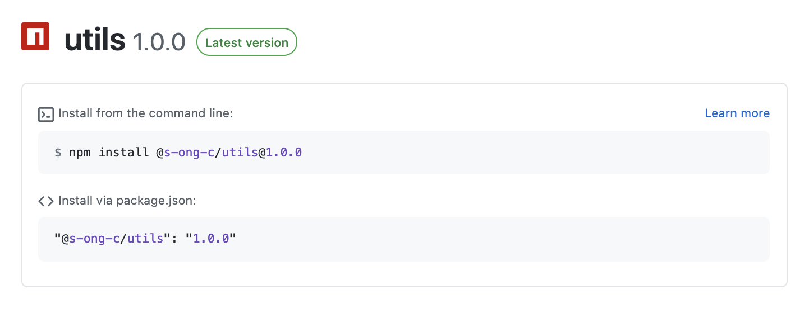

이 글은 (`Designer X Developer 01`)시리즈에서 Design System 환경 구축에 관련한 글입니다.

## 들어가기 전에

이 글은 [Lerna](https://github.com/lerna/lerna)를 사용한 Monorepo에서 packages 환경으로 디자인시스템 구축 방법을 소개하는 글입니다. 들어가기에 앞서 [Monorepo with lerna!](https://blog.songc.io/etc/monorepo-lerna) 를 읽어주셔서 lerna를 이용한 Monorepo 의 장점을 읽어주시면 좋을거 같습니다.

## 디자인시스템이 무엇인가?

`디자인 시스템`이란? Product(웹, 앱 서비스 등등)을 만드는데 디자인 패턴과 원칙을 모아둔 시스템을 말하며, 제품의 규모와 관리비용과 같은 요소들을 효율적으로 사용할 수 있는 장점을 지닌 시스템입니다.
이미 많은 크고 작은 회사에서 고유의 디자인 시스템을 구축하고 있습니다.
**디자인 시스템은 단순이 UI 툴킷을 의미하는 것은 아니라고 알고 있습니다.**

<span style="background-color: #92c7e1">디자인 시스템 !== 디자인 + 개발</span>

> 디자인 시스템은 디자인 + 코드 보다 훨씬 더 큰 요소를 가지고 있습니다.


## 목표

<span style="background-color: #f8baba">사실 디자인시스템은 쉬운게 아니다</span>
많은 시간과 끊임없는 고민이 필요합니다.

이번 프로젝트에 목표는 디자이너와 개발자 교차점인 디자인시스템을 한번 직접 처음부터 구현을 해서 구현을 하면서 좀더 다양한 UI개발에 심도 있는 고민과 성장하는것에 목표를 두었습니다.

## Design System 구축

## 00. package.json 설정

기본적인 환경은 아래와 같습니다.

- yarn2
- storybook(react)
- lerna
- rollup

> yarn2 를 사용하시려면 \$yarn set version berry 으로 생성하시면 됩니다.

## 01. config 파일 설정

우선 공통 tsconfig파일과 rollup.config 파일을 작성합니다.

```js
// rollup.config.js
...

const extensions = [".js", ".jsx", ".ts", ".tsx"];

const isProduction = process.env.NODE_ENV = 'production'

function buildJS(input, output, format) {
  const defaultOutputConfig = {
    format,
    exports: 'named',
    sourcemap: true,
  };
  const esOutputConfig = {
    ...defaultOutputConfig,
    dir: output,
  };
  const cjsOutputConfig = {
    ...defaultOutputConfig,
    file: output,
  };

  return {
    input,
    ... 생략 (https://github.com/s-ong-c/CDD/rollup.config.js)참고
    preserveModules: format === 'es',
  };
}

export default [
  buildJS('index.ts', 'dist/index.js', 'cjs'),
  buildJS('index.ts','dist/esm', 'es'),
];
```

```json
//tsconfig.common.json
{
  "compilerOptions": {
    "module": "es6",
    "target": "es6",
    "lib": ["esnext"],
    "sourceMap": true,
    "moduleResolution": "node",
    "forceConsistentCasingInFileNames": true,
    "noImplicitAny": true,
    "noImplicitReturns": true,
    "noUnusedParameters": true,
    "noUnusedLocals": true,
    "strictNullChecks": true,
    "strict": true,
    "allowSyntheticDefaultImports": true,
    "esModuleInterop": true,
    "declaration": true,
    "emitDeclarationOnly": true,
    "baseUrl": ".",
    "paths": {
      "@/*": ["packages/*"],
      "~/*": ["src/*"]
    }
  }
}
```

## 02. build lerna 설정

```js
{
  "version": "0.0.0",
  "npmClient": "yarn",
  "command": {
    "publish": {
      "ignoreChanges": [
        "*.md",
        "*.txt",
        "test/**",
        "**/test/**"
      ],
      "allowBranch": [
        "main"
      ]
    }
  },
  "useWorkspaces": true,
  "packages": [
    "packages/*"
  ]
}
```

package.json 에 `yarn build`를 추가 해줍니다.

```json
  "scripts": {
    "build": "lerna run build", //lerna build
  },
```

## 03. packages 생성

이제 packages directory별로 build 테스트를 위해서 packages폴더에 utils라는 directory를 생성해줍니다.



```json
{
  "name": "@s-ong-c/utils", //packages 이름
  "description": "Utils for cdd",
  "version": "1.0.0",
  "main": "dist/index.js",
  "types": "dist/index.d.ts",
  "module": "dist/esm/index.js",
  "scripts": {
    "build": "rm -rf dist/ && rm -rf esm/ && tsc --declarationDir dist && rollup -c ../../rollup.config.js",
    ...생략
  },
  "license": "MIT",
  "repository": {
    "type": "git",
    "url": "https://github.com/s-ong-c/CDD.git",
    "directory": "packages/utils"
  }
}
```

> **repository 선언 필수 잘못된 경우에는 나중에 packages 배포시에 404 error가 납니다.**

root 에서 작성했던 tsconfig.common 으로 상속해줍니다.

```json
{
  "extends": "../../tsconfig.common.json",
  "compilerOptions": {
    "target": "esnext",
    "module": "commonjs",
    "declaration": true,
    "outDir": "./dist"
  },
  "include": ["src"]
}
```

### Type 정의 파일 생성 및 rollup.config build

```json
"build": "rm -rf dist/ && rm -rf esm/ && tsc --declarationDir dist && rollup -c ../../rollup.config.js",
```

root 에서 `yarn build`를 하게 되면 아래와 같은 dist 폴더로 build가 성공적으로 됩니다.



## 04. GitHub Packages 배포하기

생성한 packages/utils 를 GitHub Package Registry에 배포를 한번 해보도록 하겠습니다.
위에서 간단하게 설명했듯이 packags/utils 에 package.json `name`과 `repository 경로가` 올바르게 작성을 하셔야지 정상적인 배포가 된다는 점을 유의하셔야 합니다.

공식 NPM[https://registry/npmjs.org/](https://registry/npmjs.org/)이 아닌 GitHub Package Registry에서 다운로드 받는것은 username/packagesName 형식으로 [https://npm.pkg.github.com/](https://npm.pkg.github.com/) 다운로드를 합니다.

### .npmrc 파일 생성

```js
//prefix 설정
@s-ong-c:registry=https://npm.pkg.github.com/
```

### GitAction CI/CD

Github 에서 gitActions를 사용해서 master Merge가 되었을 때 CI/CD를 할 수 있습니다.
프로젝트에서 .github 디렉로리에 `publish.yml`와 `ci.yml`를 생성해줍니다.
<span style="background-color: #f8baba">잠깐 publish 와 ci 작성전에</span>

GITHUB_TOKEN 먼저 발급을 해줍니다.

> Github에서 GitActions을 수행과 GitHub Package Registry 배포를 위해서는 Github package 권한을 가진 토큰을 발급받아야 합니다.

그리고 해당 리포지토리에 접속을 해서 Token 값을 설정을 해줍니다. settings/Secrets 에 key 값을 추가 해주시면 됩니다.


#### ci.yml 작성

```yml
name: CI

on:
  push:

jobs:
  build:
    runs-on: ubuntu-18.04
    steps:
      - name: checkout
        uses: actions/checkout@v2
      - name: Setup Node.js
        uses: actions/setup-node@v1
        with:
          node-version: 12.18.0
      - name: Get yarn cache directory path
        id: yarn-cache-dir-path
        run: echo "::set-output name=dir::$(yarn config get cacheFolder)"
      - uses: actions/cache@v2
        id: yarn-cache
        with:
          path: ${{ steps.yarn-cache-dir-path.outputs.dir }}
          key: ${{ runner.os }}-yarn-${{ hashFiles('**/yarn.lock') }}
          restore-keys: |
            ${{ runner.os }}-yarn-
      - name: Install Dependencies
        run: yarn install
      - name: Build
        run: yarn run build
      - name: Type Check
        run: yarn run typecheck
      - name: Lint Check
        run: yarn run lint
```

#### publish.yml 작성

```yml
name: Release

on:
  push:
    branches:
      - master

jobs:
  deploy:
    runs-on: ubuntu-18.04
    steps:
      - name: checkout
        uses: actions/checkout@v2
      - name: Setup Node.js
        uses: actions/setup-node@v1
        with:
          node-version: 12.18.0
          registry-url: 'https://npm.pkg.github.com'
      - name: Get yarn cache directory path
        id: yarn-cache-dir-path
        run: echo "::set-output name=dir::$(yarn config get cacheFolder)"
      - name: Add GiHub Package Token
        run: echo "//npm.pkg.github.com/:_authToken=${{ secrets.GH_PACKAGE_TOKEN }}" > ~/.npmrc
      - name: Install Dependencies
        run: yarn install
      - name: Deploy new Package
        run: yarn run publish
        env:
          GH_TOKEN: ${{ secrets.GH_PACKAGE_TOKEN }}
          GITHUB_TOKEN: ${{ secrets.GH_PACKAGE_TOKEN }}
          NODE_AUTH_TOKEN: ${{ secrets.GH_PACKAGE_TOKEN }}
```

<span style="background-color: #f8baba">Secrets에서 선언했던 key 이름과 secrets.GH_PACKAGE_TOKEN 동일해야 합니다.</span>

### 배포

merge 후에 CI / CD gitActions 가 동작을 하고 Packages/{packageName} 중에서 version 이 바뀐 패키지는 배포를 하게 됩니다.



## 정리

이전에는 단순하게 스토리 북을 먼저 설정을 하고 components를 구현하였으나 이번에는 좀 더 체계적으로 monorepo를 적용하여 디자인시스템을 구축을 하려고 합니다. monorepo에 장점을 최대한 활용해서 패키지를 나눠서 구현해보고자 합니다.다음 포스트에서는 이제 본격적으로 컴포넌트를 구현하여 배포하고 디자인패턴에 맞게 관리 할수 있는것을 다루도록 하겠습니다.

## Reference

- [https://so-so.dev/pattern/mono-repo-config/](https://so-so.dev/pattern/mono-repo-config/)
- [박성룡-lerna-정리](https://medium.com/@pks2974/mono-repo-%EB%A5%BC-%EC%9C%84%ED%95%9C-lerna-%EA%B0%84%EB%8B%A8-%EC%A0%95%EB%A6%AC%ED%95%98%EA%B8%B0-65c22029988)
- [ 디자인 가이드/디자인 시스템은 왜 필요한가](https://story.pxd.co.kr/1434)

## 감사합니다.
