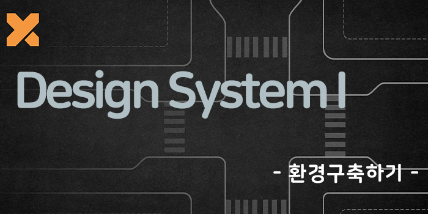

이 글은 (`Designer X Developer 01`)시리즈에서 Design System 환경 구축에 관련한 글입니다.

## 들어가기 전에

이 글은 [Lerna](https://github.com/lerna/lerna)를 사용한 Monorepo에서 packages 환경으로 디자인시스템 구축 방법을 소개하는 글입니다. 들어가기에 앞서 [Monorepo with lerna!](https://blog.songc.io/etc/monorepo-lerna) 를 읽어주셔서 lerna를 이용한 Monorepo 의 장점을 읽어주시면 좋을거 같습니다.

## 디자인시스템이 무엇인가?

`디자인 시스템`이란? Product(웹, 앱 서비스 등등)을 만드는데 디자인 패턴과 원칙을 모아둔 시스템을 말하며, 제품의 규모와 관리비용과 같은 요소들을 효율적으로 사용할 수 있는 장점을 지닌 시스템입니다.
이미 많은 크고 작은 회사에서 고유의 디자인 시스템을 구축하고 있습니다.
**디자인 시스템은 단순이 UI 툴킷을 의미하는 것은 아니라고 알고 있습니다.**

디자인 시스템 !== 디자인 + 개발

> 디자인 시스템은 디자인 + 코드 보다 훨씬 더 큰 요소를 가지고 있습니다.

## 목표

사실 디자인시스템은 쉬운게 아니다
많은 시간과 끊임없는 고민이 필요합니다.

이번 프로젝트에 목표는 디자이너와 개발자 교차점인 디자인시스템을 한번 직접 처음부터 구현을 해서 구현을 하면서 좀더 다양한 UI개발에 심도 있는 고민과 성장하는것에 목표를 두었습니다.

## Design System 구축

## Step 1. lerna build 추가

- yarn2
- storybook(react)
- lerna
- rollup
