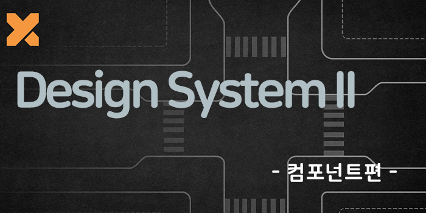
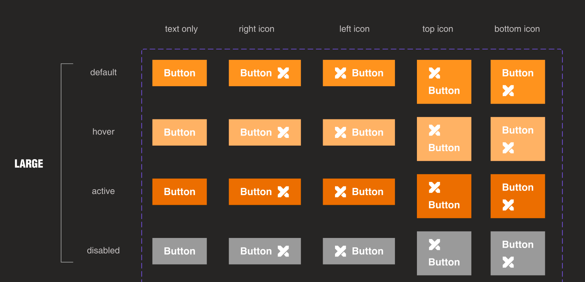
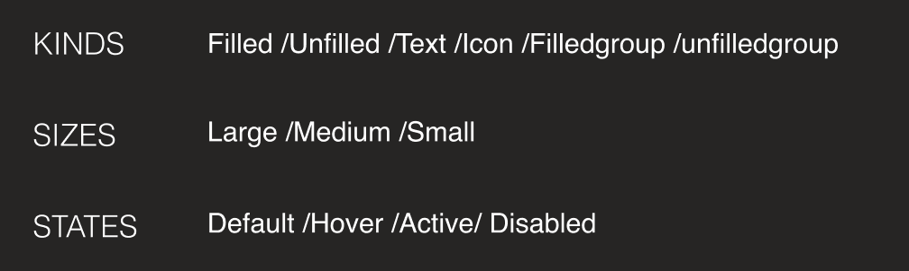
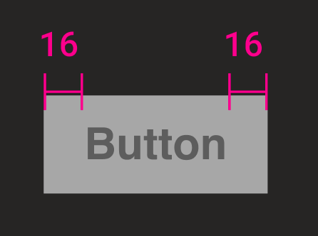
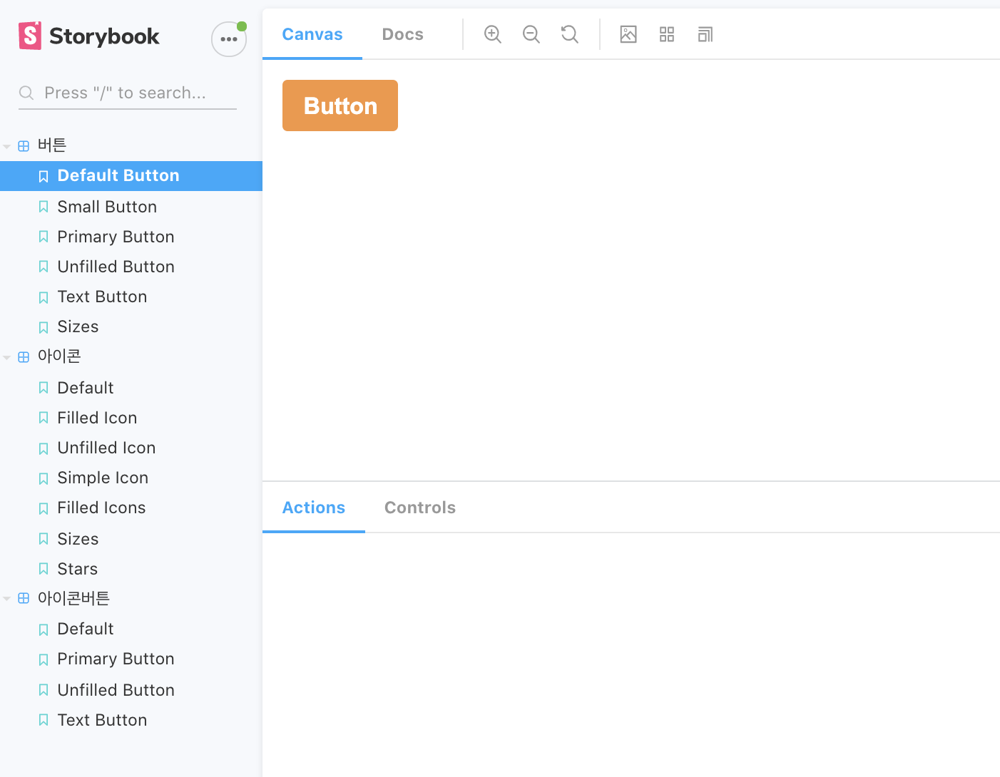

이 글은 (`[DS] Monorepo 환경에서 디자인시스템 구축 I`)시리즈에서 Design System 컴포넌트에 관련한 글입니다.

## 들어가기 전에

이 글은 Monorepo에서 packages 환경으로 디자인시스템 구축하는 내용을 담고 있습니다. 들어가기에 앞서 [[DS] Monorepo 환경에서 디자인시스템 구축](https://blog.songc.io/react/design-system-1/) 를 참고 하시면 좋을거 같습니다.

## Environments

컴포넌트 개발에 앞서 Storybook Settings 을 하도록 하겠습니다.
저번에 만든 monorepo 프로젝트에 Storybook을 생성해서 만들어 주시면 됩니다.

> 이번 포스트에는 Storybook 설정 내용은 생략하도록 하겠습니다. https://www.learnstorybook.com/intro-to-storybook/react/en/get-started/ 참고 해주세요.

환경은 아래와 같습니다.

- @emotion/react
- @storybook/addon-actions
- @storybook/addon-docs
- @storybook/addon-essentials
- @storybook/addon-links@storybook/react

## 컴포넌트 구조 및 관리

컴포넌트 개발에 앞서 어떻게 컴포넌트 구조 및 관리를 해야 효율적인가를 고민하게 됩니다. 사실 작은 프로젝트도 컴포넌트 관리 여부에 따라서 많은 파일이 컴포넌트가 생기고 적은 컴포넌트가 생기게 됩니다.

많은 컴포넌트 구조와 관리 방법이 있습니다. `Atomic Design` , `도메인 단위 방법`, `Presentational and Container Components(데이터와 화면분리)` 등이 있습니다.

처음에 접근했던 모듈화 방법

```js
if(마크업 동일 && stateful 로직 동일)
if(마크업 다르다 && stateful 로직 동일)
if(마크업 동일 && stateful 로직 다르다)

... 안될때  새로 개발
if(마크업 다르다 && stateful 로직 동일)

```

해당 프로젝트는 레이아웃 컴포넌트기 때문에 화면분리를 좀더 효율적인 방법으로 관리하기 위해서 아토믹디자인 패턴을 적용하도록 하겠습니다.

<span style="background-color: #f8baba">왜 분리 하는것이 효율적일까?</span>

> 레이아웃단위 컴포넌트를 쪼개지 않는다면 중복되는 컴포넌트가 많아지게 됩니다. 그래서 내부적으로 컴포넌트를 쪼개는 디자인 패턴인 아토믹디자인 패턴을 선택하게 되었습니다. 쉽게 설명하자면 UI 복잡성을 최대한 낮게 표현한다가 될거 같습니다.

[참고-Atomic Design?](https://speakerdeck.com/feel5ny/atomig-paeteoneuro-dijaineowa-hyeobeobhagi?slide=136)

### Sample

아래와 같은 Button 디자인을 가지고 해당 관리 패턴을 가지고 진행을 하겠습니다.



```js
/** @jsx jsx */

import { SerializedStyles, css, jsx } from '@emotion/react';
import { IComponentProps } from '../../../model/commonProps';
import React from 'react';
import { palette } from '../../../index';

...생략

interface IProps extends IComponentProps {
  isCapture?: boolean;
  onClick?(event: React.MouseEvent<HTMLButtonElement>): void;
  theme?: string;
  size?: 'small' | 'medium' | 'large';
}

function Button({
  children,
  theme = 'primary',
  isCapture = false,
  onClick,
  size = 'large',
}: IProps) {
  const clickEvent = isCapture ? { onClickCapture: onClick } : { onClick };
  const colors = themes[theme];

  return (
    <button css={[style, colors, sizes[size]]} {...clickEvent}>
      {children}
    </button>
  );
});
};
Button.defaultProps = {
  theme: 'primary',
  size: 'medium',
};

export default Button;
```

### 컴포넌트 Rule

버튼의 종류및 상태에 따른 분리를 하게 되면 아래와 같이 분리가 됩니다.

아래 분리를 토대로 테마와 컴포넌트명, 속성등을 분리하여 컴포넌트 개발을 진행을 할수 있게 됩니다.



현재 버튼은 용도와 상태가 어떠한 속성이 오는지에 따라서 가변으로 변하는 속성들이 있습니다. 그래서 가변하는 속성과 고정되는 속성을 확실히 분리 할 필요가 있을거라 생각을 해서 기본 속성이 변경된다면 다른 컴포넌트라고 정의 할 필요가 있습니다.

### 컴포넌트 기본속성

[EX]


- 높이
- text 사이즈
  등등

#### 가변속성

- width
- color
- status

### BUTTON 결과

해당 Button 코드를 stories에 출력을 하면 아래와 같이 확인을 할 수가 있습니다.



## 정리

컴포넌트에 핵심은 어떻게 구성을 할것인가? 에 초점을 맞추게 될것이라고 생각듭니다. 어디에 위치 한다기 보다 어떻게 조합하며 합성을 어떤식으로 어떤것을 전달하는냐?를 고민을 하면서 쪼갤 필요가 있다.

Atomic Design 개념에 맞춰서 프로젝트를 진행을 하겠지만 너무 atoms 단위에 집착을 하게 되면 효율에 문제가 생길수도 있다는 생각이 들어서 정말 용도와 사용에 focus를 맞춰서 컴포넌트 분리가 필요할 거 같다는 생각을 합니다.

추후에 프로젝트를 마무리 하게 된다면 회고글을 쓰도록 하겠습니다.

## Reference

- [https://storybook.js.org/](https://storybook.js.org/)
- [아토믹 패턴으로 디자이너와 협업하기](https://speakerdeck.com/feel5ny/atomig-paeteoneuro-dijaineowa-hyeobeobhagi?slide=139)
- [https://seonjinlee.com/design-system.html](https://seonjinlee.com/design-system.html)

## 감사합니다.
