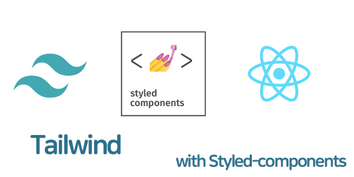
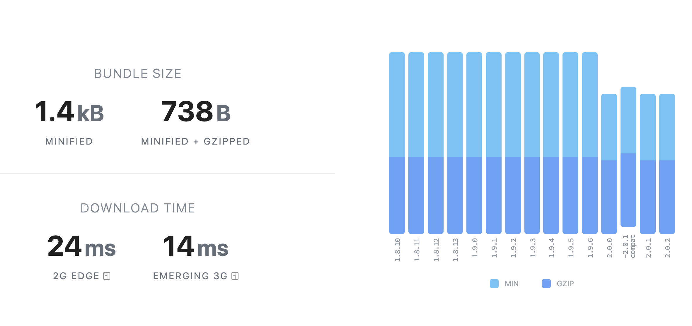
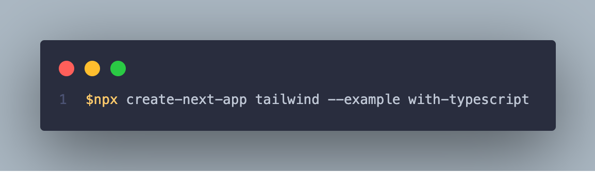
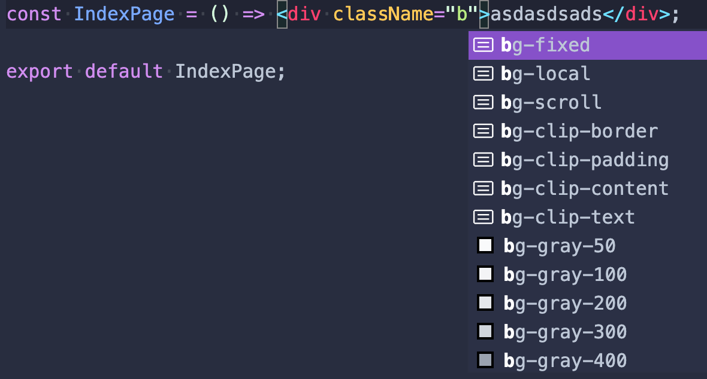

> CSS 프레임워크는 어떤것을 사용하고 계시나요?

이 포스트에서는 TailwindCss 소개 와 React 환경에서 TailwindCss을 사용하는 방법을 소개하려고 합니다.

## TailwindCSS?

> "A utility-first CSS framework for rapid UI development"

`tailwind Css`는 utility-first CSS 프레임워크라고 정의 되어 있습니다.
utility-first CSS 라는 용어가 무엇인지는 아래와 같습니다.

아래 코드는 전통적인 css 작성 방식입니다.

```html
<div class="text-notification">
  <div class="text-notification-logo-wrapper">
    
  </div>
</div>

<style>
  .text-notification {
    display: flex;
    max-width: 24rem;
    margin: 0 auto;
    padding: 1.5rem;
    border-radius: 0.5rem;
    background-color: #fff;
    box-shadow: 0 20px 25px -5px rgba(0, 0, 0, 0.1), 0 10px 10px -5px rgba(0, 0, 0, 0.04);
  }
  .text-notification-logo-wrapper {
    flex-shrink: 0;
  }
  .text-notification-logo {
    height: 3rem;
    width: 3rem;
  }
</style>
```

아래와 같이 속성값 colors , size , borders , margins , shadows 등등 속성 값을 미리 정의를 해놓고 `p-6` `space-x-4` `shadow-md` 세팅된 클래스에 utility class 로 조합하여 사용하는 방식입니다.
bootstrap 를 사용해 보셨다면 익숙한 방법일거라고 생각합나다.

### utility-first CSS 코드

```html
<div
  class="p-6 max-w-sm mx-auto bg-white rounded-xl shadow-md flex items-center space-x-4"
>
  <div class="flex-shrink-0">
    
  </div>
</div>
```

## 🤷🏻‍♂️WHY?

utility-first css 인 것을 알겠는데 사용해야 할 이유를 찾아봤습니다.

- 기본테마 X
- Utility-First 직관적인 코드
- Low level
- 커스텀 자유로움
- Tailwind CSS IntelliSense (vscode 지원)
- 다크 모드

### ✅ 작고 가벼운 사이즈



일단 모듈 사이즈도 다른 css frameworks 보다 작은 사이즈 이고, 또한
프로덕션을 위해 빌드 할 때 항상 Tailwind의 `purge`옵션을 사용하여 사용 하지 않는 스타일을 설정해서 최종 빌드 크기를 최적화가 가능합니다.

### ✅ Intelli Sense for VScode


vscode 에서 Tailwind CSS IntelliSense 도구가 있습니다.
아래 내용을 지원을 해서 도움을 받을수가 있습니다.

- Autocomplete
- lint
- 미리보기
- Syntax Highlighting

```js
// tailwind.config.js
const colors = require('tailwindcss/colors')
module.exports = {
  purge: ['./src/**/*.{js,jsx,ts,tsx}'],
  ... 생략
```

### ✅브라우저 지원

현재 이글 기준으로 Tailwind CSS v2.0.x 버전에서는

- [x] Chrome
- [x] Firefox
- [x] Edge
- [x] Safari

사용이 가능하고, IE 는 지원이 안되기 때문에 autoprefixer 를 사용해야 합니다.

### ✅ 커스텀 확장에 간편함

[Sample tailwind.config.js]

```js
const colors = require('tailwindcss/colors')

module.exports = {
  theme: {
    colors: {
      gray: colors.coolGray,
      blue: colors.lightBlue,
      red: colors.rose,
      pink: colors.fuchsia,
    },
    fontFamily: {
      sans: ['Graphik', 'sans-serif'],
      serif: ['Merriweather', 'serif'],
    },
    extend: {
      spacing: {
        '128': '32rem',
        '144': '36rem',
      },
      borderRadius: {
        '4xl': '2rem',
      },
    },
  },
  variants: {
    extend: {
      borderColor: ['focus-visible'],
      opacity: ['disabled'],
    },
  },
}
```

- [Variants](https://tailwindcss.com/docs/configuring-variants)
- [Theme](https://tailwindcss.com/docs/theme)
- [Colors](https://tailwindcss.com/docs/customizing-colors)
- [Spacing](https://tailwindcss.com/docs/customizing-spacing)
- [Plugins](https://tailwindcss.com/docs/plugins)
- [Presets](https://tailwindcss.com/docs/presets)

Tailwind CSS는 비교적으로 기본 Color 부터 모든 스타일을 간단하게 커스텀이 가능합니다. 모든 변경을 해도 값을 바꾸는 방식이기 때문에 충돌에 위험은 없습니다.
특히 [`Variants`](https://tailwindcss.com/docs/configuring-variants) theme 속성값 property 지원을 선택적으로 할 수 있어서 편하게 쓸수 있지만

<span style="background-color: #f8baba">Variants 속성값을 사용하면 바로 기본 속성이 같이 오는게 아니라 선택한 속성값만 가능하니깐 주의를 해야 합니다.</span>

## TailwindCSS React 사용하기

### step1. React Project 생성



### step2. TailwindCSS install

<span style="background-color: #f8baba">tailwind v2.0 버전은 node version 12.12 버전 이상부터 설치가 가능합니다.</span>

```s
$ yarn -D postcss tailwindcss postcss-preset-env
```

### step3. 설정하기

tailwind.config.js 생성

```s
$npx tailwind init
```

```js
// 기본 파일
module.exports = {
  purge: [],
  darkMode: false, // or 'media' or 'class'
  theme: {
    extend: {},
  },
  variants: {
    extend: {},
  },
  plugins: [],
}
```

tailwind.config.css

```css
@tailwind base;
@tailwind components;
@tailwind utilities;
```

설정이 끝났다면 아래와 같이 기본 tailwindCSS 를 사용이 가능하게 됩니다.



## TailwindCSS with CSS-in-JS

```html
<div class="flex space-x-3 mb-4 text-sm font-medium">
  <div class="flex-auto flex space-x-3">
    <button
      class="w-1/2 flex items-center justify-center rounded-md bg-black text-white"
      type="submit"
    >
      Buy now
    </button>
    <button
      class="w-1/2 flex items-center justify-center rounded-md border border-gray-300"
      type="button"
    >
      Add to bag
    </button>
  </div>
</div>
```

TailwindCSS도 twin.macro 사용을 하게되면 CSS-IN-JS를 같이 사용해서 좀더 깔끔한 코드를 작성이 가능합니다.
개인적으로 TailwindCSS 단점은 가독성일 거 같습니다. 직관적으로 속성 값을 알수는 있지만 복잡한 속성값이 많아지면 읽기가 좀 까다로울수도 있을 거 같아서
Css-in-js 와 함께 설정을 해보았습니다.

## TailwindCSS with Styled-compoentns Setup

- react
- nextjs
- typescript
- tailwindCSS
- twin.macro

### Step1

기본 nextjs typescript 프로젝트에서 추가적으로 의존성을 추가 해줍니다.

```s
$yarn add -D twin.macro tailwindcss babel-plugin-styled-components babel-plugin-macros react-is
```

```json
// package.json add
"babelMacros": {
  "twin": {
    "preset": "styled-components"
  }
},
```

### Step2

환경설정을 합니다.

- next.config.js
- tailwind.config.js
- twin.d.ts
- .babelrc.js

#### ⚠️twin.macro 설정

```ts
// twin.d.ts
import 'twin.macro'
import styledImport, { CSSProp, css as cssImport } from 'styled-components'

declare module 'twin.macro' {
  // The styled and css imports
  const styled: typeof styledImport
  const css: typeof cssImport
}
declare module 'react' {
  // The css prop
  interface HTMLAttributes<T> extends DOMAttributes<T> {
    css?: CSSProp
  }
  // The inline svg css prop
  interface SVGProps<T> extends SVGProps<SVGSVGElement> {
    css?: CSSProp
  }
}
// The 'as' prop on styled components
declare global {
  namespace JSX {
    interface IntrinsicAttributes<T> extends DOMAttributes<T> {
      as?: string
    }
  }
}
```

#### ⚠️styled-components 설정

```js
module.exports = {
  presets: [['next/babel', { 'preset-react': { runtime: 'automatic' } }]],
  plugins: ['babel-plugin-macros', ['styled-components', { ssr: true }]],
}
```

#### ⚠️next.config.js 설정

```js
module.exports = {
  webpack: (config, { isServer }) => {
    // Fixes packages that depend on fs/module module
    if (!isServer) {
      config.node = { fs: 'empty', module: 'empty' }
    }

    return config
  },
}
```

### Styled-components with TailwindCSS

모든 설정이 끝나게 되면 아래와 같이 styled-components 와 함께 사용이 가능합니다.

```tsx
import React from 'react'
import styled from 'styled-components'
import tw from 'twin.macro'

const Heading = styled.h1`
  ${tw`font-bold text-4xl text-blue-100 font-sans`}
`
const IndexPage = () => (
  <Heading>
    <div className="bg-gray-800">text</div>;
  </Heading>
)
```

emotion 과 설정이 궁금하다면
[tailwindCSS with emotion 출처:so-so.dev](https://so-so.dev/web/tailwindcss-w-twin-macro-emotion/#with-css-in-js)

## 마무리

아직까지는 익숙해지려고 하는 단계라서 미흡한 부분이 많지만 디자인 통일이나 규칙에 대한 고민을 조금은 덜수 있도록 도와주는 장점을 느꼈습니다. 아직까지는 규칙과 속성에 대한 문서를 참고를 해야하는 번거로움은 있지만 충분히 장점들을 잘 활용한다면 좋은 선택이 될수도 있다는 생각을 해봅니다.

추후에 좀더 프로젝트에 완성도를 높혀서 어느정도 속도와 여러측면에 장점에 대한 회고를 해보도록 하겠습니다.

## Reference

- [https://tailwindcss.com/](https://tailwindcss.com/)
- [https://github.com/ben-rogerson/twin.macro](https://github.com/ben-rogerson/twin.macro)
- [https://dev.to/theme_selection/best-css-frameworks-in-2020-1jjh](https://dev.to/theme_selection/best-css-frameworks-in-2020-1jjh) -[next-styled-components](https://github.com/delster/twin.examples/tree/master/next-styled-components)
- [so-so.dev/web/tailwindcss-w-twin-macro-emotion](https://so-so.dev/web/tailwindcss-w-twin-macro-emotion/#with-css-in-js)
