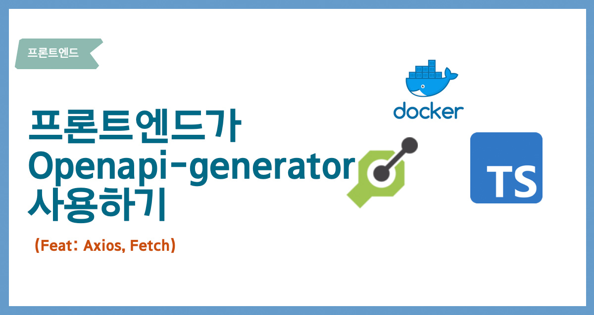
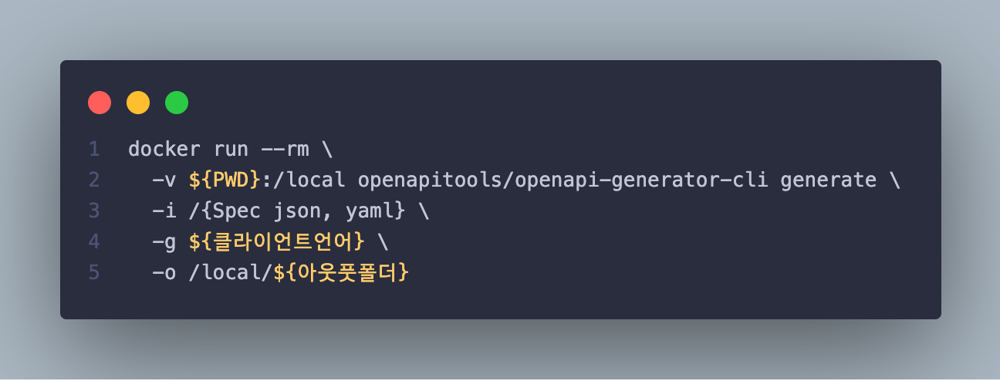
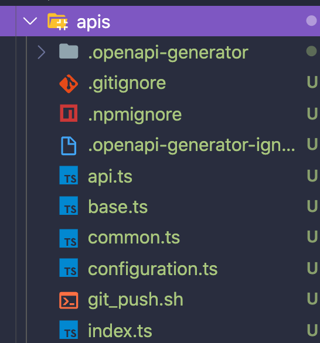

이 글에서는 `Openapi-generator` 을 사용해서 Client API 타입에 관한 내용을 정리하는 글입니다. 하지만 서버 환경설정에 대한 튜토리얼은 아니기 때문에 필요한 모든 내용을 다루지는 않습니다.

## 목차

- [Openapi-generator]
- [사용하기]
  - [Install]
  - [Usage]
  - [TypeScript-Axois]
  - [⚠️ 주의사항]

## Openapi-generator?

> 서버 API 가 RestAPI 로 되어 있을때
> 프론트개발자 여러분은 API 타입은 어떻게 정의 하나요?

OAS(Open API Specification)란?

- 예전 Swagger Specification
- RESTAPI를규칙에 맞게 API Spec => json과 yaml

<span style="background-color: #f8baba">OAS가 프론트엔드랑 무슨 관계가 있고 왜 알아야 할까요? .</span>

Openapi-generator이란 무었일까요? `OpenAPI Specification`에 맞게 코드를 generate 를 해주는 라이브러리라고 생각하시면 좋을거 같습니다.

```tsx
export const localEmailRegister = ({
  registerToken,
  form,
}: {
  registerToken: string
  form: LocalEmailRegisterForm
}) => apiClient.post(`/register`, snakeCaseKeys({ registerToken, form }))

export type LocalEmailRegisterForm = {
  displayName: string
  username: string
  shortBio: string
}
export type AuthResponse = {
  email: string
  is_certified: boolean
  username: string
  id: string
  created_at: string
  updated_at: string
  profile: {
    fk_user_id: string
    display_name: string
    short_bio: string
    thumbnail: null
    id: string
    created_at: string
    updated_at: string
    profile_links: any
  }
  tokens: {
    access_token: string
    refresh_token: string
  }
}
```

이러한 API 호출 및 타입 파일을 작성을 직접하지 않아도 됩니다.

## HOW

직접 generator-openapi 를 통해서 client code를 generator를 하도록 하겠습니다.

### Install

openapi-generator 를 사용하려면 openapi-generator cli 설치를 해야 합니다.
방법은 대표적으로 설치는 `homebrew`, `NPM` ,`docker`를 사용하면 됩니다.

homebrew, npm 으로 설치를 해보았지만 개인적으로 docker 가 편해서 이 포스트에서는 `docker` 를 가지고 진행을 하도록 하겠습니다.

> homebrew npm 을 통해서 사용하고 싶다면 [여기](https://openapi-generator.tech/docs/installation/)를 참고 해주세요

<span style="background-color: #f8baba">Docker를 설치 이후에 아래를 실행해주세요.</span>

### Usage

[generator client 용]

- typescript (experimental)
- typescript-angular
- typescript-angularjs-deprecated (deprecated)
- typescript-aurelia
- typescript-axios
- typescript-fetch
- typescript-inversify
- typescript-jquery
- typescript-nestjs (experimental)
- typescript-node
- typescript-redux-query
- typescript-rxjs

기본사용 방법



### TypeScript-Axios

공식 Github 샘플 소스를 typescript-axois 로 API 파일을 생성 해보겠습니다.
generator 를 `typescript-axios` 로 변경을 해서 원하는 디렉토리를 설정하면 됩니다.

```s
docker run --rm \
  -v ${PWD}:/local openapitools/openapi-generator-cli generate \
  -i /https://raw.githubusercontent.com/openapitools/openapi-generator/master/modules/openapi-generator/src/test/resources/3_0/petstore.yaml \
  -g typescript-axios \
  -o /local/apis
```

### Sample 결과



```ts
export class PetApi extends BaseAPI {
  /**
   *
   * @summary Add a new pet to the store
   * @param {Pet} pet Pet object that needs to be added to the store
   * @param {*} [options] Override http request option.
   * @throws {RequiredError}
   * @memberof PetApi
   */
  public addPet(pet: Pet, options?: any) {
    return PetApiFp(this.configuration)
      .addPet(pet, options)
      .then(request => request(this.axios, this.basePath))
  }
}
```

### ⚠️ 주의사항

API가 OAS(yaml, json) 되어 있어야 합니다.
또한 서버개발자와 프론트엔드개발자간에 API에 대한 코드리뷰가 중요합니다. 바로 API 스펙 한 줄 한 줄이 자동 생성된 코드에
큰 영향을 끼칠 수 있다는 점을 유의해야 합니다.

## 마무리

전에는 실무에서 graphQL 환경이여서 API 타입을 작성해야 하는 번거로움이 없었지만 Rest API 를 만나서 API 타입 명세를 직접 작성해야 하는 경우가 생겨서 generator를 찾아보다가 작년 FEConfig에서 OpenAPI Specification으로 타입-세이프하게 API 개발하기: 희망 편 VS 절망 편](https://www.youtube.com/watch?v=J4JHLESAiFk) 참고해서 튜토리얼을 작성하게 되었습니다. 저와 같은 환경에서 조금이라도 도움이 되길 바랍니다.

## Reference

- [OpenAPI Specification으로 타입-세이프하게 API 개발하기: 희망편 VS 절망편](https://www.youtube.com/watch?v=J4JHLESAiFk)
- [https://github.com/OpenAPITools/openapi-generator](https://github.com/OpenAPITools/openapi-generator)
- [hub.docker](https://hub.docker.com/r/openapitools/openapi-generator)

## 감사합니다.

글에 내용이나 수정이 필요한 부분이 있다면 댓글을 남겨주시면 감사하겠습니다.
