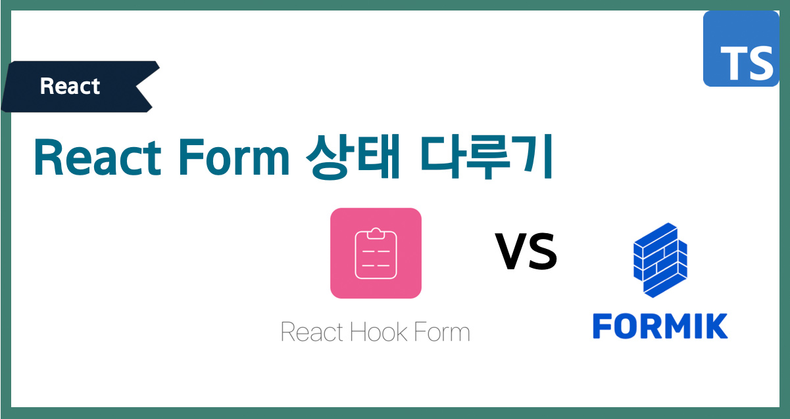
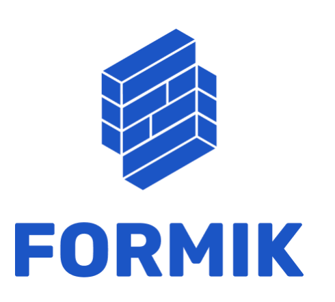
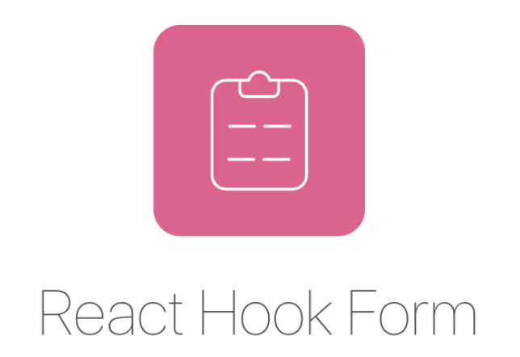
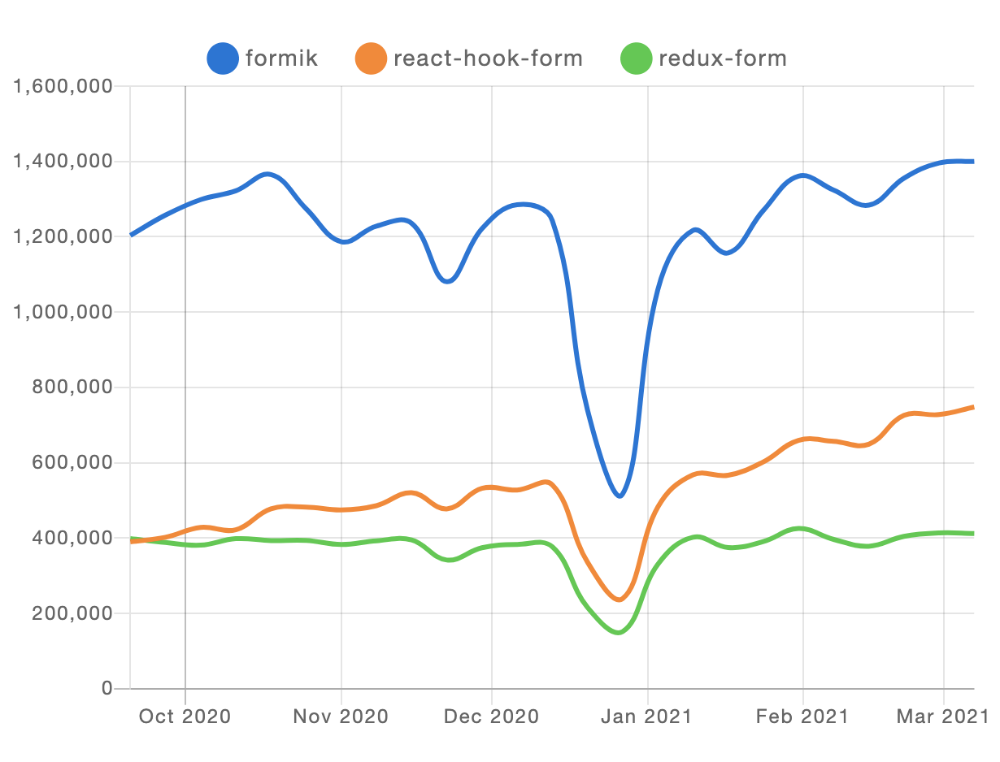
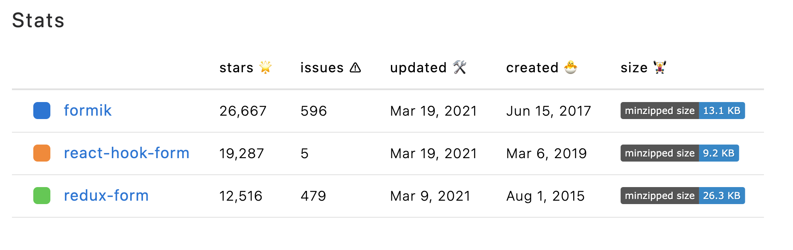

이 포스트에서는 form 상태관리를 하는 방법중에서 React-hook-form 과 Formik을 다루면서 두 라이브러리를 비교하는 글입니다.

> Form 상태를 다루기 위해서 어떤 것을 사용하고 선호하시나요?

<span class="dash" style="background-color: #f3bed366;color: #e83e8c; text-decoration: dashed"> Form 상태를 다루는 방법은 다양하게 있습니다.
</span>

- 기본적인 Controlled Components 사용하기
- React Context로 Form의 상태 관리하는 법
- formik
- react-hook-form
- redux-form

## 목차

- [React에서 기본 Form 다루기]
- [좋은 오픈소스 사용하기]
  - [Formik]
  - [React-hook-form]
- [Formik VS React-hook-form]

## React에서 기본 Form 다루기

Form 상태를 다루는 작업은 React로 개발할 때 많은 리소스가 들어가는 부분중 하나입니다.
React는 인터페이스의 동작을 제어하는 ​​데만 초점을 맞춘 미니멀 한 UI 라이브러리로, 사용자의 활동에 대한 응답으로 UI가 적절하게 변경되어야 합니다.

그래서 Controlled Components 를 사용하여 State 값을 상태로 저장하는 방법을 제공 합니다.

```tsx
<input
  type={type}
  name={name}
  autoComplete="off"
  onChange={onChange}
  value={value}
  placeholder={placeholder}
  onFocus={onFocus}
  onBlur={onBlur}
  disabled={disabled}
  {...rest}
/>
```

## 💡오픈소스 사용하기

Form 관련해서 직접 구현한다고 하면 구현해야 할 것이 단순히 상태관리 뿐만 아니라 `validation`,`form fields`, `error` 등 고려해야 하는 부분이 너무 많기 때문에 좋은 오픈소스를 이용해서 사용하겠습니다.

대표적으로 react-hook-form, formik 이 있습니다.

## [Formik](https://formik.org/docs/overview)



### 특징

- `단순하고 간결한 API`
- 하나의 state store 관리
- 유효성 검사 및 오류 메시지등을 쉽게 처리 가능

### 1. Formik Root Component

```tsx
<Formik
  initialValues={{ usernameOrEmail: '' }}
  onSubmit={async (values, { setErrors }) => {}}
>
  {({ isSubmitting }) => (
    <Form>
      <InputField
        name="usernameOrEmail"
        placeholder="username or email"
        label="Username or Email"
      />
      <Button mt={4} type="submit" isLoading={isSubmitting}>
        로그인
      </Button>
    </Form>
  )}
</Formik>
```

### 2.Dependent Formik Form Field

```tsx

const {value, set} = useFormikContext();
const [filed] = useFiled(props);

useEffect(() => {
  set(props.)
},[values.usernameOrEmail,props.name set])

return <input {...props} {...field}>
```

### ⚠️ 주의사항

<span class="dash" style="background-color: #f3bed366;color: #e83e8c; text-decoration: dashed"> 복잡한 Form에는 어울리지 않는다
</span>

> 제공되는 useFormikContext API는 특정 state만 watch를 할 수 없고 전체를 업데이트를 합니다.

단순한 Form 처리를 할때는 크게 문제가 없게 되지만 복잡한 Form을 다루게 되는 상황이라면 불필요한 re-render 가 발생할 수가 있습니다.

따라서 performance 저하가 발생할 수도 있습니다.

## [react-hook-form](https://react-hook-form.com/)



### 특징

- uncontrolled component & controlled component
- Formik 만큼 쉬운 API
- re-render 최소화 (state로 관리하지 않는다.)
- Isolate Component Re-Rendering
- Reduce Rendering
- Faster Mounting
- Input Change Subscriptions
- Typescript Support

### 1. Default Form

```tsx
  const { register, handleSubmit } = useForm();
  const onSubmit = (data) => {
    console.log(data);
  };

  return (
    <form onSubmit={handleSubmit(onSubmit)}>
      <input
        name="firstName"
        ref={register}
        placeholder="First name"
      />
      <input
        name="lastName"
        ref={register}
        placeholder="Last name"
      />
      <select name="category" ref={register}>
        <option value="">Select...</option>
        <option value="A">Category A</option>
        <option value="B">Category B</option>
      </select>
      <input type="submit" />
    </form>
```

### 2. Handling Errors

```tsx
  const { register, handleSubmit, error } = useForm();
  const onSubmit = (data) => {
    console.log(data);
  };

  return (
    <form onSubmit={handleSubmit(onSubmit)}>
      <input
        name="firstName"
        ref={register({required: true})}
        placeholder="First name"
      />
      {errors.firstName && "First name is required"}
      <input
        name="lastName"
        ref={register({required: true})}
        placeholder="Last name"
      />
      {errors.lastName && "First name is required"}
      <input type="submit" />
    </form>
```

### 3 Watch

```tsx
  const { register, handleSubmit, error, watch } = useForm();
  const onSubmit = (data) => {
    console.log(data);
  };

  /* 조건부 Render*/
  const watchShowLastName = watch("showLastName", false); // you can supply default value as second argument
  /* 모든 필드 Watch */
  const watchAllFields = watch();
  /* 특정 필드 Watch*/
  const watchFields = watch(["showLastName","lastName"]);

  return (
    <form onSubmit={handleSubmit(onSubmit)}>
      <input
        name="firstName"
        ref={register({required: true})}
        placeholder="First name"
      />
      {errors.firstName && "First name is required"}
      <input type="checkbox" name="showLastName" ref={register} />
      {showLastName && <input
        name="lastName"
        ref={register({required: true})}
        placeholder="Last name"
      />}
      {errors.lastName && "First name is required"}
      <input type="submit" />
    </form>
```

## [Formik VS React-hook-form]()

### NPM Trends (2021 3월기준)

- react-hook-form
- formik
- redux-form



### Stats (2021 3월기준)

- react-hook-form
- formik
- redux-form



trends 를 비교해보면 다운로드 formik 이 1,400,000 대로 확실히 압도적으로 우세 합니다.

|                        | react-hook-form | formik    |
| ---------------------- | --------------- | --------- |
| Weekly Downloads       | 7xx,xxx         | 1,4xx,xxx |
| Re-render 효율         | Win             | Lose      |
| Size                   | 9.2kb           | 13.1kb    |
| Typescript             | ✅              | ✅        |
| Class components       | ❌              | ✅        |
| 부분 Watch             | ✅              | ❌        |
| Hook API               | ✅              | ✅        |
| Error, Validataion     | ✅              | ✅        |
| Yup, Schema            | ✅              | ✅        |
| Controlled Component   | ✅              | ✅        |
| UnControlled Component | ✅              | ❌        |

## 마무리

Form 상태를 다루는 상황은 많고 다양한 케이스가 생긴다고 생각합니다. 복작한 Form을 다룰때는 상태관리 라이브러리 + 직접 구현 또는 React-hook-form 으로 다룬다면 효율적으로 다룰수 있지 않을까 생각이 들고 주로 백오피스, 관리자, 또는 Editor 를 쓰는 경우에는 re-render 퍼포먼스 이슈에 크게 도움이 되지 않을까 생각듭니다.

단순한 Form 경우에는 `formik`, `react-hook-form` 모두 장점이 빠르고 간결하게 사용하기 모두 용이 할거 같습니다.

Form을 다루는데 조금이라도 도움이 되셨길 바라고, 글에 부족한 내용이나 수정이 필요한 부분이 있다면 Comment 남겨주시면 감사하겠습니다.

## 감사합니다!🙏🏻
