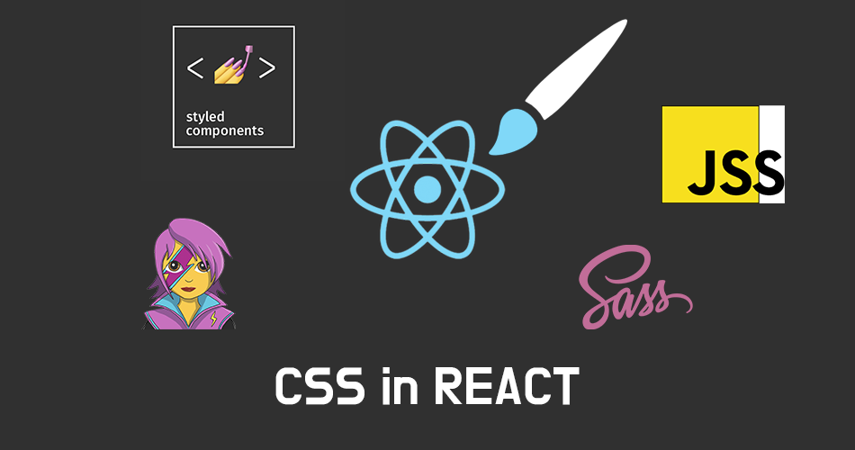
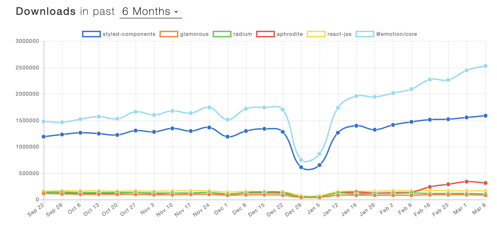
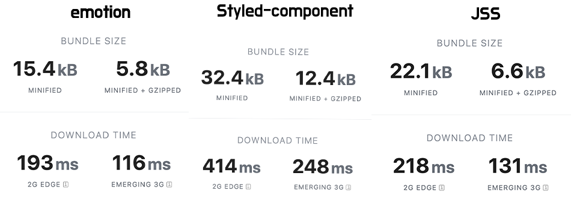
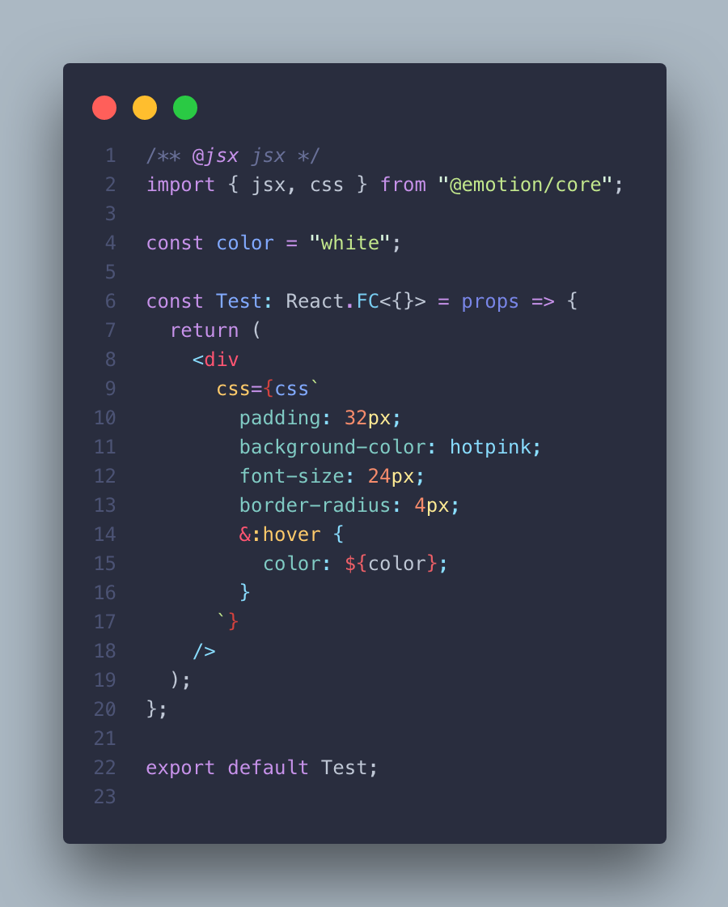
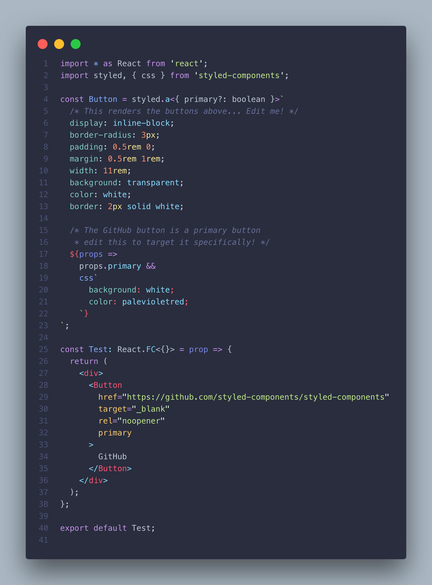
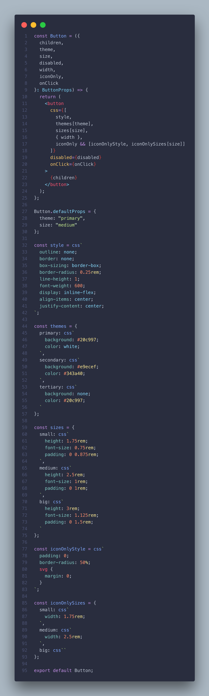
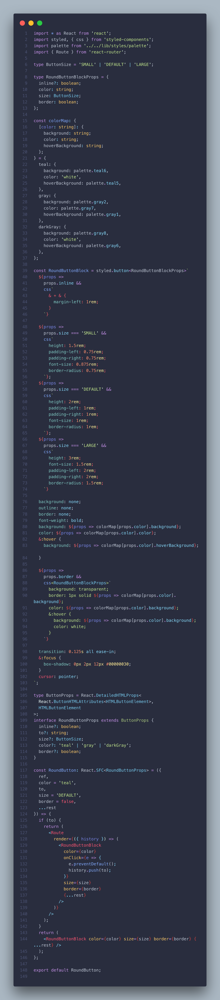

## 리액트 스타일을 어떤방법으로 적용하지?

> css in js 라이브러리 사용전에는 Sass를 사용했었는데 이젠 기억이......
> 여러분들은 어떤 방법으로 컴포넌트 스타일을 구현하고 있나요?

그전에 Css in JS 란?

CSS를 구성 요소를 추상화하고 JavaScript를 사용하여 선언적이고 유지 관리 가능한 방식으로 스타일

- `Styled-component`
- `Emotion`
- `JSS`
- `Aphrodite`
- `Radium`
- `Glamorous`
- `Glamor`
- `Fela`
- `Styletron`
- `JSS`

   

그래서 이번 글에서는 **다양한 Css in JS** 비교 해보도록 하겠습니다. 
**이번 포스팅에서는 `Styled-component` `emotion` 를 다루겠습니다.**

### 🚀trends

npm tredns: [https://www.npmtrends.com](https://www.npmtrends.com/styled-components-vs-glamorous-vs-radium-vs-aphrodite-vs-react-jss-vs-@emotion/core)

> 국내 인지도는 Styled-component가 우위에 있지만 세계인지도는 @Emotion/core가 Styled-component 앞지르고 있다. 물론 라이브러리 배포 용도 많이 사용하기때문에 많은 영향을 끼쳤다고도 생각이 듭니다.

### 🧐번들크기

> emotion < Styled-component
> 크기면에서는 emotion이 가장 작았습니다.

### [`emotion`](https://emotion.sh/docs/introduction)

> Emotion은 성능이 뛰어나고 유연한 CSS-in-JS 라이브러리 다른 많은 CSS-in-JS 라이브러리를 기반으로하여 문자열 또는 객체 스타일로 앱의 스타일을 빠르게 지정할 수 있습니다.

### [`Styled component`](https://www.styled-components.com/docs)

> styled-components는 태그가있는 템플릿 리터럴 (최근 JavaScript에 추가 된 기능)과 CSS의 기능을 활용하여 실제 CSS 코드를 작성하여 구성 요소의 스타일을 지정할 수 있고, 또한 컴포넌트와 스타일 사이의 맵핑을 제거 컴포넌트를 하위 레벨 스타일링 구성으로 사용하는 것은 쉽지 않다는 단점

### emotion.js와 styled component 비교예제

#### emotion

#### styled component

### prop 기반으로 한 조건부 스타일링👨🏻‍💻

Button 컴포넌트를 만들어 봤습니다.

#### emotion

- `children: React.ReactNode`
- `theme`
- `size`
- `disabled`
- `width`
- `iconOnly`

button 속성에 styles , size, theme, disabled, width,iconOnly
대해서 조건부 props를 줄때 아래 소스와 같습니다.

`emotion` 에서는 css props 를 사용하기 위해서 상단에 /\*_ @jsx jsx _/ 라는 JSX Pragma 를 설정하고, jsx 를 emotion 에서 불러와야 합니다.

#### styled component

- `Size`
- `Color`
- `inline`
- `border`
- `to`

Button 사이즈 `Color` `inline` `border` `to(link)`에 대해서 조건부 props를 줄때 아래 소스와 같습니다.

## 내생각

Emotion, Styled-component 둘다 충분히 도입하기 좋은 라이브러리라고 생각이든다.
emotion에서는 서버사이드렌더링에 따로 서버쪽에 설정을 하지 않아도 된다는 장점이 있고, 번들사이즈가 확실히 적기때문에 라이르러리 용도로는 적격이라고 생각이 듭니다.

저도 현재 주로 Styled-component 사용중이지만 개발관점을 어디에 따라서는 Css in js 는 선택에 폭을 넓힐 필요가 있을거 같습니다.

## Refer

> - [All You Need To Know About CSS-in-JS](https://medium.com/better-programming/all-you-need-to-know-about-css-in-js-984a72d48ebc/)
> - [https://www.npmtrends.com/styled-components-vs-glamorous-vs-radium-vs-aphrodite-vs-react-jss-vs-@emotion/core](https://www.npmtrends.com/styled-components-vs-glamorous-vs-radium-vs-aphrodite-vs-react-jss-vs-@emotion/core)
> - [https://styled-components.com/](https://styled-components.com/)
> - [https://cssinjs.org/?v=v10.0.4](https://cssinjs.org/?v=v10.0.4)
> - [https://github.com/jsjoeio/styled-components-vs-emotion](https://github.com/jsjoeio/styled-components-vs-emotion)
