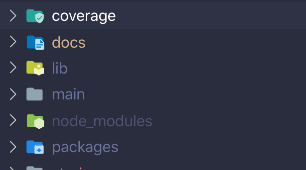
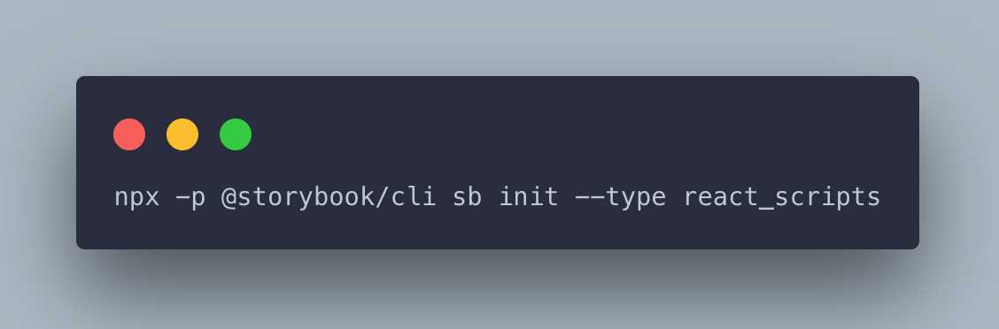
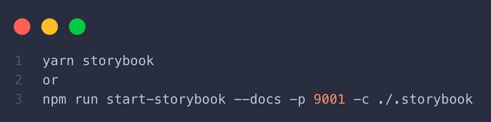
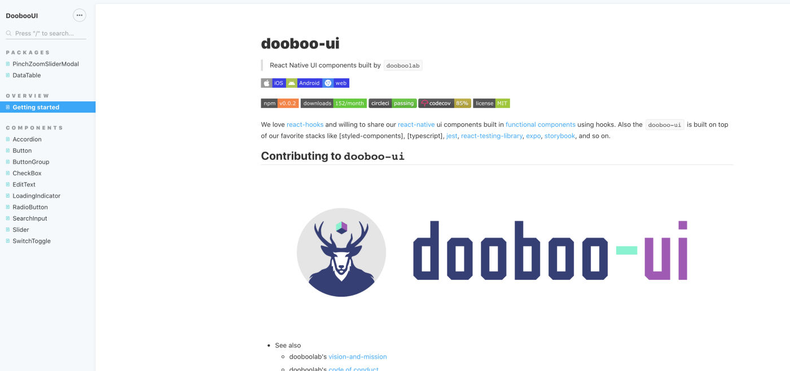
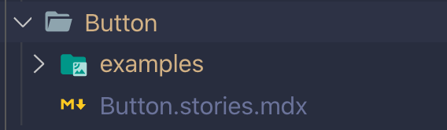
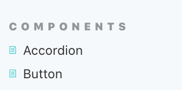
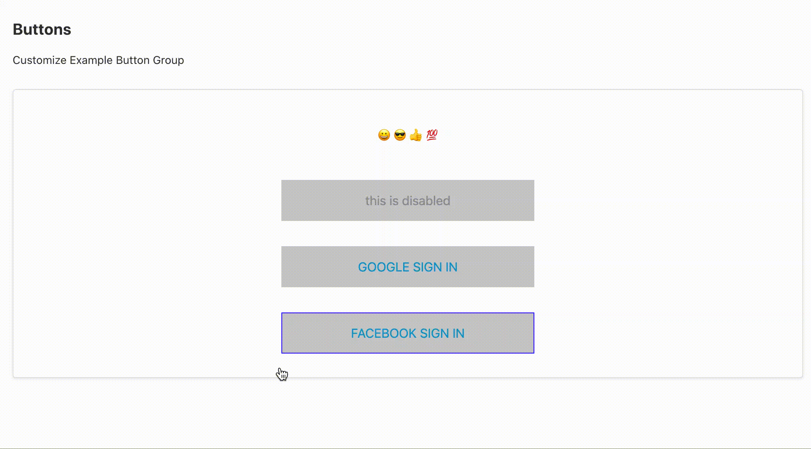

> RN 환경에서 Storybook을 어떻게 사용하시나요?

이 포스트에서는 React-Native 환경에서 Component UI를 @storybook/addons-docs 을 사용하는 Tutorial Guide작성 글입니다.

### 🤷🏻‍♂️WHY? MDX

`MDX`를 사용하면 Markdown으로 더욱 쉽게 문서화 할 수 있습니다. 만약 자동 생성되는 DocsPage만 사용한다면 제한이 있을 수 있지만, `MDX`를 사용한다면 원하는 곳 어디든지 설명을 추가 할 수 있기 때문에 더욱 자유롭게 문서화를 할 수 있습니다.

`Component documentation` 외에도, Style Guide, Typography에 관한 문서 또는 디자인 시스템에 대한 README 를 작성 할 때 `MDX` 를 사용하면 유용합니다.

### <h3 style="color:#f47171">그러나!</h3>

> “Storybook docs supports except for React Native (currently)”

Storybook에서 아직까지 React-Native 환경에서 Storybook Docs 공식적으로 지원을 하지 않고 있습니다.

그렇지만 저희가 문서화 하는 것은 `React-Native-Web` 을 통해서 만든 UI Components 이기 때문에 Storybook 을 (for React-Native) 가 아닌 (for React) 환경으로 React-Native-web 환경을 구축해 보겠습니다.

## 👨🏻‍💻Quick Start

> 독립적인 환경을 위해서 기존 UI Component Project에 docs 라는 Directory 만들어서 사용하겠습니다.



모든 작업은 docs Directory 에서 진행됩니다.

### 1. Installation



```
/docs
├── .storybook // storybook 설정폴더 (Ex. webpack, addons)
├── node_modules // 모듈
├── src
└── package.json
```

설치후에 위와 같은 기본 구조가 생성이 됩니다.
Storybook/addons-docs 를 사용하기 위해서 설정을 하도록 하겠습니다.

### 2. Settings

```
dependencies
   @storybook/theming
   @storybook/addon-docs
   react-native-web
devDependencies
   babel-plugin-react-native-web
   webpack
   url-loader
```

추가로 필요한 react-native-web 설정과 docs 설정해줍니다.
저는 addons-docs MDX 형식으로 문서를 하겠습니다.

### 3. .storybook/addons.js 작성 (애드온 적용하기)

```tsx
import { addParameters, configure } from '@storybook/react'

import { create } from '@storybook/theming'

// Option defaults:
addParameters({
  options: {
    storySort: (a, b) => {
      const sectionA = a[1].id.split('-')[0]
      const sectionB = b[1].id.split('-')[0]

      return sectionB.localeCompare(sectionA)
    },
    theme: create({
      base: 'light',
      brandTitle: 'DoobooUI',
      brandUrl: '',
    }),
    hierarchySeparator: /\/|\./,
    hierarchyRootSeparator: /\|/,
    panelPosition: 'bottom',
  },
})

const context = require.context('../src', true, /\.stories\.(js|mdx)$/)

configure(context, module)
```

### 4. .storybook/main.js

```tsx
module.exports = [
  {
    name: '@storybook/addon-docs/preset',
    options: {
      configureJSX: true,
      babelOptions: {},
      sourceLoaderOptions: null,
    },
  },
]
```

### 5. .storybook/webpack.config.js

```tsx
const { resolve } = require('path')
const { withUnimodules } = require('@expo/webpack-config/addons')

module.exports = ({ config, mode }) => {
  config.module.rules.push({
    test: /\.(gif|jpe?g|png|svg)$/,
    use: {
      loader: 'url-loader',
      options: { name: '[name].[ext]' },
    },
  })

  config.module.rules.push({
    test: /\.(png|jpe?g|gif|jp2|webp)$/,
    loader: 'file-loader',
    options: {
      name: 'images/[name].[ext]',
    },
  })

  config.module.rules.push({
    test: /\.scss$/,
    use: ['style-loader', 'css-loader', 'sass-loader'],
    include: resolve(__dirname, '../'),
  })

  config.resolve.extensions = [
    '.web.js',
    '.js',
    '.json',
    '.web.jsx',
    '.jsx',
    '.ts',
    '.tsx',
  ]

  config.resolve.alias = {
    'react-native': 'react-native-web',
  }

  return withUnimodules(config, {
    projectRoot: resolve(__dirname, '../'),
  })
}
```

> [react-native , react-native] config 설정과 ts, tsx 파일까지 webpack으로 설정을 해줍니다. 하지 않는다면 ts, tsx 파일 에러가 납니다.

여기까지 하셨다면 모든 설정이 완료가 되었습니다.
stories.mdx 파일을 작성해보겠습니다.

## 👨🏻‍💻MDX 파일 작성법


Stories.MDX 매우 간단합니다. 일단 보통 README.md 작성과 비슷합니다.

```md
import { Meta, Story, Canvas } from '@storybook/addon-docs/blocks';
import Example from './examples/Accordion.examples';

<Meta title="Components/Accordion" />

# Accordion

> Simple drop down item component for react-native. This component supports drop down toggle with animation.<br/>


## Props

|                 | necessary | types   | default        |
| --------------- | --------- | ------- | -------------- |
| data            | ✓         | array   | `Default Data` |
| isAnimated      |           | boolean | `true`         |
| collapseOnStart | ✓         | boolean | `false`        |
| animDuration    |           | number  | `300`          |

... 생략
<Canvas withSource="none">
<Example />
</Canvas>
```

> 차이점이 있다면 <Meta title="카테고리/이름" /> 를 작성하지 않으면 compile 에러가 납니다.

그리고 실행해 보면!





## 👨🏻‍💻 MDX Component 스토리 작성하기

우리의 목표인React-Native Components를 MDX파일에 작성을 하도록 해보겠습니다.



먼저 편의상 Button 이라는 폴더를 생성하고 examples 폴더에Samples.tsx 파일에 코드를 작성합니다.

```tsx
import { Button, View } from 'react-native'
import React, { ReactElement } from 'react'

export default function Color(): ReactElement {
  return (
    <View>
      <Button onPress={() => {}} title="onPress" />
    </View>
  )
}
```

그리고 나서 Button.stories.mdx 파일에 imports 를 해줍니다.
@storybook/addon-docs/blocks Story, Preview 속성을 사용해서 보여줄 Components를 Wrapper 해서 보여줍니다.

```tsx
import { Meta, Story, Preview } from '@storybook/addon-docs/blocks';
import as Storyies from './examples';
<Meta title="Components|Button" />

# Button

> [Button] component that can be used inside product. Has basic features like `loading` state, `disabled` state and also has ability to put `img` to left-hand which is used very often.
> 

### color

Customize

<Preview withSource="none">
  <Story>
    <Stories.color />
  </Story>
</Preview>

```

그리고 나서 다시 실행을 하면 !



Components 카테고리에 Button 이 생성되고 아래 처럼 잘 나타나는 것을 확인 할 수 있습니다.



## 스토리북 배포 하기

배포하는 방법은 아래 처럼 방법은 다양합니다.
대표적으로 많이 사용하는 방법은 아래와 같습니다.

### Features

- GitPages
- Aws S3
- netlify

### 공통으로

```
build-storybook --docs -o ./dist -c ./.storybook
```

#### build 결과

dist/\* 파일을 <br />
branch gh-pages 로 push를 하면 해당 Repository GitPages로 배포가 되고, Aws S3, netlify, 또한 같습니다.
결론적으로 build 파일을 배포하시면 됩니다.

## Review

마치면서 Storybook-docs for React-Native에서 공식적으로 지원이 되길 바랍니다.
추가적으로 addon-knobs 사용하여 컴포넌트의 props 를 스토리북 화면에서 바꿔서 바로 반영시키는 방법이 있습니다.

## Reference

> - [Originally published at medium](https://medium.com/react-native-seoul/making-storybook-docs-for-react-native-web-a2ae1163119e)
> - [Storybook](https://storybook.js.org/)
> - [react-native-web storybook](https://necolas.github.io/react-native-web/docs/?path=/docs/*)
> - [@storybook/addon-docs](https://www.npmjs.com/package/@storybook/addon-docs)
