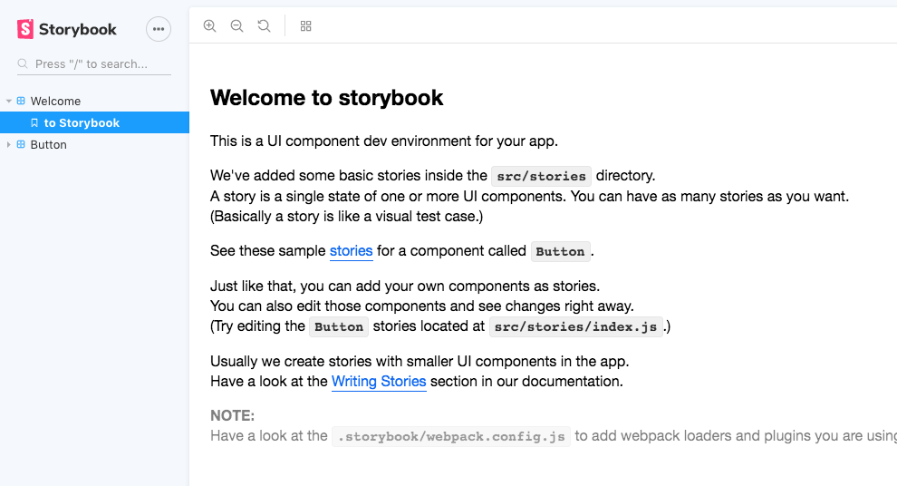
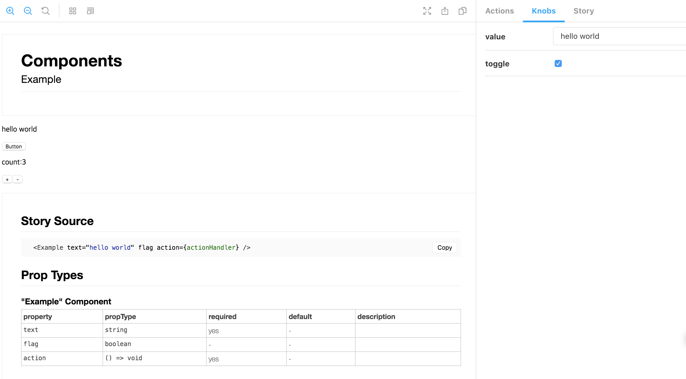
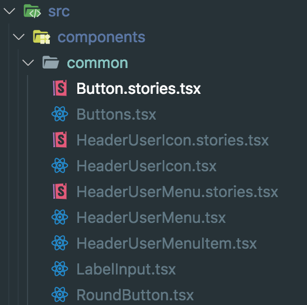
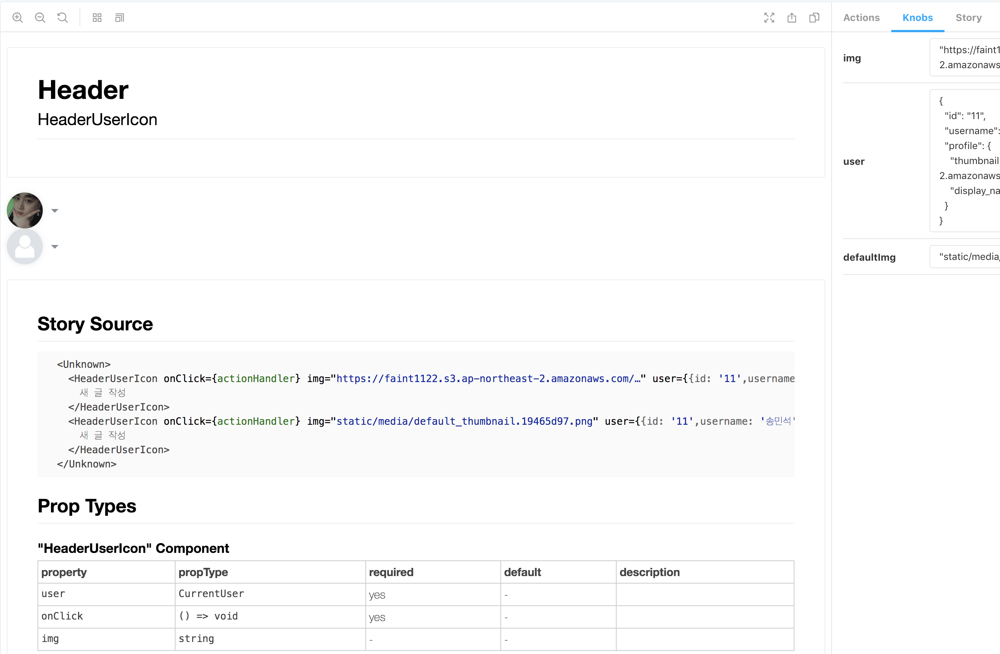
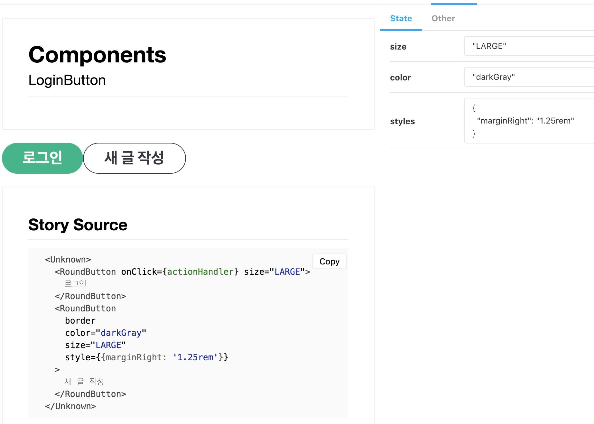

## StoryBook

> `👨🏻‍💻Stroy book UI 컴포넌트를 직접 보면서 개발을 할 수 있는 환경을 제공하는 툴`


### 👨🏻‍💻Why

개발이 페이지 단위에서 -> 컴포넌트 단위로 바뀌었다
But 아직도 페이지단위로 개발을 한다.
React Component 정의에 따르면 독립적이고 외부환경에 영향을 받지 않아야한다.

그래서 .....<br>
이러한 독립적인 환경을 제공함으로써 프로젝트 내에서 독립된 환경으로 실행 되기 때문에, 앱의 특정한 의존성에서 벗어나서 순수 UI 개발에 집중 할 수 있다. 스토리북을 활용하면 개발자 본인 뿐 아니라,
협업 구조에서도 원할한 커뮤니케이션과 빠른 이터레이션(iteration)을 통한 개발 생산성 효과도 올라가고 UI 개발을 하다 보면 빈번하게 일어나는 디자인 스펙 오류, 기획 프로세스 오류 등을 빠르게 확인 하여 수정 할 수 있으며, 개발자는 컴포넌트를 더욱 유연하고, 재사용 가능한 컴포넌트 개발을 할 수 있도록 도와준다.

이 Post 에서는 StoryBook 사용법 및 Setup !!

## 👇🏻Installation

### `👨🏻‍💻Environment`

- React
- Typescript

`❗️그밖에 Vue, Angular 도 지원 가능❗`

```s
$ create-react-app Storybook --typescirpt
```

> Baisc React Project 생성

`1. Storybook Installation`

```s
$ npm install -g @storybook/cli
```

`2. Storybook 프로젝트 설치 및 Storybook init`

```s
$ yarn add @storybook/cli
$ yarn sb init
```

### `기본 구조`

```
└── .storybook
│    ├── addons.js
│    └── config.js
└── src
      └── stories
            └── index.js

```

### 설치 후 Package.json

```json
 "dependencies": {
    // ... 생략
 }
  "scripts": {
    "start": "react-scripts start",
    "build": "react-scripts build",
    "test": "react-scripts test",
    "eject": "react-scripts eject",
    "storybook": "start-storybook -p 9009 -s public",
    "build-storybook": "build-storybook -s public"
  },
  ... 생략
```

### 실행 스크립트만 사용하면 Storybook이 실행

```s
yarn storybook
```



## Typescript 적용

`❗.Tsx 로 Story 작성시 설정 필요❗`
👇🏻 Storybook은 webpack을 사용하다
설정이 Customize 가능하다 === TypeScript 가능
TypeScript 👇🏻공식 사이트 잘 설명되어있다.

> -[https://storybook.js.org/docs/configurations/typescript-config/](https://storybook.js.org/docs/configurations/typescript-config/)

`❗요약하자면 .storybook/webpack.config.js 작성❗`

```js
const path = require('path')
module.exports = ({ config }) => {
  config.module.rules.push({
    test: /\.(ts|tsx)$/,
    use: [
      {
        loader: require.resolve('react-docgen-typescript-loader'),
      },
      {
        loader: require.resolve('@storybook/addon-storysource/loader'),
        options: { parser: 'typescript' },
      },
    ],
  })
  config.resolve.extensions.push('.ts', '.tsx')
  return config
}
```

## 의존성 Setup

```
yarn add @storybook/addon-knobs \
         @storybook/addon-viewport \
        @storybook/addon-storysource \
        react-docgen-typescript-loader \
        @storybook/addon-info \
        @storybook/addon-console
        @storybook/addon-backgrounds
```

### .storybook/addons.js 설정

Storybook에 설치하는 모든 애드온은 해당 파일에 등록해야한다.

```js
import '@storybook/addon-actions/register'
import '@storybook/addon-links/register'
import '@storybook/addon-backgrounds/register'
import '@storybook/addon-knobs/register'
import '@storybook/addon-viewport/register'
import '@storybook/addon-storysource/register'
import '@storybook/addon-console'
```

## 기본 Story 작성

### `1. 컴포넌트를 작성한다.`

```ts
import React, { useState, useCallback } from 'react'

export interface ExampleProps {
  text: string
  flag?: boolean
  action(): void
}

const Example = (props: ExampleProps) => {
  const { text, flag, action } = props
  const [count, countChg] = useState(0)
  const countUp = useCallback(() => countChg(prev => prev + 1), [])
  const countDown = useCallback(() => countChg(prev => prev - 1), [])

  return (
    <div>
      {flag && <p>{text}</p>}
      <button onClick={action}>Button</button>
      <p>count:{count}</p>
      <button onClick={countUp}>+</button>
      <button onClick={countDown}>-</button>
    </div>
  )
}
export default Example
```

`Example.stories.tsx 작성`

### `2. Story 작성한다.`

```ts
import React from 'react'
import { storiesOf } from '@storybook/react'
import { withInfo } from '@storybook/addon-info'
import { withKnobs, text, boolean } from '@storybook/addon-knobs'
import { action } from '@storybook/addon-actions'

import Example from '../Example'

const components = storiesOf('Components', module)
components
  .addDecorator(withKnobs)
  .addDecorator(withInfo({ inline: true }))
  .add('Example', () => (
    <Example
      text={text('value', 'hello world')}
      flag={boolean('toggle', true)}
      action={action('function')}
    />
  ))
```

> 문법은 컴포넌트를 storiesOf 함수로 감싼 뒤에, add로 여러가지 스토리를 추가하는 형태로 사용한다. 여기에서 스토리는 환경이거나 컴포넌트의 상태

## 결과



## Storybook을 실제로 도입하기

React 구조와 똑같이 컴포넌트 별 폴더로 관리하면 좋을거 같다



## 👨🏻‍💻HeaderUserIcon - Story 만들기 -❗️

### 컴포넌트

```ts
import * as React from 'react'
import styled from 'styled-components'
import { MdArrowDropDown } from 'react-icons/md'
const HeaderUserIconBlock = styled.div`
  ... 생략;
`

export type CurrentUser = {
  id: string
  username: string
  profile: {
    thumbnail: string
    display_name: string
  }
}

export interface HeaderUserIconProps {
  user: CurrentUser
  onClick: () => void
  img?: string
}

const HeaderUserIcon: React.SFC<HeaderUserIconProps> = ({ onClick, img }) => {
  return (
    <HeaderUserIconBlock onClick={onClick}>
      
      <MdArrowDropDown />
    </HeaderUserIconBlock>
  )
}

export default HeaderUserIcon
```

### Story 작성

```ts
import React from 'react'

import { storiesOf } from '@storybook/react'
import { withInfo } from '@storybook/addon-info'
import { defaultThumbnail } from '../../static/images'
import { withKnobs, object } from '@storybook/addon-knobs'
import { action } from '@storybook/addon-actions'
import HeaderUserIcon from './HeaderUserIcon'

const components = storiesOf('Header', module)
const User = {
  id: '11',
  username: '송민석',
  profile: {
    thumbnail: 'https://amazonaws.com/Image.jpg',
    display_name: 'songc',
  },
}

components
  .addDecorator(withKnobs)
  .addDecorator(withInfo({ inline: true }))
  .add('HeaderUserIcon', () => (
    <>
      <HeaderUserIcon
        onClick={action('clicked')}
        img={object('img', User.profile.thumbnail, 'props')}
        user={object('user', User, 'props')}
      ></HeaderUserIcon>
      <HeaderUserIcon
        onClick={action('clicked')}
        img={object('defaultImg', defaultThumbnail, 'props')}
        user={object('user', User, 'props')}
      ></HeaderUserIcon>
    </>
  ))
```

### Storybook UI



> 오른쪽에 애드온 통해 데이터나 상태값으로 바뀌는거 확인

## Buttons - Story 만들기 -❗️❗️

이번에는 컴포넌트는 생략 바로 `Story` 작성

```ts
import React from 'react'

import { storiesOf } from '@storybook/react'
import { withInfo } from '@storybook/addon-info'
import { withKnobs, boolean, object } from '@storybook/addon-knobs'
import { action } from '@storybook/addon-actions'
import RoundButton from './RoundButton'

// button style
const label = 'styles'
const defaultValue = {
  marginRight: '1.25rem',
}
const groupId = 'state'

// size properties
const size = 'size'
const size_defaultValue = 'DEFAULT'
const size_groupId = 'state'

const components = storiesOf('Components', module)

components
  .addDecorator(withKnobs)
  .addDecorator(withInfo({ inline: true }))
  .add('LoginButton', () => (
    <>
      <RoundButton
        onClick={action('clicked')}
        size={object(size, size_defaultValue, size_groupId)}
      >
        로그인
      </RoundButton>
      <RoundButton
        border={boolean('border', true)}
        color={object('color', 'darkGray', 'state')}
        size={object(size, size_defaultValue, size_groupId)}
        style={object(label, defaultValue, groupId) as React.CSSProperties}
        //   style={{ marginRight: '1.25rem' }}
      >
        새 글 작성
      </RoundButton>
    </>
  ))
  .add('Button', () => (
    <RoundButton
      border={boolean('border', true)}
      size={object(size, size_defaultValue, size_groupId)}
      style={object(label, defaultValue, groupId) as React.CSSProperties}
      //   style={{ marginRight: '1.25rem' }}
    >
      새 글 작성
    </RoundButton>
  ))
```

`@storybook/addon-knobs (object , text, color, ... )참고`

### Story UI



> styles & size color 상태값으로 다양한 버튼이 생성 될 수 있다.

## 내생각

이렇게 모아놓은 컴포넌트들은 체계적으로 문서화를 한다면 인터랙티브한 문서가 되고, 디자이너 혹은 기획자와 협업하는 도구로 충분할거 같다.

> `👨🏻‍💻평소에 Story Book 듣긴 들었는데 최신에 Naver D2에서 열린 "SHOWROOM:쇼핑 개발자를 부탁해” 통해서 - UI 모듈화로 워라밸 지키기에서 Storybook 을 사용한것을 보고 관심이 생겨서 직접 적용해보는 시간을 가졌다. 나온지 오래되었는데 나만 늦게 안 기분이지만 앞으로 프로젝트 관리 할때 틈틈히 적용해서 관리를 해야 겠다.`

## Refer

> - [이현섭님 블로그](https://hyunseob.github.io/2018/01/08/storybook-beginners-guide/)
> - [Storybook 공식사이트](https://storybook.js.org/docs/basics/introduction/)
> - [Storybook github](https://github.com/storybookjs/storybook)
> - [https://qiita.com/otanu/items/dd06d6702f673268c74e](https://qiita.com/otanu/items/dd06d6702f673268c74e)
