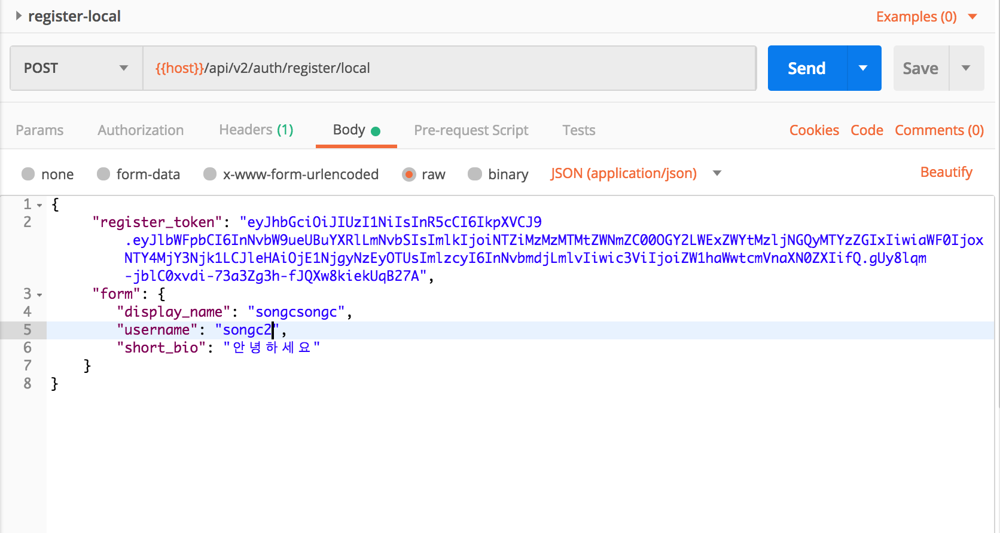
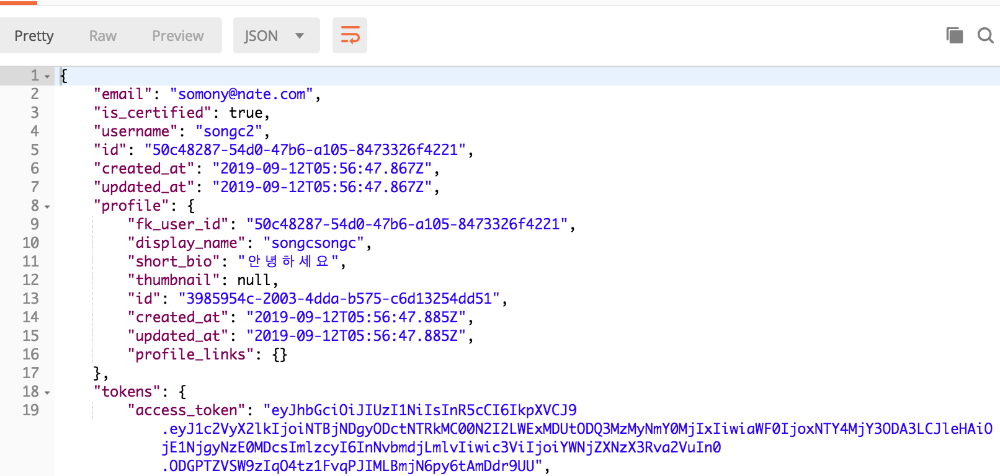
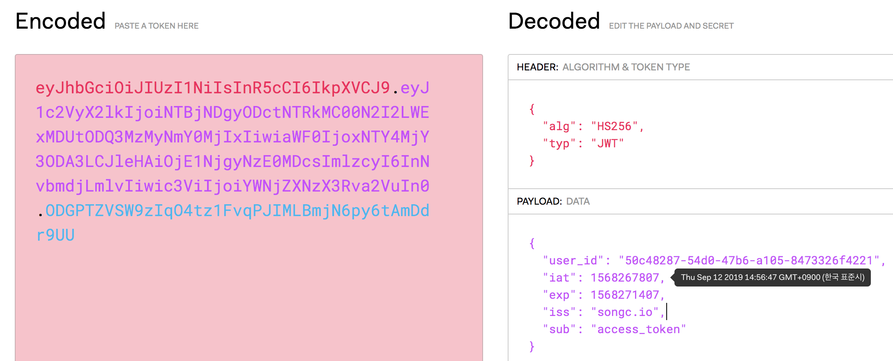

## JWT 란?

`JWT (JSON Web Token)는 웹표준 (RFC 7519) 통신간에 간결하고 독립적인 방식으로 정보를 안전성 있게 전달`


`👉🏻self-contained ( 자가 수용적 )`<br>
JWT 자체적으로 필요한 모든 정보를 포함합니다. 헤더 정보와, 실제 전달할 데이터, 검증할 수 있는 서명 데이터를 모두 포함하고 있습니다.<br>
`👉🏻신뢰성`<br>
JWT는 SIGN 의해 검증할 되며 신뢰할 수 있다. 비밀 값을 사용하는 HMAC 알고리즘이나 RDS or ECDSA와 같은 공개키, 개인키 쌍으로 서명될 수 있다.

> 쉽게 말해서
> JWT로 발급된 토큰은, 토큰에 대한 기본정보, 토큰이 검증됐다는것을 증명해주는 signature 를 포함하고 있고 웹서버의 경우에는 HTTP의 Header 넣어서 전달 할 수있으며, URL 의 파라미터로 전달 할 수있다.

### 🤷🏻‍Why ?

`❗️거의 모든 프로그래밍 언어에 지원된다.❗️`

`❗️덜 복잡하고 데이터용략이 가볍다.❗️`

`❗️JWT Token 인증으로 Auth인증을 하면 기존 쿠키/세션 보다 보안 이슈를 막을수 있다.❗️`

## HOW?

### 👨🏻‍💻Environment

- Node
- Koa
- Typescript

> `목표: 회원가입과 로그인이 성공하였을 때, JWT 토큰을 발급`

### 👨🏻‍💻jsonwebtoken 설치

```sh
yarn add jsonwebtoken @types/jsonwebtoken
```

### 👨🏻‍💻jJWT 기본 사용법`

```ts
import jwt from 'jsonwebtoken'
const token = jwt.sign(
  { foo: 'bar' },
  'SECRET_KEY',
  { expiresIn: '7d' },
  (err, token) => {
    if (err) {
      console.log(err)
      return
    }
    console.log(token)
  }
)
```

- 파라미터는 토큰에 넣을 데이터
- 비밀 키
- 옵션
- 콜백함수

### 👨🏻‍💻JWT 처리 Middleware Token.ts

```ts
import jwt, { SignOptions } from 'jsonwebtoken'
const { SECRET_KEY } = process.env

if (!SECRET_KEY) {
  const error = new Error('InvalidSecretKeyError')
  error.message = 'Secret key for JWT is missing.'
  throw error
}

export const generateToken = (
  payload: any,
  options: SignOptions
): Promise<string> => {
  const jwtOptions: SignOptions = {
    issuer: 'songc.io', // 출처명
    expiresIn: '7d', // 유효기간
    ...options,
  }
  if (!jwtOptions.expiresIn) {
    delete jwtOptions.expiresIn
  }
  return new Promise((resolve, reject) => {
    jwt.sign(payload, SECRET_KEY, jwtOptions, (err, token) => {
      if (err) reject(err)
      resolve(token)
    })
  })
}
```

### 👨🏻‍💻Generate Token 생성 Model에 인스턴스 적용

```ts
  async generateUserToken() {
    (...생략)
    const accessToken = await generateToken(

     // JWT 에 담을 내용
      {
        user_id: this.id
      },
      {
        subject: 'access_token',
        expiresIn: '1h'
      }
    );
    return {
      accessToken
    };
  }
```

### 👨🏻‍💻API 작성하기

```ts
auth.post('/register/local', async ctx => {
  type RequestBody = {
    register_token: string
    form: {
      display_name: string
      username: string
      short_bio: string
    }
  }
  const {
    register_token,
    form: { username, short_bio, display_name },
  }: RequestBody = ctx.request.body

  // 계정 생성
  const userRepo = getRepository(User)
  const user = new User()
  user.email = email
  user.is_certified = true
  user.username = username
  await userRepo.save(user)

  ...생략
  // 토큰생성 및 데이터 전달
  const tokens = await user.generateUserToken()
  setTokenCookie(ctx, tokens)
  ctx.body = {
    ...user,
    tokens: {
      access_token: tokens.accessToken,
    },
  }
})
```

### API 실행

`👇🏻Postman 으로 실행`



`👇🏻Token 생성 및 데이터 호출`



`👇🏻JWT.io 토큰 데이터 확인하기`



> 만료값 user 정보, token 내용들이 담겨있는것을 확인할 수 있다.

## Wrap up

`❗️주의❗️`

JWT는 안전한 HttpOnly 쿠키에 저장해한다 그래야 XSS 공격을 방지할 수 있다.<br>
또 쿠키를 사용해서 JWT를 전송한다면, CSRF 방어가 중요하다.<br>
강력한 키key로 토큰을 서명해야 한다.

`중요한 정보는 보안에 특히 신경을 잘 쓰도록하자!!!!`

## Refer

> - [Velopert.com](https://velopert.com/2389)
> - [JWT.io](https://jwt.io)
> - [https://medium.com/sjk5766/jwt-json-web-token](https://medium.com/sjk5766/jwt-json-web-token-%EC%86%8C%EA%B0%9C-49e211c65b45)
