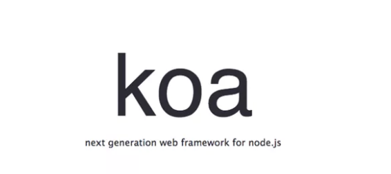

## koa 란?



> Node.js 에서 가장 인기있던 웹 프레임워크인 Express.js 의 개발팀이, Koa 라는 웹프레임워크를 새로 만들었다. 기존의 Express 의 경우엔 오픈소스의 소유권이 IBM 계열사인 StrongLoop 으로 이전이 되었으며, 유지보수는 되고있긴 하지만, 장기적으로 보면 이로 인하여 인지도를 잃을 확률이 높습니다. 물론, 워낙 유명한 라이브러리이기 때문에, 지금 매우 많은 프로젝트에서 Express 를 사용하고 있긴 하지만, Koa 로 마이그레이션 하는 프로젝트도 늘어나는 추세

🧐Express 와의 큰 차이는, Koa 는 훨씬 가볍고, async/await 기능을 아주 편하게 사용 할 수 있다는 점...

## koa setup

❗️❗️ node -v 7 이상 사용할것 ❗️❗️

```sh
$ yarn add koa
$ yarn add koa-router
```

## Basic Koa Server

`❗️typescritp ts 파일로 작성`

```ts
import Koa from 'koa';

const app = new Koa();

app.use(ctx => {
    ctx.body = 'hello world'
});

app.listen(4000, () => {
    console.log('Listening to port 4000)
})

export default app;
```

## Basic Koa Router

`❗️typescritp ts 파일로 작성`

```ts
import Koa from 'koa'
import Router from 'koa-router'

const app = new Koa()
const routers = new Router()

// Router setup
router.get('/', ctx => {
  ctx.body = 'hello world'
})

router.get('/test', ctx => {
  ctx.body = 'test'
})

/* setup middlewares */
app.use(router.routes().use(router.alloweMethods()))

app.listen(4000, () => {
  console.log('Listening to port 4000')
})

export default app
```

## Route 파라미터 & Query

```ts
import Koa from 'koa'
import Router from 'koa-router'

const app = new Koa()
const routers = new Router()

// Router setup
router.get('/', ctx => {
  ctx.body = 'hello world'
})

router.get('/test', ctx => {
  ctx.body = 'test'
})

// parameter
router.post('/login/:provider', async ctx => {
  // provider 따라서 다른 결과 출력
  const { provider }: { code: string } = ctx.params;
});

// query
router.post('/data', ctx => {
    const {data } = ctx.queuy;
    ctx.body = data ? 데이터#`${data}` : '데이터가 없다.'
});

/* setup middlewares */
app.use(router.routes().use(router.alloweMethods()))

app.listen(4000, () => {
  console.log('Listening to port 4000')
})

export default app
```

## Route 모듈화

```
src
└── routes
│    ├── api
│    └── index.ts
└── app.ts  ( server 실행 파일)
```

`auth` `post` `write` `etc`

```ts
// api/index.ts
import Router from 'koa-router'
import v2 from './v2'

const api = new Router()
api.use('/v2', v2.routes())
// http://localhost/api/v2/
export default api
```

```ts
// api/auth/index.ts
import Router from 'koa-router'
import auth from './auth/auth'

const v2 = new Router()

// localhost/api/v2/check
v2.get('/check', ctx => {
  ctx.body = {
    version: 'v2',
  }
})

// localhost/api/v2/auth
v2.use('/auth', auth.routes())
v2.use('/post', post.routes())
v2.use('/write', post.routes())

export default v2
```

:bulb: 하나의 파일로 작성하게 되면 코드가 길어지면 유지보수가 힘들진다.

:bulb: 여러 파일로 모듈화해서 파일을 관리하자

## Controller 작성

```sh
$ yarn add koa-bodyparser @types/koa-bodyparser
```

:bulb: api 구현 할때 Request Body에 JSON 방식으로 데이터를 넣어서 사용 가능

### app.ts (서버 실행 파일)

```ts
import Koa, { Context } from 'koa'
import bodyParser from 'koa-bodyparser'
import routes from './routes'

const app = new Koa()

/* setup middlewares */

app.use(bodyParser())

app.use(routes.routes()).use(routes.allowedMethods())

app.listen(4000, () => {
  console.log('Listening to port 4000')
})
```

### Controller Ex

```ts
auth.post('/sendmail', async ctx => {
  type RequestBody = {
    email: string
  }
  const schema = Joi.object().keys({
    email: Joi.string()
      .email()
      .required(),
  })
  if (!validateBody(ctx, schema)) return false

  const { email }: RequestBody = ctx.request.body

  // find user by email
  try {
    const user = await getRepository(User).findOne({
      email,
    })

    // create email
    const emailAuth = new EmailAuth()
    emailAuth.code = shortid.generate()
    emailAuth.email = email
    await getRepository(EmailAuth).save(emailAuth)
    const emailTemplate = createAuthEmail(!!user, emailAuth.code)
    ctx.body = {
      registered: !!user,
    }
    // send email
    setImmediate(() => {
      sendMail({
        to: email,
        ...emailTemplate,
        from: 'verification@songc.io',
      })
    })
  } catch (e) {
    ctx.throw(500, e)
  }
})
```

> 여기까지가 기본적인 Koa 구조

## SONGC boilerplate structure

```
src
├── entity // DATABASE
├── etc // 기타...
├── lib // library file
├── graphql //
├── routes
│   ├── api
│   │      ├── ex)auth ..
│   │      ├── ex)post ..
│   │      ├── ex)write ..
│   │      └── ex)admin ..
│   └── index.ts
├── server.ts
└── app.ts
```

## References

> - [velopert 블로그](https://velopert.com/)
> - [https://backend-intro.vlpt.us/](https://backend-intro.vlpt.us//)
> - [https://koajs.com/](https://koajs.com/)
