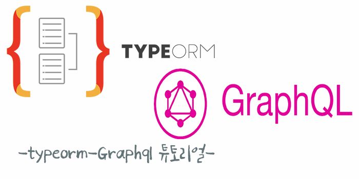
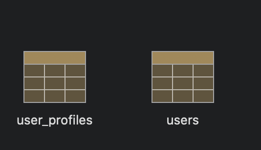

## Apollo REACT 튜토리얼 시리즈 [서버편]

<br>



이 튜토리얼은 Apollo REACT를 다루기 전 backend 구축 하는 Tutorial
React + Apollo tutorial 을 진행하기 앞서 backend가 필요하기 때문에 앞서 TypeOrm + GraphQL tutorial 작성해보겠습니다.

> `👨🏻‍💻TypeOrm 부분을 주로 다루도록 하겠습니다.!`

### What?

먼저 Graphql, Typeorm 간단히 알아보겠습니다.

[GraphQL](https://graphql.org/)
GraphQL은 기존 REST API의 대안으로 새롭게 나타난, 더욱 강력한 API
Facebook에 의해 오픈 소스로 개발되었고 현재 많은 기업과 개인들에 의해 사용되고 이미 이제는 많이 사용중인)

[Typeorm](https://typeorm.io/#/)
TypeOrm 이란 TypeScript 와 JavaScript(ES5 , ES6 , ES7) 용 ORM이다. MySQL, PostgreSQL, MariaDB, SQLite, MS SQL Server, Oracle, WebSQL 데이터베이스를 지원


Typeorm은 Typescript 환경에서 이미 npm trend 충분히 많은 사용자가 있습니다

### 👨🏻‍💻Environment

Tutorial 개발 환경은 아래와 같습니다.

- Node (KOA)
- Typescript
- TypeOrm
- Graphql
- Postgres

### 👨🏻‍💻Directory 구조

```

graphql (graphql 쿼리 작성)
src
  ├── entity
  ├── lib
  │      └──  utils.ts
  |
  ├── routes
  |       ├── api
  |       │     └──  index.ts
  |       │     └──  index.ts
  |       │
  |       index.ts
  |
  |
  |
  ├── App.ts
  └── server.ts
.env
...생략
```

### TypeOrm 설정

Database config 설정법은 두가지 방법이 있습니다.
1 or 2 둘중 아무거나 사용해도 무방합니다.

`1. .env (env 파일 생성)`

```ts
PORT=5000
TYPEORM_CONNECTION=postgres
TYPEORM_HOST=localhost
TYPEORM_USERNAME=test_song
TYPEORM_PASSWORD=test_song
TYPEORM_DATABASE=test_song
TYPEORM_PORT=5432
TYPEORM_SYNCHRONIZE=true
TYPEORM_LOGGING=true
TYPEORM_ENTITIES=src/entity/**/*.ts
```

`2. ormconfig.json`

먼저 \$ npm install -g typescript typeorm 설치 후
cli 명령어으로 생성을 할 수 있습니다.

```
$ typeorm init --name 프로젝트이름 --database 데이터베이스
```

```json
{
  "synchronize": true,
  "logging": false,
  "entities": ["src/entity/**/*.ts"],
  "migrations": ["src/migration/**/*.ts"],
  "subscribers": ["src/subscriber/**/*.ts"],
  "cli": {
    "entitiesDir": "src/entity",
    "migrationsDir": "src/migration",
    "subscribersDir": "src/subscriber"
  }
}
```

### TypeOrm 패턴

[Active Record vs Data Mapper](https://github.com/typeorm/typeorm/blob/master/docs/active-record-data-mapper.md)

TypeORM을 사용하여 개발을 하면 Data Mapper 패턴과 Active Record 패턴을 둘다 사용이 가능합니다.

1. Active Record
   > Active Record패턴은 모델 자체 내에서 모든 쿼리 메서드를 정의하고 모델의 메서드를 통해 데이터를 조회, 삽입, 삭제등을 할 수 있습니다. 따라서, SQL을 사용하지 않고도 모델 내에서 데이터를 조작하는 다양한 메서드를 제공합니다.

```ts
import { BaseEntity, Entity, PrimaryGeneratedColumn, Column } from 'typeorm'

@Entity()
export class User extends BaseEntity {
  @PrimaryGeneratedColumn()
  id: number

  @Column()
  firstName: string

  @Column()
  lastName: string

  @Column()
  isActive: boolean

  static findByName(firstName: string, lastName: string) {
    return this.createQueryBuilder('user')
      .where('user.firstName = :firstName', { firstName })
      .andWhere('user.lastName = :lastName', { lastName })
      .getMany()
  }
}
```

2.Data Mapper

> Data Mapper 패턴은 분리된 클래스에 쿼리 메소드를 정의하는 방식이며, Repository를 이용하여 객체를 저장, 제거, 불러온다.
> Active Record 패턴과의 차이점은 모델에 접근하는 방식이 아닌 Repository에서 데이터에 접근

```ts
import { Entity, PrimaryGeneratedColumn, Column } from 'typeorm'

@Entity()
export class User {
  @PrimaryGeneratedColumn()
  id: number

  @Column()
  firstName: string

  @Column()
  lastName: string

  @Column()
  isActive: boolean
}
```

### 📝Entity 작성

User, UserProfile 작성하겠습니다.

| USER         | UserProfile       |
| :----------- | ----------------- |
| ID ('uuid')  | **ID ('uuid')**   |
| Password     | **fk_id (user)**  |
| email        | **display_name**  |
| username     | **user(id_fk**)   |
| updated_at   | **thumbnail**     |
| created_at   | **updated_at**    |
| is_certified | **created_at**    |
|              | **profile_links** |
|              | **about**         |

```ts
import {
  Entity,
  PrimaryGeneratedColumn,
  Column,
  Index,
  CreateDateColumn,
  UpdateDateColumn,
  getRepository,
} from 'typeorm'

@Entity('users', {
  synchronize: true,
})
export default class User {
  @PrimaryGeneratedColumn('uuid')
  id!: string

  @Column({ type: 'text' })
  password: string

  @Index()
  @Column({ unique: true, length: 255 })
  username!: string

  @Index()
  @Column({ unique: true, length: 255 })
  email!: string

  @Column('timestampz')
  @CreateDateColumn()
  created_at!: Date

  @Column('timestamptz')
  @UpdateDateColumn()
  updated_at!: Date

  @Column({ default: false })
  is_certified!: boolean
}
```

```ts
import {
  Entity,
  PrimaryGeneratedColumn,
  Column,
  UpdateDateColumn,
  CreateDateColumn,
  OneToOne,
  JoinColumn,
  getRepository,
} from 'typeorm'
import User from './User'

@Entity('user_profiles', {
  synchronize: false,
})
export default class UserProfile {
  @PrimaryGeneratedColumn('uuid')
  id!: string

  @Column({ length: 255 })
  display_name!: string

  @Column({ length: 255 })
  short_bio!: string

  @Column({ length: 255, nullable: true })
  thumbnail!: string

  @Column('timestampz')
  @CreateDateColumn()
  created_at!: Date

  @Column('timestamptz')
  @UpdateDateColumn()
  updated_at!: Date

  @OneToOne(type => User, { cascade: true })
  @JoinColumn({ name: 'fk_user_id' })
  user!: User

  @Column('uuid')
  fk_user_id!: string

  @Column({
    default: {},
    type: 'jsonb',
  })
  profile_links!: any

  @Column('text')
  about!: string
}
```

### App.ts 코드 작성

Entity 작성 코드를 테이블 생성을 연결 해주는 작업을 해줍니다.
저는 express가 아닌 Koa 로 구성을 하였습니다.

app.ts 코드를 아래와 같이 작성을 합니다.

```ts
import Koa from 'koa'
import { createConnection } from 'typeorm'

const app = new Koa()

async function initalize() {
  try {
    await createConnection()
    console.log('Postgres RDBMS connection is establishde')
  } catch (e) {
    console.log(e)
  }
}
initalize()

export default app
```

### server 실행 코드 작성

```ts
import app from './app'

app.listen(5001, () => {
  console.log('Songc server is listening to port', 5001)
})
```

```json
 "dev": "NODE_ENV=development ts-node-dev --respawn ./src/server.ts"
```

위 와 같은 script 파일을 실행해주면
테이블이 생기는 것을 확인하면 Entity 코드와 일치하는 테이블이 생기는 것을 확인 할수 있습니다.



다음 포스트에서 간단한 Api 와 GraphQL tutorial 진행 하고 3번째 시리즈 부터 Apollo React 튜토리얼 프론트엔드 부분을 진행하도록 하겠습니다.

## References

> - [Typeorm](https://typeorm.io/#/)
> - [GraphQL](https://graphql.org/)
> - [TypeOrm 패턴](https://github.com/typeorm/typeorm/blob/master/docs/active-record-data-mapper.md)
> - [Setup PostgreSQL with TypeORM in GraphQL Tutorial](https://dev.to/rxassim/setup-postgresql-with-typeorm-in-graphql-tutorial-1cn8)

### 🙏🏻감사합니다.
